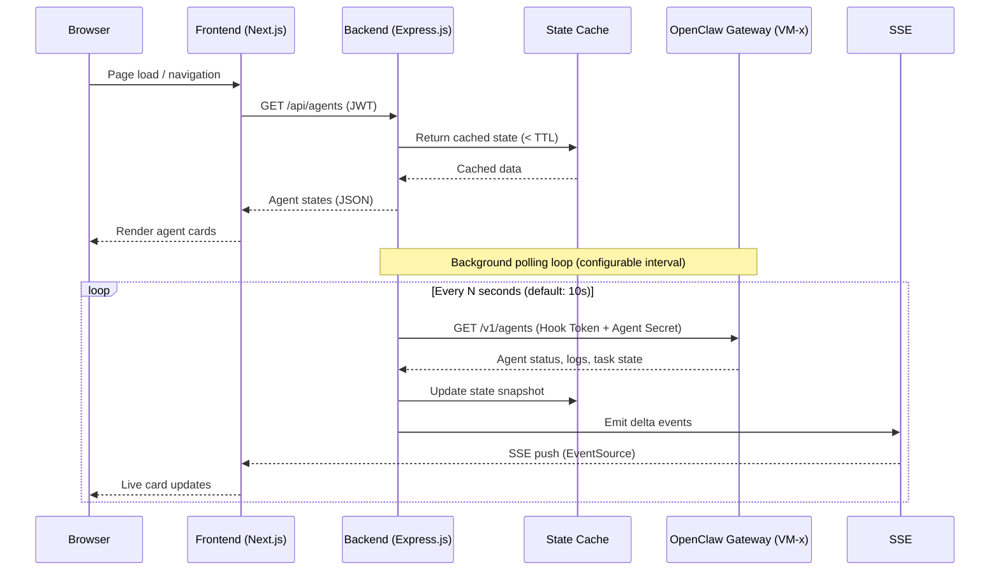

# GateForge Admin Portal — Feature Specification

**Document Status:** Draft  
**Version:** 0.1  
**Author:** Tony NG (CTO / Project Lead)  
**Created:** 2026-04-07  
**Last Updated:** 2026-04-07  
**Reference Project:** [ClawDeck](https://github.com/tonylnng/clawdeck)

---

## Table of Contents

1. [Executive Summary](#1-executive-summary)
2. [Architecture Overview](#2-architecture-overview)
3. [Feature Specification — Agent Dashboard](#3-feature-specification--agent-dashboard-primary-view)
4. [Feature Specification — Lobster Pipeline View](#4-feature-specification--lobster-pipeline-view)
5. [Feature Specification — Blueprint Explorer](#5-feature-specification--blueprint-explorer)
6. [Feature Specification — Project Dashboard](#6-feature-specification--project-dashboard)
7. [Feature Specification — QA Metrics Dashboard](#7-feature-specification--qa-metrics-dashboard)
8. [Feature Specification — Operations Dashboard](#8-feature-specification--operations-dashboard)
9. [Feature Specification — Notification Center](#9-feature-specification--notification-center)
10. [Feature Specification — Setup & Configuration Page](#10-feature-specification--setup--configuration-page)
11. [Status Alignment Reference](#11-status-alignment-reference)
12. [API Design](#12-api-design)
13. [Deployment Architecture](#13-deployment-architecture)
14. [Navigation & UI Structure](#14-navigation--ui-structure)
15. [Future Enhancements](#15-future-enhancements)

---

## 1. Executive Summary

### What Is the GateForge Admin Portal?

The GateForge Admin Portal is a purpose-built observability and transparency dashboard for the GateForge multi-agent SDLC pipeline. It provides Tony NG (CTO / Project Lead) with a single-pane-of-glass view into all five VM-resident AI agent groups, their activities, SDLC pipeline progress, quality gate outcomes, and system health — all in real time.

The portal is **read-only by design**. It observes and reports; it never sends instructions to agents.

### Why Does It Exist?

GateForge operates as a fully autonomous multi-agent pipeline: five VM clusters run distinct specialised AI agents (System Architect, System Designer, Developers, QC Agents, and Operator), communicating through a tightly controlled hub-and-spoke topology. This architecture intentionally routes all human interaction through the System Architect (VM-1) via Telegram.

Without a monitoring layer, Tony's only window into the pipeline is the System Architect's Telegram messages — a single-channel, summary-level view. The Admin Portal exposes the full picture:

- What every agent is doing right now
- Where the SDLC pipeline is in its journey through six phases
- Which quality gates have passed, which are blocked, and why
- Live notification feed from all VMs
- Historical logs, Blueprint documents, QA metrics, and operations data

### Key Design Principles

| Principle | Description |
|-----------|-------------|
| **Read-Only Observation** | The portal never issues commands or prompts to any agent. Tony interacts with the pipeline exclusively via Telegram → System Architect. |
| **Hub-and-Spoke Alignment** | The portal mirrors the hub-and-spoke model. VM-1 (Architect) is prominently identified as the coordinator; all other VMs are spokes. |
| **Real-Time Transparency** | SSE-based live updates surface agent activity, notifications, and pipeline changes without manual refresh. |
| **Status Fidelity** | Every status value in the portal (task status, agent activity, gate decisions, priority levels) maps exactly to the GateForge canonical definitions. No invented states. |
| **ClawDeck-Derived Architecture** | The portal inherits ClawDeck's proven tech stack (Next.js 14, TypeScript, Tailwind CSS, shadcn/ui, Express.js, Docker Compose) and UI patterns (setup wizard, agent cards, SSE log streaming, dark/light mode). |
| **Clarity Over Density** | Each view is optimised for rapid situational awareness. Tony should be able to determine overall system health within five seconds of opening any page. |

---

## 2. Architecture Overview

### System Architecture Diagram

```mermaid
graph TB
    subgraph Tony["Tony (CTO / Project Lead)"]
        Browser["Admin Portal Browser\n(Next.js 14 + shadcn/ui)"]
        Telegram["Telegram Client"]
    end

    subgraph AdminPortal["GateForge Admin Portal (Docker Compose)"]
        FE["Frontend\nNext.js 14 + TypeScript\nTailwind CSS + shadcn/ui\n:3000"]
        BE["Backend\nExpress.js + TypeScript\n:3001"]
        Cache["In-Memory Cache\n(per-VM state snapshots)"]
        SSE["SSE Event Bus\n(real-time push)"]
    end

    subgraph GateForgeNetwork["GateForge Network (192.168.72.x)"]
        subgraph VM1["VM-1 — System Architect\n192.168.72.10:18789\nClaude Opus 4.6"]
            GW1["OpenClaw Gateway"]
            A1["Architect Agent"]
        end
        subgraph VM2["VM-2 — System Designer\n192.168.72.11:18789\nClaude Sonnet 4.6"]
            GW2["OpenClaw Gateway"]
            A2["Designer Agent"]
        end
        subgraph VM3["VM-3 — Developers\n192.168.72.12:18789\nClaude Sonnet 4.6"]
            GW3["OpenClaw Gateway"]
            A3a["dev-01"]
            A3b["dev-02..dev-N"]
        end
        subgraph VM4["VM-4 — QC Agents\n192.168.72.13:18789\nMiniMax 2.7"]
            GW4["OpenClaw Gateway"]
            A4a["qc-01"]
            A4b["qc-02..qc-N"]
        end
        subgraph VM5["VM-5 — Operator\n192.168.72.14:18789\nMiniMax 2.7"]
            GW5["OpenClaw Gateway"]
            A5["Operator Agent"]
        end
    end

    subgraph USDeployment["US VM (Deployment Target)"]
        Dev["Dev Environment"]
        UAT["UAT Environment"]
        Prod["Production Environment"]
    end

    subgraph Blueprint["Blueprint Git Repository"]
        GitRepo["Git Repo\n(requirements/, architecture/,\ndesign/, development/,\nqa/, operations/, project/)"]
    end

    Browser <-->|"HTTPS + JWT"| FE
    FE <-->|"HTTP + JWT"| BE
    BE <-->|"SSE"| SSE
    SSE -->|"push events"| FE

    BE <-->|"READ ONLY\nHTTP GET + Hook Token\n+ Agent Secret"| GW1
    BE <-->|"READ ONLY\nHTTP GET + Hook Token\n+ Agent Secret"| GW2
    BE <-->|"READ ONLY\nHTTP GET + Hook Token\n+ Agent Secret"| GW3
    BE <-->|"READ ONLY\nHTTP GET + Hook Token\n+ Agent Secret"| GW4
    BE <-->|"READ ONLY\nHTTP GET + Hook Token\n+ Agent Secret"| GW5

    BE <-->|"SSH / HTTPS READ ONLY"| GitRepo
    BE <-->|"Tailscale SSH\nhealth probe only"| USDeployment

    Telegram <-->|"Telegram Bot API"| A1

    style AdminPortal fill:#1e3a5f,color:#fff
    style GateForgeNetwork fill:#1a2e1a,color:#fff
    style Tony fill:#2d1b4e,color:#fff
    style USDeployment fill:#3d2200,color:#fff
    style Blueprint fill:#3a2200,color:#fff
```



### Data Flow: Portal → VM Gateway → Agent Data



### Tech Stack

| Layer | Technology | Source |
|-------|-----------|--------|
| Frontend framework | Next.js 14 (App Router) | ClawDeck |
| Language | TypeScript (strict) | ClawDeck |
| Styling | Tailwind CSS v3 | ClawDeck |
| UI components | shadcn/ui | ClawDeck |
| Backend framework | Express.js + TypeScript | ClawDeck |
| Real-time transport | Server-Sent Events (SSE) | ClawDeck |
| Authentication | JWT (HttpOnly cookies) + bcrypt | ClawDeck |
| Deployment | Docker Compose | ClawDeck |
| Git integration | isomorphic-git / simple-git | New |
| Markdown rendering | react-markdown + remark-gfm | ClawDeck (adapted) |
| Charts / gauges | Recharts or Tremor | New |
| Pipeline visualisation | React Flow (read-only) | New |
| Notifications | Native SSE event bus | New |

### Read-Only Principle

The portal backend exclusively uses HTTP `GET` requests and read-only Git operations against all external systems. It holds no write credentials for any OpenClaw agent. The two-layer auth (Hook Token + Agent Secret) used to query gateway endpoints is stored server-side only and never exposed to the browser.

> **Enforcement**: The backend has no route that proxies `POST /hooks/agent`, `POST /v1/chat/completions`, or any write endpoint. Any attempt to add such a route must be rejected in code review as a design violation.

---

## 3. Feature Specification — Agent Dashboard (Primary View)

### Overview

The Agent Dashboard is the default landing page. It presents all active agents as a responsive card grid, giving Tony immediate situational awareness of every agent group in the pipeline.

### 3.1 Card Grid Layout

- **Grid columns**: 1 (mobile) → 2 (tablet) → 3 (desktop ≥1280px)
- **Card order** (fixed, reflects architecture priority):
  1. VM-1: Architect (always first, hub)
  2. VM-2: Designer
  3. VM-3: dev-01, dev-02 … dev-N (dynamic, one card per sub-agent)
  4. VM-4: qc-01, qc-02 … qc-N (dynamic, one card per sub-agent)
  5. VM-5: Operator
- VM-3 and VM-4 cards are grouped under a labelled section header ("Developers" / "QC Agents") with a collapsible toggle
- VM-1 Architect card is visually distinguished (wider border, hub badge)

**Read-Only Banner:**

```
┌─────────────────────────────────────────────────────────────────────┐
│  👁  OBSERVATION ONLY — This portal is read-only. Interact with     │
│      the pipeline via Telegram → System Architect (VM-1).           │
└─────────────────────────────────────────────────────────────────────┘
```

Banner is sticky at the top of the Agent Dashboard and dismissible per session (not per page refresh).

---

### 3.2 Agent Card Design

Each card contains the following fields, rendered in a fixed layout:

```
┌──────────────────────────────────────────────────────┐
│  [HUB] VM-1 · System Architect          [● WORKING]  │
│  Claude Opus 4.6                 [CRITICAL] ⚠        │
│──────────────────────────────────────────────────────│
│  Task: FEAT-042 · Resolve module boundary dispute    │
│──────────────────────────────────────────────────────│
│  Latest AI Output:                                   │
│  "...the proposed split between auth-service and     │
│   user-service introduces a circular dependency.     │
│   Recommend consolidating the user-token model..."   │
│──────────────────────────────────────────────────────│
│  Last activity: 23 seconds ago           [→ Details] │
└──────────────────────────────────────────────────────┘
```

#### Card Fields Reference

| Field | Description | Data Source |
|-------|-------------|-------------|
| **VM Identifier** | VM-1 through VM-5 (plus sub-ID for dev-NN / qc-NN) | Config |
| **Role Name** | System Architect / System Designer / Developer / QC Agent / Operator | Config |
| **Hub Badge** | Shown only on VM-1 card | Config |
| **AI Model Name** | Claude Opus 4.6 / Claude Sonnet 4.6 / MiniMax 2.7 | Config / Gateway |
| **Status Indicator** | Color dot + label (see 3.3) | Gateway poll |
| **Notification Priority Badge** | Highest active notification for this agent | Notification feed |
| **Current Task ID + Title** | FEAT-NNN / BUG-NNN / TASK-NNN / SPIKE-NNN | Gateway / Git |
| **Latest AI Output Snippet** | Last 3–4 lines of the most recent model response, truncated at 280 chars with "…" | Gateway |
| **Time Since Last Activity** | Relative timestamp (e.g. "23 seconds ago"), updated live | Gateway |
| **Details Link** | Opens Agent Detail modal/page | Portal navigation |

#### Card Status Indicators (3.3)

| Status | Color | Dot Animation | Label | Trigger Condition |
|--------|-------|--------------|-------|-------------------|
| **active / working** | Green `#22c55e` | Pulsing ring (CSS `ping`) | WORKING | Agent has active conversation turn in progress |
| **idle** | Blue-gray `#94a3b8` | Static | IDLE | Agent connected, no active turn, awaiting task |
| **blocked** | Orange `#f97316` | Slow blink | BLOCKED | Agent sent `[BLOCKED]` notification or task status = blocked |
| **error** | Red `#ef4444` | Fast blink | ERROR | Gateway returned error, agent process crash detected |
| **offline** | Gray `#6b7280` | Static (hollow) | OFFLINE | Gateway unreachable or connection timeout |

Status dot uses a 12 × 12px circle. The pulsing animation for WORKING uses Tailwind's `animate-ping` class on an absolute overlay ring. The BLOCKED slow blink uses a custom `animate-pulse` variant at 1s interval. ERROR uses `animate-pulse` at 0.5s interval.

#### Notification Priority Badge

Shown in the top-right of the card when any active (unacknowledged) notification exists:

| Priority | Badge Color | Icon |
|----------|-------------|------|
| CRITICAL | Red `#dc2626` | ⚠ |
| BLOCKED | Orange `#ea580c` | ⛔ |
| DISPUTE | Yellow `#ca8a04` | ⚡ |
| COMPLETED | Green `#16a34a` | ✓ |
| INFO | Gray `#6b7280` | ℹ |

Only the highest priority active badge is shown on the card. Full list visible in Notification Center.

---

### 3.4 Agent Detail Modal / Page

Triggered by clicking any agent card (or "Details →" link). Opens as a full-screen modal on desktop; a dedicated page on mobile.

#### Tabs

**Tab 1: Conversation History**

- Full chronological list of all AI model interactions for this agent
- Each entry shows:
  - Timestamp
  - Role (system / user / assistant)
  - Full message content with Markdown rendering
  - Token count (input + output, if available from gateway)
  - Model version used
- Infinite scroll or pagination (50 messages per page)
- Copy-to-clipboard button per message
- Search / filter by keyword within this agent's history

**Tab 2: Task History**

- Table of all tasks assigned to this agent (current + historical)
- Columns: Task ID | Title | Status | Priority | Started | Completed | Phase
- Status chip uses canonical status colors (see Section 11)
- Click task row → Blueprint Explorer filtered to that task's documents

**Tab 3: Agent Tools**

- Read-only list of tools registered to this agent in OpenClaw
- Tool name, description, enabled/disabled state
- No toggle control (read-only)

**Tab 4: Performance Metrics**

- Avg response time (ms) — last 24h, 7d, 30d sparklines
- Total tokens used — input / output breakdown
- Tokens per hour trend chart
- Error rate (failed turns / total turns)
- Gateway connection uptime %

---

### 3.5 Multi-Agent VM Handling

**VM-3 (Developers) and VM-4 (QC Agents)** may run multiple concurrent sub-agents.

- The portal queries the gateway per VM and discovers all agent instances
- Each sub-agent (`dev-01`, `dev-02`, …`dev-N`) receives its own card
- Cards within VM-3 and VM-4 sections are collapsible into a compact list view (toggle between "Cards" and "List" views)
- Sub-agent IDs are displayed as `dev-01@VM-3`, `qc-01@VM-4` in all detail views
- A VM-level aggregate badge shows the count of sub-agents per status: e.g., "3 working, 1 idle, 0 blocked"

---

### 3.6 Auto-Refresh

- Default polling interval: **10 seconds** (configurable in Settings: 5s / 10s / 30s / 60s / manual)
- SSE connection delivers delta events between full polls for near-instant status changes
- Refresh indicator: small spinner in the page header during active poll
- "Last refreshed: X seconds ago" counter visible in header
- Manual refresh button always available

---

## 4. Feature Specification — Lobster Pipeline View

### Overview

The Lobster Pipeline View visualises the GateForge SDLC as a six-phase horizontal pipeline. Tony can see at a glance which phase is active, how tasks are distributed, and whether any quality gates are blocking progress.

### 4.1 Pipeline Diagram Layout

```
┌──────────────────────────────────────────────────────────────────────────────────────────────────────┐
│  GateForge SDLC Pipeline — Iteration 3                                     [▶ History] [↻ Refresh]   │
├──────────────────────────────────────────────────────────────────────────────────────────────────────┤
│                                                                                                      │
│   ●─────────●─────────●══════════●─────────○─────────○                                              │
│   │  REQ    │  ARCH   │   DEV    │   QA    │  DEPLOY │  ITER  │                                     │
│   │ Phase 1 │ Phase 2 │ Phase 3  │ Phase 4 │ Phase 5 │ Phase 6│                                     │
│   │ ✓ Done  │ ✓ Done  │ ⟳ Active │ ○ Pend  │ ○ Pend  │ ○ Pend │                                     │
│   │ ✓ 12   │ ✓ 8    │ ✓ 6     │          │          │        │                                     │
│   │          │         │ ⟳ 4    │          │          │        │                                     │
│   │          │         │ ○ 7    │          │          │        │                                     │
│   └──────────┴─────────┴─────────┴──────────┴──────────┴────────┘                                   │
│                                                                                                      │
│   ══ = Currently active phase (glowing border animation)                                             │
│   ─  = Completed edge     ○ = Not yet started                                                       │
└──────────────────────────────────────────────────────────────────────────────────────────────────────┘
```

Implementation uses **React Flow** in read-only (non-interactive drag) mode with custom node components.

---

### 4.2 Phase Node Design

Each phase is rendered as a node with:

| Element | Details |
|---------|---------|
| **Phase number** | Large numeral (1–6) as background watermark |
| **Phase name** | Bold label |
| **Status badge** | Not Started / In Progress / Completed / Blocked |
| **Task counters** | ✓ passed · ⟳ working · ○ pending · ✗ blocked |
| **Active animation** | Glowing pulsing border (box-shadow keyframes) on the active phase node |
| **Click handler** | Expands phase detail panel (slide-in from right) |

#### Phase Status Visual States

| Status | Node Border | Fill | Label Color | Animation |
|--------|-------------|------|-------------|-----------|
| Not Started | Gray dashed | Light gray | Gray | None |
| In Progress | Blue solid 2px | White / dark | Blue | Pulsing glow |
| Completed | Green solid 2px | Light green tint | Green | None |
| Blocked | Red solid 2px | Light red tint | Red | Slow blink |

#### Connector Edges

- Completed → Completed: Solid green line
- Completed → In Progress: Solid blue line
- In Progress → Not Started: Dashed gray line
- Any → Blocked: Red dashed line

---

### 4.3 Phase Detail Panel

Slides in from the right when a phase node is clicked. Contains:

#### Task List Sub-Panel

| Column | Content |
|--------|---------|
| Task ID | FEAT-NNN / BUG-NNN / TASK-NNN / SPIKE-NNN |
| Title | Short description |
| Status | Chip: backlog / ready / in-progress / in-review / done / blocked |
| Priority | Chip: Critical (P0) / High (P1) / Medium (P2) / Low (P3) |
| Assigned Agent | e.g. dev-02@VM-3 |
| Points | Fibonacci estimate |
| MoSCoW | Must / Should / Could / Won't |

Sortable by Status and Priority. Filterable by agent, status, priority.

#### Quality Gate Sub-Panel

Shown for phases that have associated quality gates:

| Phase | Gate Name | Criteria |
|-------|-----------|----------|
| Phase 2 (Architecture) | **Design Gate** | Security assessment ✓/✗, Rollback strategy ✓/✗, Blueprint updated ✓/✗ |
| Phase 3 (Development) | **Code Gate** | Unit tests pass ✓/✗, Coding standards ✓/✗, JSDoc complete ✓/✗, No hardcoded secrets ✓/✗ |
| Phase 4 (QA) | **QA Gate** | Unit ≥ 95% ✓/✗, Integration ≥ 90% ✓/✗, E2E ≥ 85% ✓/✗, No P0/P1 defects ✓/✗ |
| Phase 5 (Deployment) | **Release Gate** | All QA gates pass ✓/✗, Deployment runbook ✓/✗, Rollback tested ✓/✗, Smoke tests ✓/✗ |

Each criterion shows a green ✓ or red ✗ with a timestamp of last evaluation.

#### Gate Decision Indicator (QA Phases)

Prominent card at the top of the gate sub-panel:

```
┌─────────────────────────────────────┐
│  QA Gate Decision                   │
│                                     │
│  ● PROMOTE  ○ HOLD  ○ ROLLBACK      │
│                                     │
│  Evaluated: 2026-04-07 14:22 HKT   │
│  By: qc-01@VM-4                     │
└─────────────────────────────────────┘
```

| Decision | Background | Description |
|----------|-----------|-------------|
| PROMOTE | Green | All gate criteria met — advance to next phase |
| HOLD | Orange | One or more criteria failing — fix & retest |
| ROLLBACK | Red | Critical regression — revert to previous known-good state |

---

### 4.4 Lobster Pipeline — Phase Alignment Table

| Phase # | Phase Name | GateForge Description | Primary Agent(s) | Quality Gate | Task Status in Phase |
|---------|-----------|----------------------|-----------------|-------------|---------------------|
| 1 | Requirements & Feasibility | Tony → Telegram → Architect → Blueprint v0.1 | VM-1 (Architect) | — | ready, in-progress, done |
| 2 | Architecture & Infrastructure Design | Architect → Designer → Blueprint v0.2 | VM-1, VM-2 | Design Gate | in-progress, in-review, done |
| 3 | Development (Parallel) | Architect → Developers → Blueprint v0.3 | VM-3 (dev-01…dev-N) | Code Gate | in-progress, in-review, blocked, done |
| 4 | Quality Assurance (Parallel) | Architect → QC Agents → Blueprint v0.4 | VM-4 (qc-01…qc-N) | QA Gate | in-progress, in-review, blocked, done |
| 5 | Deployment & Release | Architect → Operator → US VM (Dev→UAT→Prod) | VM-5 (Operator) | Release Gate | in-progress, done |
| 6 | Iteration | Feedback → new requirements or hotfix | VM-1 (Architect) | — | backlog, ready |

---

### 4.5 Pipeline History

- Dropdown selector in the page header: "Iteration 1 / Iteration 2 / Iteration 3 (Current)"
- Historical iterations are read-only snapshots (captured from Git tags / project status docs)
- Phase states, gate outcomes, and task counts for past iterations are fully viewable
- A "Compare Iterations" button (future enhancement) is a placeholder in the UI

---

### 4.6 Lobster Pipeline YAML Preview

A collapsible panel at the bottom of the Pipeline View shows the raw Lobster YAML for the current active workflow:

- Rendered as syntax-highlighted YAML (read-only, no editor)
- Shows: steps, agent assignments, actions, inputs, `on_fail` / `on_pass` branches, resume tokens
- Retry counter visible per step (current retry / max 3)
- Human escalation flag shown if max retries reached

---

## 5. Feature Specification — Blueprint Explorer

### Overview

The Blueprint Explorer provides a read-only file tree and Markdown viewer for the Blueprint Git repository — the canonical source of truth for all GateForge project documents.

### 5.1 File Tree View

```
Blueprint Repository
├── requirements/
│   ├── user-requirements.md          [Approved] ✓
│   ├── functional-requirements.md    [Approved] ✓
│   └── non-functional-requirements.md [In Review] ◐
├── architecture/
│   ├── technical-architecture.md     [Approved] ✓
│   ├── data-model.md                 [Approved] ✓
│   └── api-specs.md                  [In Review] ◐
├── design/
│   ├── infrastructure-design.md      [Draft] ◯
│   ├── security-design.md            [Draft] ◯
│   ├── resilience-design.md          [Draft] ◯
│   ├── db-design.md                  [Draft] ◯
│   └── monitoring-design.md          [Draft] ◯
├── development/
│   ├── coding-standards.md           [Approved] ✓
│   └── module-documentation/
├── qa/
│   ├── test-plans/
│   ├── test-cases/
│   ├── reports/
│   ├── defects/
│   └── metrics/
├── operations/
│   ├── deployment-runbook.md         [Draft] ◯
│   ├── incident-reports/
│   └── sla-slo-tracking.md           [Draft] ◯
└── project/
    ├── backlog.md                     [Approved] ✓
    ├── iterations/
    ├── releases/
    ├── decision-log.md               [Approved] ✓
    └── status.md                     [Approved] ✓
```

- Tree is loaded from the configured Git repo via `git clone --depth 1` or Git API
- Folders are collapsible/expandable
- Search bar filters the tree by filename or path
- Document status badges shown inline (see Section 11)

### 5.2 Document Viewer

Clicking any file opens it in a split-pane view (tree left, content right):

- Full Markdown rendering (react-markdown + remark-gfm + rehype-highlight)
- Frontmatter metadata displayed as a summary card at the top (status, version, author, last updated)
- Table of contents sidebar (auto-generated from headings)
- "Raw" tab to view unrendered Markdown
- Copy link to document button
- View on Git button (links to Git hosting URL)

### 5.3 Document Status Badges

| Status | Badge | Color | Meaning |
|--------|-------|-------|---------|
| Draft | ◯ DRAFT | Gray | Work in progress, not ready for review |
| In Review | ◐ IN REVIEW | Blue | Submitted for peer/stakeholder review |
| Approved | ✓ APPROVED | Green | Signed off, canonical version |
| Deprecated | ⊗ DEPRECATED | Red | Superseded, no longer active |

### 5.4 Recent Changes Log

Sidebar panel (toggleable) showing the last 50 Git commits:

| Column | Content |
|--------|---------|
| Timestamp | Relative (e.g. "2 hours ago") |
| Author / Agent | Commit author prefixed with agent ID (e.g. `architect: Updated Blueprint v0.2`) |
| Message | Commit message (first line) |
| Files Changed | Count of files in this commit |
| Link | Click to see diff (read-only diff viewer) |

### 5.5 Decision Log Viewer

Dedicated sub-view within Blueprint Explorer filtered to `project/decision-log.md` and any ADR files in `project/decisions/`:

- Each ADR rendered as an expandable card
- Fields: Decision ID, Title, Status (Proposed/Accepted/Deprecated/Superseded), Date, Context, Decision, Consequences, Alternatives Considered
- Filter by status and date range

---

## 6. Feature Specification — Project Dashboard

### Overview

The Project Dashboard mirrors the content of `project/status.md` and `project/backlog.md`, giving Tony a high-level health view of the current project iteration.

### 6.1 Project Health Summary

Six health dimension cards arranged in a 2 × 3 grid (or 3 × 2 on wide screens):

| Dimension | Indicator Values | Color |
|-----------|----------------|-------|
| Current Phase | Phase name + number | Phase color |
| Overall Status | Green / Yellow / Red | As defined |
| Schedule | On Track / At Risk / Behind | Green / Yellow / Red |
| Budget | On Track / At Risk / Overspend | Green / Yellow / Red |
| Quality | Passing / Warning / Failing | Green / Yellow / Red |
| Team | All Active / Some Blocked / Critical Block | Green / Yellow / Red |

Each card shows:
- Dimension name
- Current value (large, prominent)
- Color indicator (background tint + colored left border)
- Last updated timestamp
- Brief note/reason (from status.md)

**Project Health Color System:**

| Status | Color Hex | Usage |
|--------|-----------|-------|
| Green (on track) | `#16a34a` | All thresholds met |
| Yellow (at risk) | `#ca8a04` | One or more thresholds at risk |
| Red (blocked/behind) | `#dc2626` | Critical blocker or missed threshold |

### 6.2 Active Tasks Table

Full-width filterable/sortable table of all active tasks (status ≠ done, ≠ backlog):

| Column | Content |
|--------|---------|
| Task ID | FEAT-NNN, BUG-NNN, TASK-NNN, SPIKE-NNN — linked to Blueprint Explorer |
| Title | Short description |
| Module | e.g. auth-service, user-service |
| Status | Chip with canonical colors |
| Priority | Chip: Critical/High/Medium/Low |
| MoSCoW | Chip: Must/Should/Could/Won't |
| Assigned Agent | e.g. dev-01@VM-3 |
| Points | Fibonacci number |
| Phase | Current pipeline phase |
| Updated | Relative timestamp |

**Filter bar**: Filter by Module, Status, Assigned Agent, Priority, MoSCoW, Phase.  
**Sort**: By Priority (default), Status, Points, Updated.

### 6.3 Backlog Overview

Side-by-side panels:

**MoSCoW Breakdown (donut chart)**
- Must: N tasks (% of total)
- Should: N tasks
- Could: N tasks
- Won't: N tasks

**Status Breakdown (horizontal bar chart)**
- backlog → ready → in-progress → in-review → done → blocked

### 6.4 Recently Completed Items

Last 20 tasks with status = `done`, sorted by completion time descending:

| Field | Content |
|-------|---------|
| Task ID | Linked |
| Title | |
| Completed by | Agent ID |
| Completed at | Timestamp |
| Phase | Pipeline phase |
| Points | Delivered |

### 6.5 Open Blockers List

Dedicated panel for all tasks with status = `blocked`:

- Task ID, Title, Blocking reason (from task notes), Blocked agent, Time blocked
- Sorted by time blocked (longest first)
- Priority badge (P0 blockers highlighted in red)
- Link to related Notification Center entry if a `[BLOCKED]` notification exists

### 6.6 Iteration Progress

For the current iteration:

- **Burndown chart**: Points remaining vs. ideal line (Recharts line chart)
- **Velocity**: Points completed this iteration vs. previous iteration average
- **Iteration dates**: Start, planned end, days remaining
- **Commitment**: Total points committed, delivered, remaining
- **Goal**: Iteration goal statement (from iteration doc)

---

## 7. Feature Specification — QA Metrics Dashboard

### Overview

The QA Metrics Dashboard exposes all quality metrics tracked by GateForge's QA phase, sourced from Blueprint `qa/metrics/` documents and `qa/reports/`.

### 7.1 Coverage Gauges

Per module, three circular gauges (or progress arcs):

| Metric | Target Threshold | Color Logic |
|--------|----------------|-------------|
| Unit Test Coverage | ≥ 95% | Green ≥ 95%, Yellow 80–94%, Red < 80% |
| Integration Test Coverage | ≥ 90% | Green ≥ 90%, Yellow 75–89%, Red < 75% |
| E2E Test Coverage | ≥ 85% | Green ≥ 85%, Yellow 70–84%, Red < 70% |

Module selector dropdown allows switching between individual modules or "All Modules (aggregate)".

### 7.2 Quality Gate Status Cards

One card per module × phase combination where a gate applies:

```
┌─────────────────────────────────────┐
│  auth-service · QA Gate             │
│                                     │
│  ████████████░░░░  PROMOTE          │
│  Decision: 2026-04-07 14:22         │
│                                     │
│  Unit:        97.2% ✓               │
│  Integration: 91.4% ✓               │
│  E2E:         86.1% ✓               │
│  P0 Defects:  0     ✓               │
│  P1 Defects:  1     ✗  (blocking)   │
└─────────────────────────────────────┘
```

| Decision | Card Border | Badge Color |
|----------|------------|-------------|
| PROMOTE | Green | Green |
| HOLD | Orange | Orange |
| ROLLBACK | Red | Red |
| Pending | Gray | Gray |

### 7.3 Defect Summary

**Open Defects by Severity Table:**

| Severity | Open Count | Trend (7d) | Age (oldest) |
|----------|-----------|-----------|-------------|
| Critical (P0) | N | ↑/↓/→ | X days |
| Major (P1) | N | ↑/↓/→ | X days |
| Minor (P2) | N | ↑/↓/→ | X days |
| Cosmetic (P3) | N | ↑/↓/→ | X days |

**Defect Density Trend** (Recharts line chart, last 30 days): Defects per 1000 lines of code per module.

**Bug Escape Rate by Discovery Stage:**

| Discovery Stage | Count | % of Total |
|----------------|-------|-----------|
| Dev / QA (caught internally) | N | % |
| UAT (caught in staging) | N | % |
| Production (escaped) | N | % |

### 7.4 Test Automation Metrics

| Metric | Value | Target | Status |
|--------|-------|--------|--------|
| Automation Coverage | N% | 100% | ✓ / ✗ |
| Total Test Cases | N | — | — |
| Automated | N | — | — |
| Manual | N | — | — |
| Avg Execution Time | Ns | < 600s | ✓ / ✗ |
| Flaky Test Rate | N% | < 2% | ✓ / ✗ |

### 7.5 Performance Baseline Comparison

Line chart (Recharts): p95 latency per endpoint over the last 7 days, with a reference line at the 200ms SLO target.

Table:

| Endpoint | p95 Latency | Throughput (req/s) | Stress Test Status |
|----------|------------|---------------------|-------------------|
| GET /api/users | Xms | N | Pass / Fail |
| POST /api/auth | Xms | N | Pass / Fail |

### 7.6 Security Vulnerability Summary

**OWASP Top 10 Coverage Checklist:**

| OWASP Category | Covered | Test Result |
|----------------|---------|------------|
| A01: Broken Access Control | ✓ / ✗ | Pass / Fail / Not Tested |
| A02: Cryptographic Failures | ✓ / ✗ | — |
| A03: Injection | ✓ / ✗ | — |
| A04: Insecure Design | ✓ / ✗ | — |
| A05: Security Misconfiguration | ✓ / ✗ | — |
| A06: Vulnerable Components | ✓ / ✗ | — |
| A07: Auth Failures | ✓ / ✗ | — |
| A08: Software Data Integrity | ✓ / ✗ | — |
| A09: Security Logging | ✓ / ✗ | — |
| A10: SSRF | ✓ / ✗ | — |

**Snyk Dependency Scan Summary:**

| Severity | Count | Fixed | Action Required |
|----------|-------|-------|----------------|
| Critical | N | N | Yes / No |
| High | N | N | Yes / No |
| Medium | N | N | — |
| Low | N | N | — |

---

## 8. Feature Specification — Operations Dashboard

### Overview

The Operations Dashboard provides Tony with live visibility into the deployment target (US VM), environment health, SLO compliance, and operational incidents.

### 8.1 Deployment Status

Three environment cards: **Dev**, **UAT**, **Production**

Each card shows:

```
┌─────────────────────────────────┐
│  🟢 Production                  │
│  Last deploy: 2026-04-06 09:15  │
│  Version: v1.4.2 (commit a3f9c) │
│  Health: Healthy                │
│  Uptime: 99.97% (30d)           │
│  Deployed by: operator@VM-5     │
└─────────────────────────────────┘
```

| Health State | Color | Description |
|-------------|-------|-------------|
| Healthy | Green | All probes passing |
| Degraded | Yellow | Some probes failing, service partially available |
| Down | Red | Service unavailable |
| Unknown | Gray | Probe unreachable |

**US VM Connectivity Status** (top-of-page banner):
- Tailscale SSH reachability indicator (green/red)
- Last successful probe timestamp
- Round-trip latency

### 8.2 SLO Compliance Gauges

Three circular gauge charts:

| SLO | Target | Critical Threshold |
|-----|--------|--------------------|
| API Availability | ≥ 99.9% | < 99.5% = Red |
| API p95 Latency | ≤ 200ms | > 300ms = Red |
| Error Rate | ≤ 0.1% | > 0.5% = Red |
| DB Availability | ≥ 99.95% | < 99.5% = Red |
| DB Query p95 | ≤ 50ms | > 100ms = Red |

Color logic: Green (on target), Yellow (within 20% of threshold), Red (threshold breached).

### 8.3 Error Budget Burn Rate Visualization

**Burn Rate Cards** (one per SLO):

```
┌────────────────────────────────────────┐
│  API Availability — Error Budget       │
│                                        │
│  Remaining:  ████████████░░  78.4%     │
│  Status:     🟢 Healthy (> 50%)        │
│                                        │
│  Burn Rate Alerts:                     │
│  Critical (14.4×): ✓ Not triggered    │
│  High (6×):        ✓ Not triggered    │
│  Medium (3×):      ✓ Not triggered    │
│  Low (1×):         ✓ Not triggered    │
└────────────────────────────────────────┘
```

| Budget Status | Color | Threshold |
|--------------|-------|-----------|
| Healthy | Green | > 50% remaining |
| Warning | Yellow | 25–50% remaining |
| Critical | Red | < 25% remaining |
| Exhausted | Dark Red | 0% (SLO breached for period) |

Burn rate alerts displayed as triggered/not-triggered badges per SLO.

### 8.4 Recent Deployment Log

Table of the last 20 deployments:

| Column | Content |
|--------|---------|
| Timestamp | Deploy date/time |
| Environment | Dev / UAT / Production |
| Version | Semver tag + commit SHA |
| Deployed by | Operator agent ID |
| Duration | Deploy time in seconds |
| Status | Success / Failed / Rolled Back |
| Notes | e.g. "Rollback: latency spike" |

### 8.5 Incident Timeline

Chronological list of incidents from `operations/incident-reports/`:

- Incident ID, Severity, Title, Start time, Resolution time, Duration, Status (Open/Resolved)
- Click to expand full incident report (Markdown rendered)
- MTTR (mean time to resolution) summary stat

### 8.6 Lobster Operator Workflow Status

Live view of any active Lobster YAML workflow being executed by VM-5 (Operator):

- Current step name and step number (e.g. Step 3 of 7)
- Current action and agent assignment
- Retry count (current / max 3)
- Resume token (shown as truncated hash, full value on hover)
- `on_fail` branch path if currently in failure handling

---

## 9. Feature Specification — Notification Center

### Overview

The Notification Center is the real-time feed of all agent-to-Architect notifications that flow through GateForge's hub-and-spoke communication layer. The portal intercepts and displays these notifications read-only.

### 9.1 Notification Feed

**Layout**: Reverse-chronological list (newest at top), infinite scroll with lazy loading.

Each notification entry:

```
┌─────────────────────────────────────────────────────────────────────────┐
│  ⚠ CRITICAL  │  VM-3 dev-02@VM-3  │  2026-04-07 14:23:01 HKT           │
│─────────────────────────────────────────────────────────────────────────│
│  auth-service module build failure — out of memory during compilation   │
│  Task: FEAT-042  │  Git ref: commit a3f9c2b  │  Phase: Development      │
│─────────────────────────────────────────────────────────────────────────│
│  [View Full Context]  [View in Blueprint]                                │
└─────────────────────────────────────────────────────────────────────────┘
```

**Priority-Coded Left Border:**

| Priority | Border Color | Background Tint | Icon |
|----------|-------------|----------------|------|
| `[CRITICAL]` | Red `#dc2626` | `#fef2f2` | ⚠ |
| `[BLOCKED]` | Orange `#ea580c` | `#fff7ed` | ⛔ |
| `[DISPUTE]` | Yellow `#ca8a04` | `#fefce8` | ⚡ |
| `[COMPLETED]` | Green `#16a34a` | `#f0fdf4` | ✓ |
| `[INFO]` | Gray `#6b7280` | `#f9fafb` | ℹ |

**Priority Definitions (for context display):**

| Priority | Response Expectation | Description |
|----------|---------------------|-------------|
| CRITICAL | Architect halts current work | System down, data loss, security breach |
| BLOCKED | Within minutes | Agent cannot continue, waiting for decision |
| DISPUTE | Within one hour | Agent disagrees with another agent's output |
| COMPLETED | Normal flow | Task done, results committed to Git |
| INFO | Low priority | Status update, no action needed |

### 9.2 Filter Bar

Filters shown as toggle chips above the feed:

- **By VM**: All / VM-1 / VM-2 / VM-3 / VM-4 / VM-5
- **By Priority**: All / CRITICAL / BLOCKED / DISPUTE / COMPLETED / INFO
- **By Time Range**: Last hour / Last 24h / Last 7d / Custom date range
- **By Phase**: All / Requirements / Architecture / Development / QA / Deployment / Iteration

**Search**: Full-text search across notification messages and task IDs.

**Sort**: Newest first (default) / Oldest first / Priority (CRITICAL first)

### 9.3 Notification Detail Modal

Clicking "View Full Context" on any notification expands to a modal with:

- Full notification JSON payload (rendered as pretty JSON)
- Complete message text (no truncation)
- Originating agent conversation context (link to Agent Detail)
- Referenced task details
- Referenced Git commit diff (read-only)
- Related notifications (same task or same agent, last 5)

### 9.4 Notification Statistics Panel

Collapsible sidebar:

- Total notifications (last 24h / 7d / 30d)
- Breakdown by priority (bar chart)
- Breakdown by VM (bar chart)
- Most active notification time of day (heatmap)
- CRITICAL and BLOCKED notification count trend (line chart)

### 9.5 Real-Time Behaviour

- SSE connection pushes new notifications instantly to the feed
- New notifications appear with a slide-in animation at the top
- Browser tab title updates: `(3) GateForge Admin — Notifications` for unread count
- Toast notification in the browser for CRITICAL and BLOCKED priorities (can be silenced in settings)
- Unread count badge on the Notification Center nav item

---

## 10. Feature Specification — Setup & Configuration Page

### Overview

The Setup & Configuration page guides Tony through the initial installation and linkage of all GateForge components, and provides an ongoing configuration health check dashboard. The pattern mirrors ClawDeck's setup wizard, extended for GateForge's multi-VM architecture.

### 10.1 Setup Wizard

A seven-step wizard with a progress stepper at the top:

```
[1. Admin] ─── [2. VMs] ─── [3. AI Keys] ─── [4. Telegram] ─── [5. Blueprint] ─── [6. Deploy] ─── [7. Review]
     ✓               ✓            ⟳                  ○                  ○                 ○               ○
```

#### Step 1: Admin Credentials

| Field | Type | Validation |
|-------|------|-----------|
| Admin Username | Text | Required, min 3 chars |
| Admin Password | Password | Required, min 12 chars, strength meter |
| Confirm Password | Password | Must match |
| JWT Secret | Text (auto-generate button) | Required, 32+ hex chars |
| JWT Expiry | Select | 1h / 8h / 24h / 7d |

Auto-generate button creates a cryptographically secure JWT secret via `openssl rand -hex 32` (invoked server-side).

#### Step 2: VM Registry

For each VM (VM-1 through VM-5), a registration card:

| Field | Default Value | Description |
|-------|-------------|-------------|
| VM ID | VM-1 … VM-5 | Fixed label |
| Role | Architect / Designer / Developers / QC Agents / Operator | Fixed label |
| IP Address | 192.168.72.10 … 192.168.72.14 | Pre-filled, editable |
| Port | 18789 | Pre-filled, editable |
| Hook Token | (empty) | Transport auth token |
| Agent Secret | (empty) | Per-VM identity secret |
| Agent IDs (VM-3, VM-4) | dev-01, dev-02 … | Comma-separated; auto-discovered |

**Auto-Detect Button**: Scans `192.168.72.10` through `192.168.72.19` on port `18789`. Discovered OpenClaw instances are highlighted in green. Discovery is done server-side (portal backend → subnet scan); results include detected agent IDs per gateway.

**Test Connection Button** (per VM):
- Sends a lightweight health probe: `GET /health` with the configured tokens
- Displays: ✓ Connected (Xms latency) or ✗ Failed (error reason)
- Latency badge color: Green < 50ms, Yellow 50–200ms, Red > 200ms

#### Step 3: AI API Keys

Per-VM API key configuration (stored server-side only, never exposed to browser after save):

| VM | Provider | Key Field |
|----|----------|----------|
| VM-1 | Anthropic | `ANTHROPIC_API_KEY` |
| VM-2 | Anthropic | `ANTHROPIC_API_KEY` |
| VM-3 | Anthropic | `ANTHROPIC_API_KEY` |
| VM-4 | MiniMax | `MINIMAX_API_KEY` |
| VM-5 | MiniMax | `MINIMAX_API_KEY` |

- Keys displayed as redacted (••••••••) after save
- "Verify Key" button per entry: makes a minimal API call to verify validity
- Option to use a shared key for all VMs using the same provider

#### Step 4: Telegram Configuration

| Field | Description |
|-------|-------------|
| Bot Token | Telegram Bot API token (from @BotFather) |
| Chat ID | Tony's Telegram chat ID (auto-detect button via test message) |
| Test Button | Sends a test message to the configured chat |

The portal monitors Telegram messages between Tony and the Architect for display in the Notification Center timeline (read-only; the portal does not reply to Telegram messages).

#### Step 5: Blueprint Repository

| Field | Description |
|-------|-------------|
| Git Repository URL | SSH or HTTPS URL |
| Branch | Default: `main` |
| Auth Method | SSH Key / Personal Access Token |
| SSH Private Key | Paste or file upload (stored encrypted server-side) |
| PAT Token | Alternative to SSH key |
| Local Clone Path | Server-side path for the portal's working clone |
| Auto-Pull Interval | Every 30s / 1m / 5m / Manual |

**Test Connection** button: Attempts `git ls-remote` with provided credentials. Shows ✓ Accessible or ✗ Failed.

#### Step 6: Deployment Target

| Field | Description |
|-------|-------------|
| US VM Tailscale Address | e.g. `100.x.x.x` or Tailscale hostname |
| SSH Port | Default: 22 |
| SSH Username | e.g. `ubuntu` |
| SSH Key | Paste or upload (read-only health probe only) |
| Environments | Checkboxes: Dev ✓ / UAT ✓ / Production ✓ |
| Health Probe Endpoint | Per-environment URL for HTTP health check |

**Test SSH** button: Attempts `ssh -T` connection. Shows ✓ Connected or ✗ Failed.

#### Step 7: Review & Save

- Summary of all configured values (secrets redacted)
- Final validation: runs all test connections in parallel
- Status table showing pass/fail for each component
- "Save Configuration" button: writes to `.env` and config files, restarts services if needed
- Option to download configuration export (see 10.3)

---

### 10.2 Configuration Health Check Dashboard

Post-setup, this page becomes the ongoing configuration health dashboard. Accessible from Setup → Health Check tab.

```
┌──────────────────────────────────────────────────────────────────────────┐
│  Configuration Health Check             Last checked: 2 minutes ago [↻]  │
├──────────────────────────────────────────────────────────────────────────┤
│  VM Connections                                                           │
│  ┌───────┬──────────────────────┬──────────┬──────────┬────────────────┐ │
│  │ VM    │ Role                 │ Gateway  │ Agents   │ Latency        │ │
│  ├───────┼──────────────────────┼──────────┼──────────┼────────────────┤ │
│  │ VM-1  │ System Architect     │ 🟢 OK   │ 1 found  │ 12ms           │ │
│  │ VM-2  │ System Designer      │ 🟢 OK   │ 1 found  │ 8ms            │ │
│  │ VM-3  │ Developers           │ 🟢 OK   │ 3 found  │ 15ms           │ │
│  │ VM-4  │ QC Agents            │ 🟡 Slow │ 2 found  │ 187ms          │ │
│  │ VM-5  │ Operator             │ 🟢 OK   │ 1 found  │ 11ms           │ │
│  └───────┴──────────────────────┴──────────┴──────────┴────────────────┘ │
│                                                                           │
│  External Services                                                        │
│  Blueprint Repository     🟢 Accessible  (last pull: 45s ago)           │
│  Telegram Bot             🟢 Active      (last msg: 3m ago)              │
│  US VM (Tailscale)        🟢 Reachable   (12ms RTT)                      │
│  Dev Environment          🟢 Healthy                                      │
│  UAT Environment          🟡 Degraded    (latency: 312ms)                │
│  Production Environment   🟢 Healthy                                      │
└──────────────────────────────────────────────────────────────────────────┘
```

Health states: 🟢 OK / 🟡 Warning / 🔴 Error / ⚫ Unknown

Auto-refreshes every 60 seconds. Manual refresh button available.

### 10.3 Edit Configuration

All configuration fields from the wizard are editable post-setup via an "Edit" button per section. Changes require password confirmation before save. Full audit log of configuration changes (timestamp, field changed, old value redacted → new value redacted).

### 10.4 Import / Export Configuration

**Export**: Downloads a JSON file with all non-secret configuration values. Secrets are excluded (API keys, SSH keys, passwords, JWT secret). The file includes VM IPs, ports, agent IDs, Git URL, environment URLs.

**Import**: Upload a previously exported JSON. The wizard pre-fills all non-secret fields. Tony must re-enter all secrets manually (security requirement: secrets are never persisted in the export file).

---

## 11. Status Alignment Reference

### 11.1 Complete Status Mapping Table

| Context | Status Values | Portal Visual | Color | Icon | Animation |
|---------|--------------|---------------|-------|------|-----------|
| **Task Status** | `backlog` | Gray chip | `#6b7280` | ○ | None |
| | `ready` | Blue chip | `#3b82f6` | ◐ | None |
| | `in-progress` | Blue bold chip | `#2563eb` | ⟳ | None |
| | `in-review` | Purple chip | `#7c3aed` | ◑ | None |
| | `done` | Green chip | `#16a34a` | ✓ | None |
| | `blocked` | Red chip | `#dc2626` | ✗ | Slow blink |
| **Task Priority** | `Critical (P0)` | Red bold badge | `#dc2626` | ‼ | None |
| | `High (P1)` | Orange badge | `#ea580c` | ! | None |
| | `Medium (P2)` | Yellow badge | `#ca8a04` | — | None |
| | `Low (P3)` | Gray badge | `#6b7280` | ↓ | None |
| **MoSCoW** | `Must` | Red outline chip | `#dc2626` | M | None |
| | `Should` | Orange outline chip | `#ea580c` | S | None |
| | `Could` | Blue outline chip | `#3b82f6` | C | None |
| | `Won't` | Gray outline chip | `#6b7280` | W | None |
| **Agent Activity** | `active / working` | Green dot | `#22c55e` | ● | Pulse ring |
| | `idle` | Blue-gray dot | `#94a3b8` | ● | None |
| | `blocked` | Orange dot | `#f97316` | ● | Slow blink |
| | `error` | Red dot | `#ef4444` | ● | Fast blink |
| | `offline` | Gray hollow dot | `#6b7280` | ○ | None |
| **Notification Priority** | `[CRITICAL]` | Red left border | `#dc2626` | ⚠ | None |
| | `[BLOCKED]` | Orange left border | `#ea580c` | ⛔ | None |
| | `[DISPUTE]` | Yellow left border | `#ca8a04` | ⚡ | None |
| | `[COMPLETED]` | Green left border | `#16a34a` | ✓ | None |
| | `[INFO]` | Gray left border | `#6b7280` | ℹ | None |
| **QA Gate Decision** | `PROMOTE` | Green banner | `#16a34a` | ▲ | None |
| | `HOLD` | Orange banner | `#ea580c` | ⏸ | None |
| | `ROLLBACK` | Red banner | `#dc2626` | ◀ | None |
| **Quality Gate** | `Design Gate` | Blue badge | `#3b82f6` | 🏛 | None |
| | `Code Gate` | Indigo badge | `#4f46e5` | ⌨ | None |
| | `QA Gate` | Purple badge | `#7c3aed` | 🔬 | None |
| | `Release Gate` | Teal badge | `#0d9488` | 🚀 | None |
| **Pipeline Phase** | `Requirements` | Phase node color | `#6b7280` | 1 | Glow if active |
| | `Architecture` | Phase node color | `#3b82f6` | 2 | Glow if active |
| | `Development` | Phase node color | `#4f46e5` | 3 | Glow if active |
| | `QA` | Phase node color | `#7c3aed` | 4 | Glow if active |
| | `Deployment` | Phase node color | `#0d9488` | 5 | Glow if active |
| | `Iteration` | Phase node color | `#ca8a04` | 6 | Glow if active |
| **Document Status** | `Draft` | Gray badge | `#6b7280` | ◯ | None |
| | `In Review` | Blue badge | `#3b82f6` | ◐ | None |
| | `Approved` | Green badge | `#16a34a` | ✓ | None |
| | `Deprecated` | Red strikethrough badge | `#dc2626` | ⊗ | None |
| **Project Health** | `Green (on track)` | Green left border | `#16a34a` | 🟢 | None |
| | `Yellow (at risk)` | Yellow left border | `#ca8a04` | 🟡 | None |
| | `Red (blocked/behind)` | Red left border | `#dc2626` | 🔴 | Pulse |
| **Deployment Env** | `Dev` | Gray badge | `#6b7280` | D | None |
| | `UAT` | Blue badge | `#3b82f6` | U | None |
| | `Production` | Green badge | `#16a34a` | P | None |
| **SLO Error Budget** | `healthy (> 50%)` | Green gauge | `#16a34a` | ████ | None |
| | `warning (25–50%)` | Yellow gauge | `#ca8a04` | ████ | None |
| | `critical (< 25%)` | Red gauge | `#dc2626` | ████ | Pulse |
| | `exhausted (0%)` | Dark red gauge | `#991b1b` | ████ | Fast blink |
| **Defect Severity** | `Critical` | Red bold | `#dc2626` | P0 | None |
| | `Major` | Orange | `#ea580c` | P1 | None |
| | `Minor` | Yellow | `#ca8a04` | P2 | None |
| | `Cosmetic` | Gray | `#6b7280` | P3 | None |
| **Bug Escape Stage** | `Dev/QA` | Green | `#16a34a` | Internal | None |
| | `UAT` | Yellow | `#ca8a04` | Staging | None |
| | `Production` | Red | `#dc2626` | Escaped | None |
| **Lobster Retry** | Retry 1/3 | Yellow | `#ca8a04` | — | None |
| | Retry 2/3 | Orange | `#ea580c` | — | None |
| | Retry 3/3 / Escalate | Red | `#dc2626` | Human ⚠ | Pulse |

### 11.2 Color Palette Summary

```
Green family (success/healthy):
  #16a34a  — Primary success
  #22c55e  — Active/working agent
  #f0fdf4  — Success background tint

Orange/Yellow family (warning/caution):
  #ca8a04  — Warning / Yellow health
  #ea580c  — High priority / Orange warning
  #f97316  — Blocked agent dot
  #fff7ed  — Orange background tint
  #fefce8  — Yellow background tint

Red family (error/critical):
  #dc2626  — Critical / Error primary
  #ef4444  — Error agent dot / fast blink
  #991b1b  — Budget exhausted (dark)
  #fef2f2  — Red background tint

Blue/Indigo family (in-progress/info):
  #3b82f6  — Info / Ready / In-progress
  #2563eb  — Strong in-progress
  #4f46e5  — Code / Development
  #7c3aed  — QA / Purple

Neutral:
  #6b7280  — Idle / Offline / Gray states
  #94a3b8  — Idle agent dot
  #6b7280  — Draft / Won't
  #f9fafb  — Info background tint
```

---

## 12. API Design

### 12.1 Portal Backend REST API

All endpoints require JWT authentication (Bearer token in `Authorization` header or HttpOnly cookie).

#### Agents

| Method | Path | Description |
|--------|------|-------------|
| `GET` | `/api/agents` | List all agents with current status across all VMs |
| `GET` | `/api/agents/:vmId/:agentId` | Get single agent details (status, latest task, last log) |
| `GET` | `/api/agents/:vmId/:agentId/history` | Agent conversation history (paginated) |
| `GET` | `/api/agents/:vmId/:agentId/tasks` | Task history for this agent |
| `GET` | `/api/agents/:vmId/:agentId/metrics` | Performance metrics (response times, token usage) |
| `GET` | `/api/vms` | List all configured VMs with connection status |
| `GET` | `/api/vms/:vmId/health` | Single VM gateway health probe |

#### Pipeline

| Method | Path | Description |
|--------|------|-------------|
| `GET` | `/api/pipeline/current` | Current iteration pipeline state (all 6 phases) |
| `GET` | `/api/pipeline/:iterationId` | Specific iteration pipeline state |
| `GET` | `/api/pipeline/:iterationId/phase/:phaseId` | Phase detail: tasks, gate status, gate criteria |
| `GET` | `/api/pipeline/iterations` | List all iterations |
| `GET` | `/api/pipeline/lobster/current` | Current active Lobster YAML workflow |

#### Blueprint

| Method | Path | Description |
|--------|------|-------------|
| `GET` | `/api/blueprint/tree` | Full file tree of the Blueprint repo |
| `GET` | `/api/blueprint/file?path=:path` | File content at given path (raw Markdown) |
| `GET` | `/api/blueprint/commits` | Recent Git commits (last 50) |
| `GET` | `/api/blueprint/decisions` | Decision log entries |
| `GET` | `/api/blueprint/search?q=:query` | Full-text search across Blueprint repo |

#### Project

| Method | Path | Description |
|--------|------|-------------|
| `GET` | `/api/project/health` | Project health summary (all 6 dimensions) |
| `GET` | `/api/project/tasks` | All tasks with filters (`?status=&priority=&agent=&module=&phase=`) |
| `GET` | `/api/project/backlog` | Backlog with MoSCoW breakdown |
| `GET` | `/api/project/iterations/current` | Current iteration progress and burndown |
| `GET` | `/api/project/blockers` | All currently blocked tasks |

#### QA Metrics

| Method | Path | Description |
|--------|------|-------------|
| `GET` | `/api/qa/coverage` | Coverage percentages per module (unit/integration/e2e) |
| `GET` | `/api/qa/gates` | Quality gate decisions per module |
| `GET` | `/api/qa/defects` | Open defects with severity breakdown |
| `GET` | `/api/qa/defects/trend` | Defect density trend (last 30d) |
| `GET` | `/api/qa/automation` | Test automation metrics |
| `GET` | `/api/qa/performance` | Performance baselines and p95 latency data |
| `GET` | `/api/qa/security` | OWASP coverage and Snyk scan summary |

#### Operations

| Method | Path | Description |
|--------|------|-------------|
| `GET` | `/api/ops/deployments` | Deployment status per environment |
| `GET` | `/api/ops/deployments/history` | Recent deployment log |
| `GET` | `/api/ops/slo` | Current SLO compliance per metric |
| `GET` | `/api/ops/slo/:sloId/budget` | Error budget remaining and burn rate |
| `GET` | `/api/ops/incidents` | Incident list |
| `GET` | `/api/ops/incidents/:id` | Single incident report |
| `GET` | `/api/ops/usvmHealth` | US VM Tailscale connectivity and environment health |

#### Notifications

| Method | Path | Description |
|--------|------|-------------|
| `GET` | `/api/notifications` | Notification feed (paginated, filterable) |
| `GET` | `/api/notifications/:id` | Single notification full detail |
| `GET` | `/api/notifications/stats` | Aggregate stats (by priority, by VM) |

#### Setup & Configuration

| Method | Path | Description |
|--------|------|-------------|
| `GET` | `/api/setup/status` | Current configuration health check |
| `POST` | `/api/setup/vm/test` | Test connection to a VM (body: IP, port, tokens) |
| `POST` | `/api/setup/blueprint/test` | Test Git repo connectivity |
| `POST` | `/api/setup/telegram/test` | Test Telegram bot token |
| `POST` | `/api/setup/usvmTest` | Test US VM SSH connectivity |
| `GET` | `/api/setup/scan` | Auto-scan 192.168.72.x subnet for OpenClaw gateways |
| `POST` | `/api/config/save` | Save full configuration (requires auth) |
| `GET` | `/api/config/export` | Export configuration (no secrets) |
| `POST` | `/api/config/import` | Import configuration (no secrets) |

#### Authentication

| Method | Path | Description |
|--------|------|-------------|
| `POST` | `/api/auth/login` | Login with username/password → JWT |
| `POST` | `/api/auth/logout` | Invalidate session |
| `GET` | `/api/auth/me` | Current user info |

---

### 12.2 OpenClaw Gateway Integration

The portal backend polls each VM's OpenClaw gateway using the following pattern:

**Authentication Headers (per request):**
```
X-Hook-Token: <vm-specific hook token>      # Transport layer auth
X-Agent-Secret: <vm-specific agent secret>  # Identity layer auth
```

**Gateway Endpoints Read by Portal:**

| Gateway Endpoint | Data Retrieved |
|-----------------|---------------|
| `GET /health` | Gateway liveness, version |
| `GET /v1/agents` | Agent list, current status per agent |
| `GET /v1/agents/:agentId/status` | Detailed agent state, current task, last activity |
| `GET /v1/agents/:agentId/sessions` | Conversation session list |
| `GET /v1/agents/:agentId/sessions/:sessionId` | Full session messages |
| `GET /v1/agents/:agentId/tools` | Registered tool list |
| `GET /v1/logs` | Gateway-level logs |
| `GET /v1/logs/:agentId` | Agent-level logs |

> **Enforcement**: The portal backend makes only `GET` requests to gateway endpoints. It never calls `POST /hooks/agent`, `POST /v1/chat/completions`, `POST /v1/responses`, or any mutation endpoint.

### 12.3 Blueprint Git Repository Integration

The portal backend maintains a shallow local clone of the Blueprint repository:

```
git clone --depth 1 --single-branch --branch main <repo-url> /data/blueprint-clone
```

Operations:
- `git pull` on the configured auto-pull interval
- `git log --format=...` for commit history
- File reads via Node.js `fs.readFile` (no shell exec for reads)
- `git diff` for commit diffs (read-only)

The Git credential (SSH key or PAT) is stored in the backend's credential store and never sent to the frontend.

### 12.4 WebSocket / SSE for Real-Time Updates

The portal uses **Server-Sent Events (SSE)** (consistent with ClawDeck architecture) rather than WebSocket bidirectional communication, reinforcing the read-only principle.

**SSE Stream Endpoint:** `GET /api/events` (auth required via JWT in `Authorization` header or query param `?token=`)

**Event Types:**

| Event Name | Payload | Trigger |
|-----------|---------|---------|
| `agent.status` | `{ vmId, agentId, status, lastActivity }` | Agent status change |
| `agent.output` | `{ vmId, agentId, snippet, timestamp }` | New AI output detected |
| `notification.new` | `{ id, priority, vmId, agentId, message, timestamp }` | New inter-agent notification |
| `pipeline.update` | `{ iterationId, phaseId, phaseStatus, taskCounts }` | Pipeline phase state change |
| `qa.gateUpdate` | `{ module, gate, decision, timestamp }` | QA gate decision change |
| `ops.deployUpdate` | `{ environment, status, version, timestamp }` | Deployment status change |
| `ops.sloAlert` | `{ sloId, burnRate, budgetRemaining, alertLevel }` | SLO burn rate alert |
| `blueprint.commit` | `{ sha, message, author, files, timestamp }` | New Git commit |
| `system.health` | `{ vmId, status, latency }` | VM health probe result |

**Reconnection**: The frontend uses the browser's native `EventSource` API with automatic reconnection on disconnect (built-in browser behaviour). The backend emits a `ping` event every 30 seconds to keep the connection alive.

### 12.5 Authentication Flow

```mermaid
sequenceDiagram
    participant Browser
    participant FE as Frontend
    participant BE as Backend

    Browser->>FE: Navigate to Admin Portal
    FE->>BE: GET /api/auth/me (no cookie)
    BE-->>FE: 401 Unauthorized
    FE-->>Browser: Redirect to /login

    Browser->>FE: POST /api/auth/login {username, password}
    FE->>BE: POST /api/auth/login
    BE->>BE: bcrypt.compare(password, hash)
    BE-->>FE: 200 OK + Set-Cookie: jwt=<token>; HttpOnly; Secure; SameSite=Strict
    FE-->>Browser: Redirect to /dashboard

    Note over Browser,BE: All subsequent requests include HttpOnly JWT cookie automatically

    Browser->>FE: Navigate to any page
    FE->>BE: GET /api/agents (cookie auto-included)
    BE->>BE: Verify JWT signature + expiry
    BE-->>FE: 200 OK + data
    FE-->>Browser: Render page
```

- JWT stored as `HttpOnly; Secure; SameSite=Strict` cookie
- JWT secret configurable (min 32 hex chars)
- Configurable expiry (1h / 8h / 24h / 7d)
- No refresh token mechanism (re-login on expiry); session extension optional in future
- Rate limiting on `/api/auth/login`: 5 attempts per minute per IP, then 5-minute lockout

---

## 13. Deployment Architecture

### 13.1 Docker Compose Setup

```yaml
# docker-compose.yml
version: "3.9"

services:
  frontend:
    build:
      context: ./frontend
      dockerfile: Dockerfile
    ports:
      - "${FRONTEND_PORT:-3000}:3000"
    environment:
      - NEXT_PUBLIC_BACKEND_URL=${NEXT_PUBLIC_BACKEND_URL}
      - NODE_ENV=production
    depends_on:
      - backend
    restart: unless-stopped
    networks:
      - gateforge-portal

  backend:
    build:
      context: ./backend
      dockerfile: Dockerfile
    ports:
      - "${BACKEND_PORT:-3001}:3001"
    environment:
      - NODE_ENV=production
      - ADMIN_USERNAME=${ADMIN_USERNAME}
      - ADMIN_PASSWORD_HASH=${ADMIN_PASSWORD_HASH}
      - JWT_SECRET=${JWT_SECRET}
      - JWT_EXPIRES_IN=${JWT_EXPIRES_IN:-24h}
      # VM Configuration (JSON array)
      - GATEFORGE_VMS=${GATEFORGE_VMS}
      # Blueprint Repo
      - BLUEPRINT_REPO_URL=${BLUEPRINT_REPO_URL}
      - BLUEPRINT_BRANCH=${BLUEPRINT_BRANCH:-main}
      - BLUEPRINT_PULL_INTERVAL=${BLUEPRINT_PULL_INTERVAL:-60}
      # Telegram
      - TELEGRAM_BOT_TOKEN=${TELEGRAM_BOT_TOKEN}
      - TELEGRAM_CHAT_ID=${TELEGRAM_CHAT_ID}
      # US VM
      - USVAM_TAILSCALE_ADDR=${USVAM_TAILSCALE_ADDR}
      - USVAM_SSH_USER=${USVAM_SSH_USER}
      - BACKEND_PORT=${BACKEND_PORT:-3001}
    volumes:
      - blueprint-clone:/data/blueprint-clone
      - ssh-keys:/data/ssh-keys:ro
      - config:/data/config
    restart: unless-stopped
    networks:
      - gateforge-portal
      - gateforge-vms

networks:
  gateforge-portal:
    driver: bridge
  gateforge-vms:
    driver: bridge
    # Must have L3 routing to 192.168.72.x subnet
    # On Linux host: use host network or macvlan
    # Or: configure Docker host routing

volumes:
  blueprint-clone:
  ssh-keys:
  config:
```

### 13.2 Network Requirements

The portal backend **must** have network-layer access to the `192.168.72.0/24` subnet where all GateForge VMs reside.

| Requirement | Detail |
|-------------|--------|
| VM-1 reachability | TCP 192.168.72.10:18789 |
| VM-2 reachability | TCP 192.168.72.11:18789 |
| VM-3 reachability | TCP 192.168.72.12:18789 |
| VM-4 reachability | TCP 192.168.72.13:18789 |
| VM-5 reachability | TCP 192.168.72.14:18789 |
| Blueprint Git | HTTPS (443) or SSH (22) to Git hosting |
| US VM | Tailscale: UDP 41641 + Tailscale daemon on host |
| Internet | For Telegram Bot API: HTTPS to api.telegram.org |

**Recommended deployment host**: The portal should run on a machine with a route to `192.168.72.0/24`. If running in Docker on a VM within this subnet, use `network_mode: host` for the backend service on Linux:

```yaml
backend:
  network_mode: host  # Linux only; gives direct access to 192.168.72.x
```

On macOS/Windows Docker Desktop, add host routing rules or use a VPN/tunnel.

### 13.3 One-Command Install Script Design

`install.sh` (interactive, mirrors ClawDeck's install.sh pattern):

```bash
#!/usr/bin/env bash
# GateForge Admin Portal — One-Command Installer
# Usage: bash <(curl -fsSL https://raw.githubusercontent.com/.../install.sh)

set -euo pipefail

echo "=== GateForge Admin Portal Installer ==="

# 1. Preflight checks
check_command docker
check_command docker-compose
check_command git
check_network_access 192.168.72.10 18789  # Basic probe

# 2. Clone or update the portal repo
if [ -d "./gateforge-admin" ]; then
  cd gateforge-admin && git pull
else
  git clone https://github.com/tonylnng/gateforge-admin-portal ./gateforge-admin
  cd gateforge-admin
fi

# 3. Interactive .env generation
prompt_required ADMIN_USERNAME "Admin username" "admin"
prompt_password ADMIN_PASSWORD "Admin password"
generate_bcrypt_hash "$ADMIN_PASSWORD" ADMIN_PASSWORD_HASH
generate_jwt_secret JWT_SECRET
prompt_required FRONTEND_PORT "Frontend port" "3000"
prompt_required BACKEND_PORT "Backend port" "3001"

# 4. VM registration (one per VM)
for i in 1 2 3 4 5; do
  prompt_required "VM${i}_IP" "VM-$i IP address" "192.168.72.1$((i-1))"
  prompt_required "VM${i}_HOOK_TOKEN" "VM-$i hook token"
  prompt_required "VM${i}_AGENT_SECRET" "VM-$i agent secret"
done

# 5. Optional: Telegram, Blueprint, US VM
prompt_optional TELEGRAM_BOT_TOKEN "Telegram bot token (optional, press Enter to skip)"
prompt_optional BLUEPRINT_REPO_URL "Blueprint Git repo URL (optional)"
prompt_optional USVAM_TAILSCALE_ADDR "US VM Tailscale address (optional)"

# 6. Write .env file
write_env_file

# 7. Docker Compose up
docker-compose pull
docker-compose up -d

# 8. Health check
sleep 5
check_health "http://localhost:${FRONTEND_PORT}" "GateForge Admin Portal"
check_health "http://localhost:${BACKEND_PORT}/api/health" "Backend API"

echo ""
echo "=== Installation complete ==="
echo "Access the portal at: http://localhost:${FRONTEND_PORT}"
echo "Default login: ${ADMIN_USERNAME} / [your chosen password]"
```

### 13.4 Environment Variables Reference

| Variable | Required | Default | Description |
|----------|----------|---------|-------------|
| `ADMIN_USERNAME` | ✓ | `admin` | Admin login username |
| `ADMIN_PASSWORD` | Dev only | — | Plaintext password (dev fallback) |
| `ADMIN_PASSWORD_HASH` | ✓ (prod) | — | bcrypt hash of admin password |
| `JWT_SECRET` | ✓ | — | Min 32-char hex string for JWT signing |
| `JWT_EXPIRES_IN` | | `24h` | JWT token expiry duration |
| `FRONTEND_PORT` | | `3000` | Host port for frontend container |
| `BACKEND_PORT` | | `3001` | Host port for backend container |
| `NEXT_PUBLIC_BACKEND_URL` | ✓ | `http://localhost:3001` | Browser-accessible backend URL |
| `NODE_ENV` | | `production` | Node environment |
| `GATEFORGE_VMS` | ✓ | — | JSON array of VM configs (see below) |
| `BLUEPRINT_REPO_URL` | | — | Git URL for Blueprint repository |
| `BLUEPRINT_BRANCH` | | `main` | Branch to track |
| `BLUEPRINT_PULL_INTERVAL` | | `60` | Auto-pull interval (seconds) |
| `BLUEPRINT_SSH_KEY_PATH` | | `/data/ssh-keys/blueprint_rsa` | Path to SSH key for Git auth |
| `BLUEPRINT_PAT_TOKEN` | | — | Alternative: Personal Access Token |
| `TELEGRAM_BOT_TOKEN` | | — | Telegram Bot API token |
| `TELEGRAM_CHAT_ID` | | — | Tony's Telegram chat ID |
| `USVAM_TAILSCALE_ADDR` | | — | Tailscale address of US VM |
| `USVAM_SSH_USER` | | `ubuntu` | SSH username for US VM |
| `USVAM_SSH_KEY_PATH` | | `/data/ssh-keys/usvam_rsa` | SSH key for US VM health probe |
| `AGENT_POLL_INTERVAL` | | `10` | Gateway poll interval (seconds) |

**`GATEFORGE_VMS` JSON format:**
```json
[
  {
    "id": "vm-1",
    "role": "System Architect",
    "ip": "192.168.72.10",
    "port": 18789,
    "model": "claude-opus-4.6",
    "hookToken": "...",
    "agentSecret": "...",
    "agents": ["architect"],
    "isHub": true
  },
  {
    "id": "vm-2",
    "role": "System Designer",
    "ip": "192.168.72.11",
    "port": 18789,
    "model": "claude-sonnet-4.6",
    "hookToken": "...",
    "agentSecret": "...",
    "agents": ["designer"]
  },
  {
    "id": "vm-3",
    "role": "Developers",
    "ip": "192.168.72.12",
    "port": 18789,
    "model": "claude-sonnet-4.6",
    "hookToken": "...",
    "agentSecret": "...",
    "agents": ["dev-01", "dev-02"]
  },
  {
    "id": "vm-4",
    "role": "QC Agents",
    "ip": "192.168.72.13",
    "port": 18789,
    "model": "minimax-2.7",
    "hookToken": "...",
    "agentSecret": "...",
    "agents": ["qc-01", "qc-02"]
  },
  {
    "id": "vm-5",
    "role": "Operator",
    "ip": "192.168.72.14",
    "port": 18789,
    "model": "minimax-2.7",
    "hookToken": "...",
    "agentSecret": "...",
    "agents": ["operator"]
  }
]
```

---

## 14. Navigation & UI Structure

### 14.1 Sidebar Navigation

Left sidebar, always visible on desktop (collapsible to icon-only mode), accessible via hamburger on mobile.

```
┌──────────────────────┐
│  GateForge           │
│  Admin Portal        │
│  ──────────────────  │
│  ● Agents      [g+a] │ ← Primary landing page
│  ↔ Pipeline    [g+p] │
│  📁 Blueprint  [g+b] │
│  📊 Project    [g+r] │
│  🔬 QA Metrics [g+q] │
│  🚀 Operations [g+o] │
│  🔔 Alerts (3) [g+n] │ ← Badge count of unread
│  ──────────────────  │
│  ⚙  Setup      [g+s] │
│  ──────────────────  │
│  [👤 Tony NG]        │
│  [🌓 Dark Mode]      │
│  [⬚ Collapse]        │
└──────────────────────┘
```

Keyboard shortcuts use `g` (go) prefix, consistent with ClawDeck's navigation pattern.

### 14.2 Pages List

| Page | Route | Keyboard | Description |
|------|-------|----------|-------------|
| Agent Dashboard | `/` | `g+a` | Primary view — all agent cards |
| Lobster Pipeline | `/pipeline` | `g+p` | Six-phase SDLC pipeline visualisation |
| Blueprint Explorer | `/blueprint` | `g+b` | Blueprint repo file tree + viewer |
| Project Dashboard | `/project` | `g+r` | Health summary, task table, backlog |
| QA Metrics | `/qa` | `g+q` | Coverage, gate decisions, defects |
| Operations | `/operations` | `g+o` | Deployments, SLOs, incidents |
| Notification Center | `/notifications` | `g+n` | Real-time notification feed |
| Setup & Config | `/setup` | `g+s` | Setup wizard + health check |
| Agent Detail | `/agents/:vmId/:agentId` | — | Agent detail modal/page |
| Login | `/login` | — | Authentication |

### 14.3 Page Header (Persistent)

Present on all authenticated pages:

```
┌──────────────────────────────────────────────────────────────────────┐
│ [≡ Sidebar]  Agent Dashboard          [↻ 8s ago]  [🔔 3]  [👤 Tony] │
└──────────────────────────────────────────────────────────────────────┘
```

- Page title (matches current nav item)
- Refresh indicator (spinner during poll + "X seconds ago" timestamp)
- Notification bell with unread badge count
- User avatar / dropdown (profile, logout, dark mode toggle)

### 14.4 Responsive Design Requirements

| Breakpoint | Layout |
|-----------|--------|
| Mobile (< 768px) | Single column cards, sidebar hidden (hamburger), pipeline scrolls horizontally |
| Tablet (768–1279px) | Two column cards, sidebar collapsible |
| Desktop (≥ 1280px) | Three column cards, sidebar always visible |

All tables on mobile collapse to card-style row views. Charts re-scale responsively using Recharts' `ResponsiveContainer`.

### 14.5 Dark / Light Mode

- Follows system preference by default (`prefers-color-scheme`)
- Manual override toggle in sidebar footer and user menu
- Preference persisted in `localStorage`
- All status colors (Section 11) remain distinguishable in both modes (WCAG AA contrast compliance)
- Tailwind CSS `dark:` variants used throughout; no custom CSS color variables unless needed for Recharts

### 14.6 Accessibility

- All status indicators use both color AND icon/text label (never color alone)
- Animated elements (`animate-ping`, `animate-pulse`) respect `prefers-reduced-motion` media query
- All interactive elements keyboard-focusable with visible focus ring
- ARIA labels on icon-only buttons and status dots
- Minimum touch target size: 44 × 44px on mobile

---

## 15. Future Enhancements

The following items are explicitly **out of scope for v1.0** but are documented to guide future roadmap decisions. They should not be built into v1.0 even if implementation appears straightforward.

| Enhancement | Priority | Description |
|-------------|----------|-------------|
| **Lobster Pipeline YAML Editor** | High | A sandboxed YAML editor (Monaco Editor) for Tony to draft Lobster workflow YAML. Would require a review/approval flow before the Architect can act on it. Not in v1.0 because all pipeline management currently flows through Telegram → Architect. |
| **Multi-Project Support** | Medium | Support multiple concurrent GateForge projects (separate Blueprint repos, separate agent pools). Requires a project-selector in the nav and database-backed state instead of flat config files. |
| **Role-Based Access Control** | Medium | Distinguish between Admin (Tony) and read-only Observer accounts. Observers can view but not access Setup or export configuration. |
| **Mobile App** | Low | React Native app using the same backend API. Most critical pages: Agent Dashboard, Notification Center. |
| **Historical Analytics & Trend Reports** | Medium | Long-term time-series storage for agent metrics, pipeline velocity, QA trends across multiple iterations. Requires adding a time-series store (e.g. SQLite or InfluxDB). |
| **Agent Cost Tracking** | Medium | Token-level billing estimates per agent, per task, per iteration. Requires provider pricing tables and token usage aggregation. |
| **Telegram Integration View** | Low | Read-only view of Tony ↔ Architect Telegram message history within the portal (not currently captured). |
| **Diff Viewer for Blueprint Changes** | Low | Side-by-side diff rendering for any two commits in the Blueprint repo. |
| **Compare Iterations** | Low | Side-by-side pipeline phase comparison between two iterations (placeholder button already in Pipeline View). |
| **Alert Rules Engine** | Medium | Tony-configurable alert thresholds (e.g., "notify me if any VM is offline for > 5 minutes"). Sends browser notification + optional email. |
| **Exportable Reports** | Low | PDF/CSV export for QA metrics, project status, and SLO compliance reports for stakeholder sharing. |

---

## Appendix A: Repository Structure

```
gateforge-admin-portal/
├── frontend/
│   ├── app/                         # Next.js 14 App Router
│   │   ├── (auth)/
│   │   │   └── login/page.tsx
│   │   ├── (portal)/
│   │   │   ├── layout.tsx           # Sidebar + header shell
│   │   │   ├── page.tsx             # Agent Dashboard (/)
│   │   │   ├── pipeline/page.tsx
│   │   │   ├── blueprint/
│   │   │   │   ├── page.tsx
│   │   │   │   └── [path]/page.tsx
│   │   │   ├── project/page.tsx
│   │   │   ├── qa/page.tsx
│   │   │   ├── operations/page.tsx
│   │   │   ├── notifications/page.tsx
│   │   │   ├── setup/page.tsx
│   │   │   └── agents/[vmId]/[agentId]/page.tsx
│   ├── components/
│   │   ├── agents/
│   │   │   ├── AgentCard.tsx
│   │   │   ├── AgentDetailModal.tsx
│   │   │   ├── StatusDot.tsx
│   │   │   ├── NotificationBadge.tsx
│   │   │   └── AgentGrid.tsx
│   │   ├── pipeline/
│   │   │   ├── PipelineCanvas.tsx   # React Flow wrapper
│   │   │   ├── PhaseNode.tsx
│   │   │   ├── PhaseDetailPanel.tsx
│   │   │   ├── QualityGatePanel.tsx
│   │   │   ├── TaskList.tsx
│   │   │   └── LobsterYAMLPreview.tsx
│   │   ├── blueprint/
│   │   │   ├── FileTree.tsx
│   │   │   ├── DocumentViewer.tsx
│   │   │   ├── StatusBadge.tsx
│   │   │   └── CommitLog.tsx
│   │   ├── project/
│   │   │   ├── HealthCard.tsx
│   │   │   ├── TaskTable.tsx
│   │   │   ├── BurndownChart.tsx
│   │   │   └── BlockersList.tsx
│   │   ├── qa/
│   │   │   ├── CoverageGauge.tsx
│   │   │   ├── GateDecisionCard.tsx
│   │   │   ├── DefectSummary.tsx
│   │   │   └── SecurityPanel.tsx
│   │   ├── operations/
│   │   │   ├── EnvironmentCard.tsx
│   │   │   ├── SLOGauge.tsx
│   │   │   ├── BurnRateCard.tsx
│   │   │   └── IncidentTimeline.tsx
│   │   ├── notifications/
│   │   │   ├── NotificationFeed.tsx
│   │   │   ├── NotificationEntry.tsx
│   │   │   └── FilterBar.tsx
│   │   ├── setup/
│   │   │   ├── SetupWizard.tsx
│   │   │   ├── VMRegistrationCard.tsx
│   │   │   ├── HealthCheckDashboard.tsx
│   │   │   └── steps/
│   │   │       ├── Step1Admin.tsx
│   │   │       ├── Step2VMs.tsx
│   │   │       ├── Step3AIKeys.tsx
│   │   │       ├── Step4Telegram.tsx
│   │   │       ├── Step5Blueprint.tsx
│   │   │       ├── Step6Deploy.tsx
│   │   │       └── Step7Review.tsx
│   │   └── ui/                      # shadcn/ui components
│   ├── hooks/
│   │   ├── useSSE.ts                # SSE EventSource hook
│   │   ├── useAgents.ts
│   │   ├── usePipeline.ts
│   │   └── useNotifications.ts
│   ├── lib/
│   │   ├── api.ts                   # Typed fetch wrapper
│   │   └── constants.ts             # Status colors, labels
│   └── public/
├── backend/
│   ├── src/
│   │   ├── index.ts                 # Express app entry
│   │   ├── routes/
│   │   │   ├── agents.ts
│   │   │   ├── pipeline.ts
│   │   │   ├── blueprint.ts
│   │   │   ├── project.ts
│   │   │   ├── qa.ts
│   │   │   ├── operations.ts
│   │   │   ├── notifications.ts
│   │   │   ├── setup.ts
│   │   │   ├── events.ts            # SSE stream endpoint
│   │   │   └── auth.ts
│   │   ├── services/
│   │   │   ├── gatewayClient.ts     # OpenClaw gateway HTTP client
│   │   │   ├── blueprintGit.ts      # Git repo operations
│   │   │   ├── notificationBus.ts   # SSE event emitter
│   │   │   ├── stateCache.ts        # In-memory agent state cache
│   │   │   ├── poller.ts            # Background polling loop
│   │   │   ├── telegramMonitor.ts   # Read-only Telegram listener
│   │   │   └── usvmProbe.ts         # US VM health probe
│   │   ├── middleware/
│   │   │   ├── auth.ts              # JWT verification
│   │   │   └── rateLimiter.ts
│   │   └── config.ts                # Env var loading + validation
│   └── Dockerfile
├── docker-compose.yml
├── .env.example
├── install.sh
└── README.md
```

---

## Appendix B: Acceptance Criteria (Key Features)

### Agent Dashboard

**Given** the portal is running and all VMs are reachable,  
**When** Tony opens the Agent Dashboard,  
**Then** all agent cards load within 3 seconds, showing current status, latest task, and last AI output snippet for every configured agent.

**Given** an agent's status changes to `blocked` on VM-3,  
**When** the next SSE event is received (within 10 seconds),  
**Then** the corresponding dev agent card updates its status dot to orange BLOCKED with a slow blink, without a full page reload.

**Given** the portal is in read-only mode,  
**When** Tony clicks on any agent card,  
**Then** the Agent Detail modal opens showing conversation history (read-only), with no input field, send button, or any interactive prompt interface present.

### Lobster Pipeline View

**Given** the pipeline is in Phase 3 (Development),  
**When** Tony opens the Pipeline View,  
**Then** Phase 3 node is highlighted with a glowing pulsing border, phases 1–2 show as Completed (green), and phases 4–6 show as Not Started (gray).

**Given** a QA Gate decision of HOLD is recorded in Blueprint,  
**When** Tony opens Phase 4 (QA) detail panel,  
**Then** a prominent orange HOLD banner is displayed with the specific failing gate criteria listed with red ✗ indicators.

### Notification Center

**Given** VM-4 agent qc-01 sends a `[CRITICAL]` notification,  
**When** the portal's SSE event is received,  
**Then** a red toast notification appears in the browser, the notification feed prepends the new entry with a red left border and ⚠ icon, and the notification bell badge count increments.

### Setup Wizard

**Given** Tony completes Step 2 (VM Registry) and clicks "Test Connection" for VM-3,  
**When** the test request is processed,  
**Then** the result shows either "✓ Connected (Xms)" in green or "✗ Failed: [error reason]" in red within 5 seconds.

---

*Document Status: Draft — v0.1*  
*Next revision: In Review — pending Tony NG review*  
*Reference: [ClawDeck GitHub](https://github.com/tonylnng/clawdeck)*
