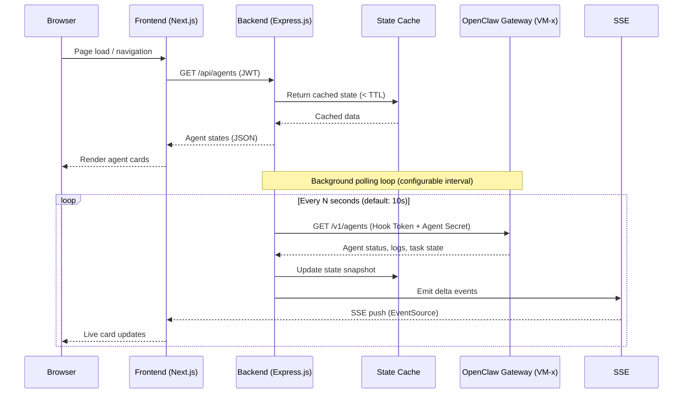

# GateForge Admin Portal — Feature Specification

**Document Status:** Draft  
**Version:** 0.2  
**Author:** the end-user (CTO / Project Lead)  
**Created:** 2026-04-07  
**Last Updated:** 2026-04-07  
**Reference Project:** [ClawDeck](https://github.com/tonylnng/clawdeck)

> **v0.2 Change Summary:** Extended from 8 original features to all 30 features across 6 categories. Added Sections 3.7–3.10 (Agent Decision Graph, Session Replay, Cost Tracker, Comparison Matrix), Sections 4.7–4.10 (Pipeline Run History, Analytics, YAML Preview upgrade, Task Lifecycle Tracker), Sections 6.7–6.11 (Iteration Manager, Dependency Map, Risk Register, Decision Timeline, Release Manager), Sections 7.7–7.8 (Defect Deep-Dive, SLO Forecasting), Section 8.7 (Deployment Diff & Rollback Viewer), Sections 9.6–9.9 (Troubleshooting Console, Cross-Agent Comms Audit, Root Cause Analyser, Blocker Chain Visualiser), Sections 5.6–5.7 (Blueprint Diff & Version Compare, Activity Feed & Audit Log), Section 16 (Project Health Score), Section 17 (Webhook & External Alerts), Section 18 (Implementation Priority Matrix). Sections 11 (Status), 12 (API), 14 (Navigation), and 15 (Future Enhancements) updated accordingly.

---

## Table of Contents

1. [Executive Summary](#1-executive-summary)
2. [Architecture Overview](#2-architecture-overview)
3. [Feature Specification — Agent Observability](#3-feature-specification--agent-observability)
   - 3.1 [Card Grid Layout](#31-card-grid-layout)
   - 3.2 [Agent Card Design](#32-agent-card-design)
   - 3.3 [Card Status Indicators](#33-card-status-indicators)
   - 3.4 [Agent Detail Modal / Page](#34-agent-detail-modal--page)
   - 3.5 [Multi-Agent VM Handling](#35-multi-agent-vm-handling)
   - 3.6 [Auto-Refresh](#36-auto-refresh)
   - 3.7 [Agent Decision Graph](#37-agent-decision-graph)
   - 3.8 [Agent Session Replay](#38-agent-session-replay)
   - 3.9 [Agent Cost Tracker](#39-agent-cost-tracker)
   - 3.10 [Agent Comparison Matrix](#310-agent-comparison-matrix)
4. [Feature Specification — Pipeline & Progress](#4-feature-specification--pipeline--progress)
   - 4.1 [Pipeline Diagram Layout](#41-pipeline-diagram-layout)
   - 4.2 [Phase Node Design](#42-phase-node-design)
   - 4.3 [Phase Detail Panel](#43-phase-detail-panel)
   - 4.4 [Phase Alignment Table](#44-lobster-pipeline--phase-alignment-table)
   - 4.5 [Pipeline History](#45-pipeline-history)
   - 4.6 [Lobster Pipeline YAML Preview](#46-lobster-pipeline-yaml-preview)
   - 4.7 [Pipeline Run History & Replay](#47-pipeline-run-history--replay)
   - 4.8 [Pipeline Analytics & Bottleneck Detection](#48-pipeline-analytics--bottleneck-detection)
   - 4.9 [Pipeline YAML Preview & Validation (Expanded)](#49-pipeline-yaml-preview--validation-expanded)
   - 4.10 [Task Lifecycle Tracker](#410-task-lifecycle-tracker)
5. [Feature Specification — Blueprint Explorer](#5-feature-specification--blueprint-explorer)
   - 5.1 [File Tree View](#51-file-tree-view)
   - 5.2 [Document Viewer](#52-document-viewer)
   - 5.3 [Document Status Badges](#53-document-status-badges)
   - 5.4 [Recent Changes Log](#54-recent-changes-log)
   - 5.5 [Decision Log Viewer](#55-decision-log-viewer)
   - 5.6 [Blueprint Diff & Version Compare](#56-blueprint-diff--version-compare)
   - 5.7 [Activity Feed & Audit Log](#57-activity-feed--audit-log)
6. [Feature Specification — Project Dashboard](#6-feature-specification--project-dashboard)
   - 6.1 [Project Health Summary](#61-project-health-summary)
   - 6.2 [Active Tasks Table](#62-active-tasks-table)
   - 6.3 [Backlog Overview](#63-backlog-overview)
   - 6.4 [Recently Completed Items](#64-recently-completed-items)
   - 6.5 [Open Blockers List](#65-open-blockers-list)
   - 6.6 [Iteration Progress](#66-iteration-progress)
   - 6.7 [Iteration Manager](#67-iteration-manager)
   - 6.8 [Dependency Map](#68-dependency-map)
   - 6.9 [Risk Register & Heat Map](#69-risk-register--heat-map)
   - 6.10 [Decision Timeline](#610-decision-timeline)
   - 6.11 [Release Manager](#611-release-manager)
7. [Feature Specification — QA Metrics Dashboard](#7-feature-specification--qa-metrics-dashboard)
   - 7.1 [Coverage Gauges](#71-coverage-gauges)
   - 7.2 [Quality Gate Status Cards](#72-quality-gate-status-cards)
   - 7.3 [Defect Summary](#73-defect-summary)
   - 7.4 [Test Automation Metrics](#74-test-automation-metrics)
   - 7.5 [Performance Baseline Comparison](#75-performance-baseline-comparison)
   - 7.6 [Security Vulnerability Summary](#76-security-vulnerability-summary)
   - 7.7 [Defect Deep-Dive & Trend Analysis](#77-defect-deep-dive--trend-analysis)
   - 7.8 [Gate History View](#78-gate-history-view)
8. [Feature Specification — Operations Dashboard](#8-feature-specification--operations-dashboard)
   - 8.1 [Deployment Status](#81-deployment-status)
   - 8.2 [SLO Compliance Gauges](#82-slo-compliance-gauges)
   - 8.3 [Error Budget Burn Rate](#83-error-budget-burn-rate-visualization)
   - 8.4 [Recent Deployment Log](#84-recent-deployment-log)
   - 8.5 [Incident Timeline](#85-incident-timeline)
   - 8.6 [Lobster Operator Workflow Status](#86-lobster-operator-workflow-status)
   - 8.7 [Deployment Diff & Rollback Viewer](#87-deployment-diff--rollback-viewer)
   - 8.8 [SLO Forecasting & Budget Projection](#88-slo-forecasting--budget-projection)
9. [Feature Specification — Notification Center & Troubleshooting](#9-feature-specification--notification-center--troubleshooting)
   - 9.1 [Notification Feed](#91-notification-feed)
   - 9.2 [Filter Bar](#92-filter-bar)
   - 9.3 [Notification Detail Modal](#93-notification-detail-modal)
   - 9.4 [Notification Statistics Panel](#94-notification-statistics-panel)
   - 9.5 [Real-Time Behaviour](#95-real-time-behaviour)
   - 9.6 [Troubleshooting Console](#96-troubleshooting-console)
   - 9.7 [Cross-Agent Communication Audit](#97-cross-agent-communication-audit)
   - 9.8 [Root Cause Analyser](#98-root-cause-analyser)
   - 9.9 [Blocker Chain Visualiser](#99-blocker-chain-visualiser)
10. [Feature Specification — Setup & Configuration Page](#10-feature-specification--setup--configuration-page)
11. [Status Alignment Reference](#11-status-alignment-reference)
12. [API Design](#12-api-design)
13. [Deployment Architecture](#13-deployment-architecture)
14. [Navigation & UI Structure](#14-navigation--ui-structure)
15. [Future Enhancements](#15-future-enhancements)
16. [Project Health Score](#16-project-health-score)
17. [Webhook & External Alerts](#17-webhook--external-alerts)
18. [Implementation Priority Matrix](#18-implementation-priority-matrix)
- [Appendix A: Repository Structure](#appendix-a-repository-structure)
- [Appendix B: Acceptance Criteria](#appendix-b-acceptance-criteria-key-features)

---

## 1. Executive Summary

### What Is the GateForge Admin Portal?

The GateForge Admin Portal is a purpose-built observability and transparency dashboard for the GateForge multi-agent SDLC pipeline. It provides the end-user (CTO / Project Lead) with a single-pane-of-glass view into all five VM-resident AI agent groups, their activities, SDLC pipeline progress, quality gate outcomes, and system health — all in real time.

The portal is **read-only by design**. It observes and reports; it never sends instructions to agents.

### Why Does It Exist?

GateForge operates as a fully autonomous multi-agent pipeline: five VM clusters run distinct specialised AI agents (System Architect, System Designer, Developers, QC Agents, and Operator), communicating through a tightly controlled hub-and-spoke topology. This architecture intentionally routes all human interaction through the System Architect (VM-1) via Telegram.

Without a monitoring layer, the end-user's only window into the pipeline is the System Architect's Telegram messages — a single-channel, summary-level view. The Admin Portal exposes the full picture:

- What every agent is doing right now
- Where the SDLC pipeline is in its journey through six phases
- Which quality gates have passed, which are blocked, and why
- Live notification feed from all VMs
- Historical logs, Blueprint documents, QA metrics, and operations data
- Deep agent debugging: decision graphs, session replay, cost tracking
- Project intelligence: bottleneck detection, root cause analysis, health scoring
- Governance: audit logs, risk registers, decision timelines, webhook alerts

### Key Design Principles

| Principle | Description |
|-----------|-------------|
| **Read-Only Observation** | The portal never issues commands or prompts to any agent. the end-user interacts with the pipeline exclusively via Telegram → System Architect. |
| **Hub-and-Spoke Alignment** | The portal mirrors the hub-and-spoke model. VM-1 (Architect) is prominently identified as the coordinator; all other VMs are spokes. |
| **Real-Time Transparency** | SSE-based live updates surface agent activity, notifications, and pipeline changes without manual refresh. |
| **Status Fidelity** | Every status value in the portal (task status, agent activity, gate decisions, priority levels) maps exactly to the GateForge canonical definitions. No invented states. |
| **ClawDeck-Derived Architecture** | The portal inherits ClawDeck's proven tech stack (Next.js 14, TypeScript, Tailwind CSS, shadcn/ui, Express.js, Docker Compose) and UI patterns (setup wizard, agent cards, SSE log streaming, dark/light mode). |
| **Clarity Over Density** | Each view is optimised for rapid situational awareness. the end-user should be able to determine overall system health within five seconds of opening any page. |
| **Drill-Down Depth** | From any dashboard card, The end-user can drill all the way down to an individual model response on a specific timestamp. |
| **Intelligence Over Raw Data** | Automated bottleneck detection, root cause analysis, SLO forecasting, and project health scoring transform raw data into actionable insights. |

### Feature Summary

The portal delivers 30 features across 6 categories:

| Category | Features | Version |
|----------|----------|---------|
| A. Agent Observability | Dashboard, Decision Graph, Session Replay, Cost Tracker, Comparison Matrix | v1.0 + v2.0 |
| B. Pipeline & Progress | Live View, Run History, Analytics, YAML Preview, Task Tracker | v1.0 + v1.5 |
| C. Project Management | Dashboard, Iterations, Releases, Dependencies, Risks, Decisions | v1.0 + v2.0 |
| D. Quality & Operations | QA Metrics, Operations, Defect Deep-Dive, Deployment Diff, SLO Forecast | v1.0 + v2.5 |
| E. Troubleshooting | Notifications, Console, Comms Audit, Root Cause, Blockers | v1.0 + v1.5/v2.0 |
| F. Knowledge & Config | Blueprint Explorer, Setup Wizard, Blueprint Diff, Audit Log, Health Score, Webhooks | v1.0 + v1.5 |

---

## 2. Architecture Overview

### System Architecture Diagram

```mermaid
graph TB
    subgraph the end-user["the end-user (CTO / Project Lead)"]
        Browser["Admin Portal Browser\n(Next.js 14 + shadcn/ui)"]
        Telegram["Telegram Client"]
    end

    subgraph AdminPortal["GateForge Admin Portal (Docker Compose)"]
        FE["Frontend\nNext.js 14 + TypeScript\nTailwind CSS + shadcn/ui\n:3000"]
        BE["Backend\nExpress.js + TypeScript\n:3001"]
        Cache["In-Memory Cache\n(per-VM state snapshots)"]
        SSE["SSE Event Bus\n(real-time push)"]
    end

    subgraph GateForgeNetwork["GateForge Network (192.168.72.x)"]
        subgraph VM1["VM-1 — System Architect\n192.168.72.10:18789\nClaude Opus 4.6"]
            GW1["OpenClaw Gateway"]
            A1["Architect Agent"]
        end
        subgraph VM2["VM-2 — System Designer\n192.168.72.11:18789\nClaude Sonnet 4.6"]
            GW2["OpenClaw Gateway"]
            A2["Designer Agent"]
        end
        subgraph VM3["VM-3 — Developers\n192.168.72.12:18789\nClaude Sonnet 4.6"]
            GW3["OpenClaw Gateway"]
            A3a["dev-01"]
            A3b["dev-02..dev-N"]
        end
        subgraph VM4["VM-4 — QC Agents\n192.168.72.13:18789\nMiniMax 2.7"]
            GW4["OpenClaw Gateway"]
            A4a["qc-01"]
            A4b["qc-02..qc-N"]
        end
        subgraph VM5["VM-5 — Operator\n192.168.72.14:18789\nMiniMax 2.7"]
            GW5["OpenClaw Gateway"]
            A5["Operator Agent"]
        end
    end

    subgraph USDeployment["US VM (Deployment Target)"]
        Dev["Dev Environment"]
        UAT["UAT Environment"]
        Prod["Production Environment"]
    end

    subgraph Blueprint["Blueprint Git Repository"]
        GitRepo["Git Repo\n(requirements/, architecture/,\ndesign/, development/,\nqa/, operations/, project/)"]
    end

    Browser <-->|"HTTPS + JWT"| FE
    FE <-->|"HTTP + JWT"| BE
    BE <-->|"SSE"| SSE
    SSE -->|"push events"| FE

    BE <-->|"READ ONLY\nHTTP GET + Hook Token\n+ Agent Secret"| GW1
    BE <-->|"READ ONLY\nHTTP GET + Hook Token\n+ Agent Secret"| GW2
    BE <-->|"READ ONLY\nHTTP GET + Hook Token\n+ Agent Secret"| GW3
    BE <-->|"READ ONLY\nHTTP GET + Hook Token\n+ Agent Secret"| GW4
    BE <-->|"READ ONLY\nHTTP GET + Hook Token\n+ Agent Secret"| GW5

    BE <-->|"SSH / HTTPS READ ONLY"| GitRepo
    BE <-->|"Tailscale SSH\nhealth probe only"| USDeployment

    Telegram <-->|"Telegram Bot API"| A1

    style AdminPortal fill:#1e3a5f,color:#fff
    style GateForgeNetwork fill:#1a2e1a,color:#fff
    style the end-user fill:#2d1b4e,color:#fff
    style USDeployment fill:#3d2200,color:#fff
    style Blueprint fill:#3a2200,color:#fff
```

### Data Flow: Portal → VM Gateway → Agent Data



### Tech Stack

| Layer | Technology | Source |
|-------|-----------|--------|
| Frontend framework | Next.js 14 (App Router) | ClawDeck |
| Language | TypeScript (strict) | ClawDeck |
| Styling | Tailwind CSS v3 | ClawDeck |
| UI components | shadcn/ui | ClawDeck |
| Backend framework | Express.js + TypeScript | ClawDeck |
| Real-time transport | Server-Sent Events (SSE) | ClawDeck |
| Authentication | JWT (HttpOnly cookies) + bcrypt | ClawDeck |
| Deployment | Docker Compose | ClawDeck |
| Git integration | isomorphic-git / simple-git | New |
| Markdown rendering | react-markdown + remark-gfm | ClawDeck (adapted) |
| Charts / gauges | Recharts or Tremor | New |
| Pipeline visualisation | React Flow (read-only) | New |
| Graph visualisation | React Flow / D3.js (decision graph, dependency map) | New |
| YAML syntax highlighting | Monaco Editor (read-only) | New |
| Notifications | Native SSE event bus | New |

### Read-Only Principle

The portal backend exclusively uses HTTP `GET` requests and read-only Git operations against all external systems. It holds no write credentials for any OpenClaw agent. The two-layer auth (Hook Token + Agent Secret) used to query gateway endpoints is stored server-side only and never exposed to the browser.

> **Enforcement**: The backend has no route that proxies `POST /hooks/agent`, `POST /v1/chat/completions`, `POST /v1/responses`, or any write endpoint. Any attempt to add such a route must be rejected in code review as a design violation.

---

## 3. Feature Specification — Agent Observability

### Overview

The Agent Observability section covers all features related to understanding individual agent behaviour: the real-time dashboard card grid, deep session debugging tools, cost tracking, and cross-agent performance comparison.

### 3.1 Card Grid Layout

- **Grid columns**: 1 (mobile) → 2 (tablet) → 3 (desktop ≥1280px)
- **Card order** (fixed, reflects architecture priority):
  1. VM-1: Architect (always first, hub)
  2. VM-2: Designer
  3. VM-3: dev-01, dev-02 … dev-N (dynamic, one card per sub-agent)
  4. VM-4: qc-01, qc-02 … qc-N (dynamic, one card per sub-agent)
  5. VM-5: Operator
- VM-3 and VM-4 cards are grouped under a labelled section header ("Developers" / "QC Agents") with a collapsible toggle
- VM-1 Architect card is visually distinguished (wider border, hub badge)

**Read-Only Banner:**

```
┌─────────────────────────────────────────────────────────────────────┐
│  👁  OBSERVATION ONLY — This portal is read-only. Interact with     │
│      the pipeline via Telegram → System Architect (VM-1).           │
└─────────────────────────────────────────────────────────────────────┘
```

Banner is sticky at the top of the Agent Dashboard and dismissible per session (not per page refresh).

---

### 3.2 Agent Card Design

Each card contains the following fields, rendered in a fixed layout:

```
┌──────────────────────────────────────────────────────┐
│  [HUB] VM-1 · System Architect          [● WORKING]  │
│  Claude Opus 4.6                 [CRITICAL] ⚠        │
│──────────────────────────────────────────────────────│
│  Task: FEAT-042 · Resolve module boundary dispute    │
│──────────────────────────────────────────────────────│
│  Latest AI Output:                                   │
│  "...the proposed split between auth-service and     │
│   user-service introduces a circular dependency.     │
│   Recommend consolidating the user-token model..."   │
│──────────────────────────────────────────────────────│
│  Last activity: 23 seconds ago           [→ Details] │
└──────────────────────────────────────────────────────┘
```

#### Card Fields Reference

| Field | Description | Data Source |
|-------|-------------|-------------|
| **VM Identifier** | VM-1 through VM-5 (plus sub-ID for dev-NN / qc-NN) | Config |
| **Role Name** | System Architect / System Designer / Developer / QC Agent / Operator | Config |
| **Hub Badge** | Shown only on VM-1 card | Config |
| **AI Model Name** | Claude Opus 4.6 / Claude Sonnet 4.6 / MiniMax 2.7 | Config / Gateway |
| **Status Indicator** | Color dot + label (see 3.3) | Gateway poll |
| **Notification Priority Badge** | Highest active notification for this agent | Notification feed |
| **Current Task ID + Title** | FEAT-NNN / BUG-NNN / TASK-NNN / SPIKE-NNN | Gateway / Git |
| **Latest AI Output Snippet** | Last 3–4 lines of the most recent model response, truncated at 280 chars with "…" | Gateway |
| **Time Since Last Activity** | Relative timestamp (e.g. "23 seconds ago"), updated live | Gateway |
| **Details Link** | Opens Agent Detail modal/page | Portal navigation |

---

### 3.3 Card Status Indicators

| Status | Color | Dot Animation | Label | Trigger Condition |
|--------|-------|--------------|-------|-------------------|
| **active / working** | Green `#22c55e` | Pulsing ring (CSS `ping`) | WORKING | Agent has active conversation turn in progress |
| **idle** | Blue-gray `#94a3b8` | Static | IDLE | Agent connected, no active turn, awaiting task |
| **blocked** | Orange `#f97316` | Slow blink | BLOCKED | Agent sent `[BLOCKED]` notification or task status = blocked |
| **error** | Red `#ef4444` | Fast blink | ERROR | Gateway returned error, agent process crash detected |
| **offline** | Gray `#6b7280` | Static (hollow) | OFFLINE | Gateway unreachable or connection timeout |

Status dot uses a 12 × 12px circle. The pulsing animation for WORKING uses Tailwind's `animate-ping` class on an absolute overlay ring. The BLOCKED slow blink uses a custom `animate-pulse` variant at 1s interval. ERROR uses `animate-pulse` at 0.5s interval.

#### Notification Priority Badge

Shown in the top-right of the card when any active (unacknowledged) notification exists:

| Priority | Badge Color | Icon |
|----------|-------------|------|
| CRITICAL | Red `#dc2626` | ⚠ |
| BLOCKED | Orange `#ea580c` | ⛔ |
| DISPUTE | Yellow `#ca8a04` | ⚡ |
| COMPLETED | Green `#16a34a` | ✓ |
| INFO | Gray `#6b7280` | ℹ |

Only the highest priority active badge is shown on the card. Full list visible in Notification Center.

---

### 3.4 Agent Detail Modal / Page

Triggered by clicking any agent card (or "Details →" link). Opens as a full-screen modal on desktop; a dedicated page on mobile.

#### Tabs

**Tab 1: Conversation History**

- Full chronological list of all AI model interactions for this agent
- Each entry shows:
  - Timestamp
  - Role (system / user / assistant)
  - Full message content with Markdown rendering
  - Token count (input + output, if available from gateway)
  - Model version used
- Infinite scroll or pagination (50 messages per page)
- Copy-to-clipboard button per message
- Search / filter by keyword within this agent's history

**Tab 2: Task History**

- Table of all tasks assigned to this agent (current + historical)
- Columns: Task ID | Title | Status | Priority | Started | Completed | Phase
- Status chip uses canonical status colors (see Section 11)
- Click task row → Blueprint Explorer filtered to that task's documents

**Tab 3: Agent Tools**

- Read-only list of tools registered to this agent in OpenClaw
- Tool name, description, enabled/disabled state
- No toggle control (read-only)

**Tab 4: Performance Metrics**

- Avg response time (ms) — last 24h, 7d, 30d sparklines
- Total tokens used — input / output breakdown
- Tokens per hour trend chart
- Error rate (failed turns / total turns)
- Gateway connection uptime %

**Tab 5: Decision Graph** *(link to Section 3.7)*

- Shortcut button that opens the Agent Decision Graph (Section 3.7) filtered to the most recent session for this agent

**Tab 6: Session Replay** *(link to Section 3.8)*

- Shortcut button that opens Session Replay (Section 3.8) for the most recent session for this agent

---

### 3.5 Multi-Agent VM Handling

**VM-3 (Developers) and VM-4 (QC Agents)** may run multiple concurrent sub-agents.

- The portal queries the gateway per VM and discovers all agent instances
- Each sub-agent (`dev-01`, `dev-02`, …`dev-N`) receives its own card
- Cards within VM-3 and VM-4 sections are collapsible into a compact list view (toggle between "Cards" and "List" views)
- Sub-agent IDs are displayed as `dev-01@VM-3`, `qc-01@VM-4` in all detail views
- A VM-level aggregate badge shows the count of sub-agents per status: e.g., "3 working, 1 idle, 0 blocked"

---

### 3.6 Auto-Refresh

- Default polling interval: **10 seconds** (configurable in Settings: 5s / 10s / 30s / 60s / manual)
- SSE connection delivers delta events between full polls for near-instant status changes
- Refresh indicator: small spinner in the page header during active poll
- "Last refreshed: X seconds ago" counter visible in header
- Manual refresh button always available

---

### 3.7 Agent Decision Graph

**What it does:** Visualises the execution tree of a single agent session — not a linear log, but a branching graph showing how the agent reasoned, which tools it called, what data it received, and where it made decisions.

**Why it matters:** When an agent produces an unexpected output, reading the raw conversation log is slow and linear. The decision graph shows the branching structure instantly — which tool calls fired, which returned errors, where the agent changed direction. This approach makes debugging agent behaviour significantly faster than reading raw logs.

**What it shows:**

- Tree-structured execution graph (not flat log) rendered using React Flow or D3.js
- Each node = a reasoning step, tool call, or model response
- Edges show data flow between steps
- Colour-coded by outcome:
  - Success: green `#16a34a`
  - Error: red `#dc2626`
  - Retry: orange `#ea580c`
  - Skipped: gray `#6b7280`
- Token count per node (input + output tokens displayed below node label)
- Latency per node (milliseconds)
- Expandable nodes: click any node → side panel shows full prompt/response content
- Node types distinguished by shape: circle = reasoning step, rectangle = tool call, diamond = decision point, hexagon = model response

**Example use case:** Dev-01 submitted code that failed QA. the end-user clicks dev-01 → Decision Graph → sees the agent called `git diff` (success), then `exec: npm test` (failed), then attempted a fix (re-edit), then `exec: npm test` again (still failed), then reported "blocked" to the Architect. The graph shows exactly where and why the loop stopped.

**Data source:** OpenClaw gateway session traces

**User interactions:**

- Session selector dropdown: pick any session from this agent's history
- Zoom / pan: standard React Flow canvas controls
- Node click: opens side panel with full content
- Export: download graph as PNG (read-only export)
- Layout toggle: top-down tree vs. left-right tree

**Integration with other features:**

- Accessible from Agent Detail Tab 5 (shortcut) and from the Agents > Decision Graph sub-page
- Nodes with errors link to the Troubleshooting Console (Section 9.6) for that specific error
- Root Cause Analyser (Section 9.8) can link directly to specific graph nodes as evidence

**Status values used:** Success (green), Error (red), Retry (orange), Skipped (gray) — these are graph-specific visual states, not canonical task statuses.

---

### 3.8 Agent Session Replay

**What it does:** A chronological playback of an agent's full session — step by step, with timestamps, model I/O, and tool calls rendered in sequence. Provides a "video playback" experience for agent activity.

**Why it matters:** Sometimes you need to understand not just what happened, but in what order and how long each step took. Session replay gives temporal context that the decision graph (Section 3.7) doesn't show explicitly.

**What it shows:**

- **Timeline scrubber**: horizontal bar with timestamps showing the full session duration
- **Step-by-step playback**: each step renders in order: prompt → model thinking → tool call → tool result → next prompt
- **Playback controls**:
  - Play / Pause button
  - Speed: 1×, 2×, 4×
  - Skip to next tool call
  - Skip to next error
  - Jump to "first error"
  - Jump to "longest step"
- **Step detail panel**: shows full content of the currently playing step (prompt, response, tool inputs/outputs)
- **Per-step overlay**: token count, latency, and cost for each step displayed in a stats strip
- **Session summary stats**: total steps, total tokens, total cost, total duration, error count

**Example use case:** QC-01 took 45 minutes on a task that should take 10. the end-user opens Session Replay → scrubs to the longest step → sees a retry loop where the agent tried the same test command 8 times with identical input. Root cause: flaky test environment.

**Data source:** OpenClaw gateway session logs (time-ordered)

**User interactions:**

- Session selector: pick any past session by timestamp or session ID
- Timeline scrubber: drag to any point in the session
- Step list sidebar: click any step to jump directly to it
- Export: export full session as JSON for offline analysis (read-only export)

**Integration with other features:**

- Accessible from Agent Detail Tab 6 (shortcut) and Agents > Session Replay sub-page
- Shares session data source with Agent Decision Graph (Section 3.7); switching between views maintains the same session context
- Longest step and error steps are automatically flagged for quick navigation

---

### 3.9 Agent Cost Tracker

**What it does:** Real-time and historical token usage and cost attribution per agent, per VM, per task, and per pipeline phase.

**Why it matters:** GateForge uses multiple AI models with different pricing (Claude Opus 4.6 is premium, MiniMax 2.7 is budget). Without cost visibility, token spend can grow invisibly — especially when agents retry or enter reasoning loops. Teams without cost instrumentation experience significant cost overruns.

**What it shows:**

**Cost Dashboard (top-level):**

| Panel | Content |
|-------|---------|
| Total cost today | Dollar amount + bar chart (today vs. 7-day average) |
| Total cost this week | Dollar amount + trend vs. previous week |
| Total cost this month | Dollar amount + trend vs. previous month |
| Cost by VM | Pie chart: VM-1 through VM-5 |
| Cost by model | Breakdown: Claude Opus 4.6 / Claude Sonnet 4.6 / MiniMax 2.7 |
| Cost by pipeline phase | Bar chart per phase |
| Top 10 most expensive tasks | Ranked list: task ID, title, total cost |

**Per-Agent Detail (drill-down per VM card):**

| Metric | Description |
|--------|-------------|
| Input tokens vs output tokens | Per-session breakdown |
| Average cost per task | Rolling 30-day average |
| Token efficiency trend | Tokens per useful output line (sparkline) |
| Retry cost | Tokens wasted on retries (highlighted in orange) |
| Cost timeline | Line chart: cost per day over last 30 days |

**Alerts:**

- Daily budget threshold: configurable (warn at $X/day), displayed as a progress bar
- Anomaly detection: agent suddenly using 5× normal tokens — flagged with orange badge
- Runaway process alert: agent in reasoning loop > 30 minutes — escalated to CRITICAL notification

**Pricing table (configurable in Settings):**

| Model | Input (per 1M tokens) | Output (per 1M tokens) |
|-------|----------------------|----------------------|
| Claude Opus 4.6 | Configurable | Configurable |
| Claude Sonnet 4.6 | Configurable | Configurable |
| MiniMax 2.7 | Configurable | Configurable |

**Data source:** OpenClaw gateway API (token counts per response), configured pricing table

**User interactions:**

- Date range picker: custom date range for all cost views
- VM / agent selector: filter cost data to specific VM or agent
- Export: CSV export of cost data for billing reconciliation

**Integration with other features:**

- Project Health Score (Section 16) uses cost efficiency as one weighted dimension
- Webhook & External Alerts (Section 17) can trigger on daily budget threshold breach
- Agent Comparison Matrix (Section 3.10) uses cost-per-task data from this tracker

---

### 3.10 Agent Comparison Matrix

**What it does:** Side-by-side comparison of agent performance metrics across all agents or selected groups, enabling the end-user to identify which agents are most productive, which are struggling, and whether workload is balanced.

**Why it matters:** With multiple developers (dev-01…dev-N) and multiple QC agents (qc-01…qc-N), understanding relative performance is essential for workload balancing and quality management.

**What it shows:**

Comparison table (rows = agents, columns = metrics):

| Column | Description |
|--------|-------------|
| Agent ID | dev-01@VM-3, qc-01@VM-4, etc. |
| Tasks Completed | Count for current iteration |
| Avg Task Completion Time | Minutes/hours |
| Avg Tokens per Task | Rolling average |
| Cost per Task | Dollar amount |
| Error / Retry Rate | % of turns that resulted in error or retry |
| QA Pass Rate | For developers: % of submitted code that passed QA first time |
| Status | Current agent status |

- **Sortable** by any column (click column header)
- **Outlier highlighting**: top performer in each column highlighted green; underperformer highlighted red
- **Trend sparklines**: per-agent, per-metric, last 7 iterations (small inline chart)
- **Filter**: by VM, by role (developers only / QC only / all)
- **Iteration selector**: compare performance across different iterations

**Example use case:** Dev-01 completes tasks in 15 min average but 40% fail QA first time. Dev-02 takes 25 min but 90% pass first time. The end-user can see this instantly and decide whether speed or quality is the bottleneck.

**Data source:** Aggregated from gateway session data, Blueprint task history, and QA gate results

**User interactions:**

- Column selector: toggle which metrics are shown
- Iteration comparison: select two iterations to compare side-by-side
- Agent detail link: click any agent row → opens Agent Detail page (Section 3.4)

**Integration with other features:**

- Uses cost data from Agent Cost Tracker (Section 3.9)
- Uses task completion data from Task Lifecycle Tracker (Section 4.10)
- Uses QA pass rates from QA Metrics Dashboard (Section 7)

---

## 4. Feature Specification — Pipeline & Progress

### Overview

The Pipeline & Progress section covers all features related to the GateForge SDLC pipeline: the live six-phase visualisation, historical run analysis, bottleneck detection, YAML inspection, and per-task lifecycle tracking.

### 4.1 Pipeline Diagram Layout

```
┌──────────────────────────────────────────────────────────────────────────────────────────────────────┐
│  GateForge SDLC Pipeline — Iteration 3                                     [▶ History] [↻ Refresh]   │
├──────────────────────────────────────────────────────────────────────────────────────────────────────┤
│                                                                                                      │
│   ●─────────●─────────●══════════●─────────○─────────○                                              │
│   │  REQ    │  ARCH   │   DEV    │   QA    │  DEPLOY │  ITER  │                                     │
│   │ Phase 1 │ Phase 2 │ Phase 3  │ Phase 4 │ Phase 5 │ Phase 6│                                     │
│   │ ✓ Done  │ ✓ Done  │ ⟳ Active │ ○ Pend  │ ○ Pend  │ ○ Pend │                                     │
│   │ ✓ 12   │ ✓ 8    │ ✓ 6     │          │          │        │                                     │
│   │          │         │ ⟳ 4    │          │          │        │                                     │
│   │          │         │ ○ 7    │          │          │        │                                     │
│   └──────────┴─────────┴─────────┴──────────┴──────────┴────────┘                                   │
│                                                                                                      │
│   ══ = Currently active phase (glowing border animation)                                             │
│   ─  = Completed edge     ○ = Not yet started                                                       │
└──────────────────────────────────────────────────────────────────────────────────────────────────────┘
```

Implementation uses **React Flow** in read-only (non-interactive drag) mode with custom node components.

---

### 4.2 Phase Node Design

Each phase is rendered as a node with:

| Element | Details |
|---------|---------|
| **Phase number** | Large numeral (1–6) as background watermark |
| **Phase name** | Bold label |
| **Status badge** | Not Started / In Progress / Completed / Blocked |
| **Task counters** | ✓ passed · ⟳ working · ○ pending · ✗ blocked |
| **Active animation** | Glowing pulsing border (box-shadow keyframes) on the active phase node |
| **Click handler** | Expands phase detail panel (slide-in from right) |

#### Phase Status Visual States

| Status | Node Border | Fill | Label Color | Animation |
|--------|-------------|------|-------------|-----------|
| Not Started | Gray dashed | Light gray | Gray | None |
| In Progress | Blue solid 2px | White / dark | Blue | Pulsing glow |
| Completed | Green solid 2px | Light green tint | Green | None |
| Blocked | Red solid 2px | Light red tint | Red | Slow blink |

#### Connector Edges

- Completed → Completed: Solid green line
- Completed → In Progress: Solid blue line
- In Progress → Not Started: Dashed gray line
- Any → Blocked: Red dashed line

---

### 4.3 Phase Detail Panel

Slides in from the right when a phase node is clicked. Contains:

#### Task List Sub-Panel

| Column | Content |
|--------|---------|
| Task ID | FEAT-NNN / BUG-NNN / TASK-NNN / SPIKE-NNN |
| Title | Short description |
| Status | Chip: backlog / ready / in-progress / in-review / done / blocked |
| Priority | Chip: Critical (P0) / High (P1) / Medium (P2) / Low (P3) |
| Assigned Agent | e.g. dev-02@VM-3 |
| Points | Fibonacci estimate |
| MoSCoW | Must / Should / Could / Won't |

Sortable by Status and Priority. Filterable by agent, status, priority.

#### Quality Gate Sub-Panel

Shown for phases that have associated quality gates:

| Phase | Gate Name | Criteria |
|-------|-----------|----------|
| Phase 2 (Architecture) | **Design Gate** | Security assessment ✓/✗, Rollback strategy ✓/✗, Blueprint updated ✓/✗ |
| Phase 3 (Development) | **Code Gate** | Unit tests pass ✓/✗, Coding standards ✓/✗, JSDoc complete ✓/✗, No hardcoded secrets ✓/✗ |
| Phase 4 (QA) | **QA Gate** | Unit ≥ 95% ✓/✗, Integration ≥ 90% ✓/✗, E2E ≥ 85% ✓/✗, No P0/P1 defects ✓/✗ |
| Phase 5 (Deployment) | **Release Gate** | All QA gates pass ✓/✗, Deployment runbook ✓/✗, Rollback tested ✓/✗, Smoke tests ✓/✗ |

Each criterion shows a green ✓ or red ✗ with a timestamp of last evaluation.

#### Gate Decision Indicator (QA Phases)

Prominent card at the top of the gate sub-panel:

```
┌─────────────────────────────────────┐
│  QA Gate Decision                   │
│                                     │
│  ● PROMOTE  ○ HOLD  ○ ROLLBACK      │
│                                     │
│  Evaluated: 2026-04-07 14:22 HKT   │
│  By: qc-01@VM-4                     │
└─────────────────────────────────────┘
```

| Decision | Background | Description |
|----------|-----------|-------------|
| PROMOTE | Green | All gate criteria met — advance to next phase |
| HOLD | Orange | One or more criteria failing — fix & retest |
| ROLLBACK | Red | Critical regression — revert to previous known-good state |

---

### 4.4 Lobster Pipeline — Phase Alignment Table

| Phase # | Phase Name | GateForge Description | Primary Agent(s) | Quality Gate | Task Status in Phase |
|---------|-----------|----------------------|-----------------|-------------|---------------------|
| 1 | Requirements & Feasibility | the end-user → Telegram → Architect → Blueprint v0.1 | VM-1 (Architect) | — | ready, in-progress, done |
| 2 | Architecture & Infrastructure Design | Architect → Designer → Blueprint v0.2 | VM-1, VM-2 | Design Gate | in-progress, in-review, done |
| 3 | Development (Parallel) | Architect → Developers → Blueprint v0.3 | VM-3 (dev-01…dev-N) | Code Gate | in-progress, in-review, blocked, done |
| 4 | Quality Assurance (Parallel) | Architect → QC Agents → Blueprint v0.4 | VM-4 (qc-01…qc-N) | QA Gate | in-progress, in-review, blocked, done |
| 5 | Deployment & Release | Architect → Operator → US VM (Dev→UAT→Prod) | VM-5 (Operator) | Release Gate | in-progress, done |
| 6 | Iteration | Feedback → new requirements or hotfix | VM-1 (Architect) | — | backlog, ready |

---

### 4.5 Pipeline History

- Dropdown selector in the page header: "Iteration 1 / Iteration 2 / Iteration 3 (Current)"
- Historical iterations are read-only snapshots (captured from Git tags / project status docs)
- Phase states, gate outcomes, and task counts for past iterations are fully viewable
- "Compare Iterations" button opens Pipeline Run History & Replay (Section 4.7)

---

### 4.6 Lobster Pipeline YAML Preview

A collapsible panel at the bottom of the Pipeline View shows the raw Lobster YAML for the current active workflow:

- Rendered as syntax-highlighted YAML (read-only, no editor) using Monaco Editor in read-only mode
- Shows: steps, agent assignments, actions, inputs, `on_fail` / `on_pass` branches, resume tokens
- Retry counter visible per step (current retry / max 3)
- Human escalation flag shown if max retries reached
- "Open Full Viewer" link → opens full Pipeline YAML Preview & Validation page (Section 4.9)

---

### 4.7 Pipeline Run History & Replay

**What it does:** A log of all past pipeline runs (iterations) with the ability to inspect any historical run in full detail and compare runs side by side.

**Why it matters:** The live Pipeline View shows the current state. But the end-user needs to compare: "Was this iteration faster than the last one? Did we have more blockers this time? Which phase took longer?" History enables trend analysis and continuous improvement.

**What it shows:**

**Run List View:**

| Column | Content |
|--------|---------|
| Iteration # | Iteration identifier |
| Start Date | Iteration start timestamp |
| End Date | Completion timestamp (or "In Progress") |
| Duration | Total elapsed time |
| Outcome | Completed / Aborted / In Progress |
| Tasks Completed | Count |
| Blockers | Count of blocked tasks encountered |
| Quality Gate Summary | PROMOTE/HOLD/ROLLBACK per gate |
| Total Cost | Estimated AI cost for this run |

- **Filters**: by date range, outcome, project module
- **Search**: by iteration number or date

**Run Detail View (click any run):**

- Opens the Pipeline View frozen at that point in time
- Shows exactly how tasks progressed through each phase
- All phase nodes, task counts, and gate decisions reflect the historical state
- Labeled clearly: "ITERATION 2 — Historical View (Read-Only)"

**Run Comparison View (select 2 runs → "Compare"):**

Side-by-side layout:

| Metric | Iteration N | Iteration M | Delta |
|--------|-------------|-------------|-------|
| Total duration | X days | Y days | ±Z days |
| Phase 1 duration | X hours | Y hours | ±Z hours |
| Phase 2 duration | … | … | … |
| Phase 3 duration | … | … | … |
| Phase 4 duration | … | … | … |
| Phase 5 duration | … | … | … |
| Tasks completed | N | M | ±delta |
| Blocker count | N | M | ±delta |
| Gate pass rate | N% | M% | ±delta% |
| Total cost | $N | $M | ±$delta |

Bar chart: phase durations side by side (Recharts grouped bar chart).

**Data source:** Blueprint `project/iterations/` and `project/status.md` history; pipeline state snapshots stored by portal backend on each phase transition

**Integration with other features:**

- "Compare" button also available from Pipeline Live View header
- Pipeline Analytics (Section 4.8) uses run history as its primary data source
- Iteration Manager (Section 6.7) links to this view for each iteration's pipeline record

---

### 4.8 Pipeline Analytics & Bottleneck Detection

**What it does:** Automated analysis of pipeline performance identifying where time is spent, what causes delays, and which phases are bottlenecks.

**Why it matters:** Automated bottleneck detection makes issue identification proactive rather than reactive, enabling correction before problems compound.

**What it shows:**

**Phase Duration Analysis:**

- Average time per phase across all completed iterations (line chart with one line per phase)
- Current iteration phase durations vs. historical average (bar chart with reference lines)
- Bottleneck highlight: any phase that exceeded its historical average by > 50% is marked with a red "BOTTLENECK" badge

**Wait Time Analysis:**

| Metric | Description |
|--------|-------------|
| Queue time | Time tasks spend waiting between phases (agent idle, task pending) |
| Block time | Time tasks spend blocked waiting for another agent |
| Review time | Time tasks spend in-review vs. active-work |
| Cycle time | Task created → task completed (total elapsed) |
| Lead time | Requirement captured → production deployment |

**Throughput Metrics:**

| Metric | Description |
|--------|-------------|
| Velocity | Tasks completed per day (rolling 7-day average, trend line) |
| Pipeline cycle time | Requirement → production (current vs. historical) |
| Throughput trend | Recharts area chart over last 10 iterations |

**Predictive Alerts (displayed as amber warning cards):**

- "At current velocity, Phase 4 (QA) will take 3 more days" — based on remaining task count ÷ completion rate
- "Phase 3 has 2 blocked tasks — pipeline will stall if not resolved within 4 hours"
- "QA gate coverage at 87% — 8% below target, gate likely to HOLD"

**Data source:** Pipeline run history (Section 4.7), agent status data, Blueprint task history

**User interactions:**

- Date range selector for historical analysis
- Phase filter: focus analysis on specific phases
- Anomaly threshold: configurable sensitivity (50% / 100% / 200% above average = bottleneck)

**Integration with other features:**

- Bottleneck phases link directly to Phase Detail Panel (Section 4.3)
- Predictive alerts feed into Notification Center (Section 9.1) as `[INFO]` priority notifications
- Root Cause Analyser (Section 9.8) uses bottleneck data as context for root cause chains

---

### 4.9 Pipeline YAML Preview & Validation (Expanded)

**What it does:** View the Lobster Pipeline YAML definition in a structured, readable format with validation checks. Read-only in v1.0; editable in a future version.

**Why it matters:** The Lobster YAML defines the deterministic orchestration flow. the end-user should be able to see and validate it without reading raw YAML.

**What it shows:**

**YAML Source Viewer:**

- Full YAML content with syntax highlighting (Monaco Editor, read-only)
- Line numbers
- Collapsible sections (step-level folding)
- Copy to clipboard button

**Structured Preview:**

- Each step rendered as a vertical flow card:
  - Step number and name
  - Agent assignment
  - Action description
  - Input parameters
  - `on_pass` branch (blue arrow)
  - `on_fail` branch (red arrow)
  - Max retries counter
  - Resume token indicator
- Arrows between steps show the flow graph

**Validation Panel:**

| Check | Description |
|-------|-------------|
| Unreachable steps | Steps that no other step can reach |
| Missing on_fail handlers | Steps without error handling |
| Undefined agent references | Agent IDs referenced but not in VM registry |
| Circular dependencies | Steps that reference each other circularly |
| Retry limit consistency | Steps with non-standard retry counts flagged |

Each validation result shows: severity (Error / Warning), step name, description, suggested fix.

**Diff Viewer:**

- "Compare with previous version" button → side-by-side diff of current YAML vs. previous Git commit
- Additions in green, removals in red (standard diff coloring)

**Data source:** Blueprint repository (current YAML file), Git history for diff

**Integration with other features:**

- Inline YAML panel in Pipeline Live View (Section 4.6) links here for full view
- Validation errors can trigger `[INFO]` notifications to the Notification Center
- Blueprint Diff (Section 5.6) provides the diff backend used by YAML Diff Viewer

---

### 4.10 Task Lifecycle Tracker

**What it does:** A detailed timeline view for any single task, showing every state change from creation to completion across all agents and all systems.

**Why it matters:** When a task is delayed or blocked, the end-user needs to see the full history: who created it, who assigned it, when it started, when it was blocked, why, when it was unblocked, when QA picked it up, etc.

**What it shows (for a single task):**

Vertical timeline with events:

```
[2026-04-05 09:00]  Created           by Architect (from requirement REQ-007)
[2026-04-05 09:05]  Assigned          to dev-01@VM-3, priority P1
[2026-04-05 09:10]  → in-progress     dev-01 started work
[2026-04-05 11:30]  Commit            dev-01 pushed to feature/FEAT-014
[2026-04-05 11:35]  → in-review       Architect review requested
[2026-04-05 12:00]  → done            Architect approved
[2026-04-05 12:05]  QA Assigned       to qc-01@VM-4
[2026-04-05 12:10]  → in-progress     qc-01 running tests
[2026-04-05 14:00]  QA Result: HOLD   unit coverage 88% < 95% threshold
[2026-04-05 14:05]  Reassigned        to dev-01@VM-3 for fix
[2026-04-05 14:10]  → in-progress     dev-01 working on fix
[2026-04-05 15:00]  Commit            dev-01 pushed coverage fix
[2026-04-05 15:30]  QA Result: PROMOTE  unit coverage 96%
[2026-04-05 15:35]  Deployed to Dev   by operator@VM-5
[2026-04-06 10:00]  Deployed to UAT   by operator@VM-5
[2026-04-07 09:00]  Deployed to Prod  by operator@VM-5
```

Each event shows:
- Timestamp (absolute + relative to previous event)
- Actor (agent ID)
- Duration since previous event
- Event type (icon-coded: 🔀 status change, 📦 commit, 🔬 QA result, 🚀 deploy, ⛔ blocked)
- Related Git commit SHA (clickable → Blueprint file diff)
- Related notification ID (clickable → Notification Center)

**Task header summary card:**

| Field | Value |
|-------|-------|
| Task ID | FEAT-014 |
| Title | Auth module — JWT implementation |
| Module | auth-service |
| Priority | P1 (High) |
| MoSCoW | Must |
| Story Points | 8 |
| Total Duration | 46 hours |
| QA Cycles | 2 |
| Status | done |

**Data source:** Blueprint task documents, agent session data, Git commit history, QA reports, deployment logs

**User interactions:**

- Task search / selector: search by task ID or title
- Filter timeline: show only specific event types (status changes only, commits only, QA results only)
- Export: CSV export of full task timeline

**Integration with other features:**

- Accessible from Project Dashboard task table (click any task row → "View Lifecycle")
- Accessible from Dependency Map (Section 6.8) node click
- Accessible from Blocker Chain Visualiser (Section 9.9) for blocked tasks
- Linked from QA Metrics Dashboard defect table for QA-related events

---

## 5. Feature Specification — Blueprint Explorer

### Overview

The Blueprint Explorer provides a read-only file tree and Markdown viewer for the Blueprint Git repository — the canonical source of truth for all GateForge project documents.

### 5.1 File Tree View

```
Blueprint Repository
├── requirements/
│   ├── user-requirements.md          [Approved] ✓
│   ├── functional-requirements.md    [Approved] ✓
│   └── non-functional-requirements.md [In Review] ◐
├── architecture/
│   ├── technical-architecture.md     [Approved] ✓
│   ├── data-model.md                 [Approved] ✓
│   └── api-specs.md                  [In Review] ◐
├── design/
│   ├── infrastructure-design.md      [Draft] ◯
│   ├── security-design.md            [Draft] ◯
│   ├── resilience-design.md          [Draft] ◯
│   ├── db-design.md                  [Draft] ◯
│   └── monitoring-design.md          [Draft] ◯
├── development/
│   ├── coding-standards.md           [Approved] ✓
│   └── module-documentation/
├── qa/
│   ├── test-plans/
│   ├── test-cases/
│   ├── reports/
│   ├── defects/
│   └── metrics/
├── operations/
│   ├── deployment-runbook.md         [Draft] ◯
│   ├── incident-reports/
│   └── sla-slo-tracking.md           [Draft] ◯
└── project/
    ├── backlog.md                     [Approved] ✓
    ├── iterations/
    ├── releases/
    ├── decision-log.md               [Approved] ✓
    └── status.md                     [Approved] ✓
```

- Tree is loaded from the configured Git repo via `git clone --depth 1` or Git API
- Folders are collapsible/expandable
- Search bar filters the tree by filename or path
- Document status badges shown inline (see Section 11)

### 5.2 Document Viewer

Clicking any file opens it in a split-pane view (tree left, content right):

- Full Markdown rendering (react-markdown + remark-gfm + rehype-highlight)
- Frontmatter metadata displayed as a summary card at the top (status, version, author, last updated)
- Table of contents sidebar (auto-generated from headings)
- "Raw" tab to view unrendered Markdown
- Copy link to document button
- View on Git button (links to Git hosting URL)

### 5.3 Document Status Badges

| Status | Badge | Color | Meaning |
|--------|-------|-------|---------|
| Draft | ◯ DRAFT | Gray | Work in progress, not ready for review |
| In Review | ◐ IN REVIEW | Blue | Submitted for peer/stakeholder review |
| Approved | ✓ APPROVED | Green | Signed off, canonical version |
| Deprecated | ⊗ DEPRECATED | Red | Superseded, no longer active |

### 5.4 Recent Changes Log

Sidebar panel (toggleable) showing the last 50 Git commits:

| Column | Content |
|--------|---------|
| Timestamp | Relative (e.g. "2 hours ago") |
| Author / Agent | Commit author prefixed with agent ID (e.g. `architect: Updated Blueprint v0.2`) |
| Message | Commit message (first line) |
| Files Changed | Count of files in this commit |
| Link | Click to see diff (read-only diff viewer) |

### 5.5 Decision Log Viewer

Dedicated sub-view within Blueprint Explorer filtered to `project/decision-log.md` and any ADR files in `project/decisions/`:

- Each ADR rendered as an expandable card
- Fields: Decision ID, Title, Status (Proposed/Accepted/Deprecated/Superseded), Date, Context, Decision, Consequences, Alternatives Considered
- Filter by status and date range

---

### 5.6 Blueprint Diff & Version Compare

**What it does:** Compare any two versions of any Blueprint document side-by-side, with full author attribution and approval status tracking.

**Why it matters:** The Blueprint is a living document updated by multiple agents. Understanding what changed, when, and by whom is essential for governance and audit.

**What it shows:**

**Version Selector:**

- Pick two commits by: commit SHA, date, or tag (e.g. "Iteration 2 baseline")
- Relative shortcuts: "Current vs. Previous", "Current vs. Last iteration start", "Last two commits"

**Side-by-side Diff View:**

- Split pane: left = older version, right = newer version
- Line-level diff highlighting: additions in green, removals in red, unchanged in gray
- Toggle between: unified diff (single pane, ±lines) and split diff (two panes)
- Syntax highlighting preserved in both panes

**Change Summary Panel:**

| Metric | Value |
|--------|-------|
| Lines added | N |
| Lines removed | N |
| Lines modified | N |
| Sections changed | List of heading-level sections with changes |
| Net change | +N / -N lines |

**Author Attribution:**

- Each changed line shows: Git commit author, timestamp, commit message
- Author labeled with agent ID (e.g. `architect@VM-1`, `designer@VM-2`)
- Click any line → shows full commit details

**Approval Status:**

- Was the newer version reviewed? Shows: Pending Review / Approved / Auto-committed
- Approval agent ID and timestamp if approved

**Data source:** Blueprint Git repository diff operations

**User interactions:**

- File selector: choose which file to compare (or compare full repo changes between two commits)
- Download: export diff as unified diff file
- "View full file at this version" button per side

**Integration with other features:**

- Recent Changes Log (Section 5.4) "See diff" links open this view
- Activity Feed (Section 5.7) commit entries link here
- Decision Timeline (Section 6.10) links to relevant Blueprint diffs as supporting evidence

---

### 5.7 Activity Feed & Audit Log

**What it does:** A comprehensive, immutable audit log of everything that happens in GateForge — every agent action, every status change, every deployment, every gate decision. This is the single source of truth for what happened and when.

**Why it matters:** For enterprise and regulated environments, complete decision logging with chain-of-custody tracking across all agents is essential. Immutable audit records cannot be modified after creation.

**What it shows:**

**Unified Activity Feed:**

Reverse-chronological stream of all system events:

| Event Category | Event Types |
|----------------|-------------|
| Agent events | Started / Stopped / Status changed (working→idle→blocked) |
| Task events | Created / Assigned / Status changed / Points updated |
| Pipeline events | Phase started / Phase completed / Gate evaluated / Gate decision |
| Deployment events | Deploy initiated / Deploy completed / Rollback initiated / Rollback completed |
| Notification events | Notification dispatched / Priority / Source VM |
| Blueprint events | Document created / Document updated / Document approved |
| Configuration events | Setting changed / VM registered / API key updated |
| Auth events | Login / Logout / Failed login attempt |

Each event entry shows:

```
[2026-04-07 14:22:01]  TASK_STATUS_CHANGED   FEAT-014: in-review → done
                       Actor: architect@VM-1
                       Context: Architect approved FEAT-014 implementation
                       Related: commit a3f9c2b | notification N-0542
```

**Filters:**

- By event category (multi-select checkboxes)
- By actor VM (VM-1 through VM-5)
- By agent ID
- By date range (date picker)
- By severity (Info / Warning / Critical)
- Free-text search across event messages

**Export:**

- CSV export: filtered results → downloadable CSV file
- JSON export: structured event data for programmatic processing
- PDF report: formatted audit report with date range header

**Retention Configuration (in Settings):**

- Configurable retention period: 30 / 90 / 180 / 365 days
- Older events archived (not deleted) to a compressed file

**Data source:** All portal data sources (gateway events, Git commits, deployment logs, configuration changes). Events are written to the audit log by the portal backend as they are received; the log is append-only.

**User interactions:**

- Filter controls: sidebar with all filter options
- Pagination: 100 events per page (configurable)
- Event detail modal: click any event → expands full payload and related context
- Export: date-range and filter-aware export

**Integration with other features:**

- Every feature in this spec produces audit log entries
- Cross-Agent Communication Audit (Section 9.7) uses this log filtered to inter-agent message events
- Decision Timeline (Section 6.10) uses this log filtered to architectural and gate-decision events
- Webhook & External Alerts (Section 17) can push specific audit events to external channels

---

## 6. Feature Specification — Project Dashboard

### Overview

The Project Dashboard mirrors the content of `project/status.md` and `project/backlog.md`, giving the end-user a high-level health view of the current project iteration.

### 6.1 Project Health Summary

Six health dimension cards arranged in a 2 × 3 grid (or 3 × 2 on wide screens):

| Dimension | Indicator Values | Color |
|-----------|----------------|-------|
| Current Phase | Phase name + number | Phase color |
| Overall Status | Green / Yellow / Red | As defined |
| Schedule | On Track / At Risk / Behind | Green / Yellow / Red |
| Budget | On Track / At Risk / Overspend | Green / Yellow / Red |
| Quality | Passing / Warning / Failing | Green / Yellow / Red |
| Team | All Active / Some Blocked / Critical Block | Green / Yellow / Red |

Each card shows:
- Dimension name
- Current value (large, prominent)
- Color indicator (background tint + colored left border)
- Last updated timestamp
- Brief note/reason (from status.md)

**Project Health Color System:**

| Status | Color Hex | Usage |
|--------|-----------|-------|
| Green (on track) | `#16a34a` | All thresholds met |
| Yellow (at risk) | `#ca8a04` | One or more thresholds at risk |
| Red (blocked/behind) | `#dc2626` | Critical blocker or missed threshold |

### 6.2 Active Tasks Table

Full-width filterable/sortable table of all active tasks (status ≠ done, ≠ backlog):

| Column | Content |
|--------|---------|
| Task ID | FEAT-NNN, BUG-NNN, TASK-NNN, SPIKE-NNN — linked to Blueprint Explorer |
| Title | Short description |
| Module | e.g. auth-service, user-service |
| Status | Chip with canonical colors |
| Priority | Chip: Critical/High/Medium/Low |
| MoSCoW | Chip: Must/Should/Could/Won't |
| Assigned Agent | e.g. dev-01@VM-3 |
| Points | Fibonacci number |
| Phase | Current pipeline phase |
| Updated | Relative timestamp |

**Filter bar**: Filter by Module, Status, Assigned Agent, Priority, MoSCoW, Phase.  
**Sort**: By Priority (default), Status, Points, Updated.

### 6.3 Backlog Overview

Side-by-side panels:

**MoSCoW Breakdown (donut chart)**
- Must: N tasks (% of total)
- Should: N tasks
- Could: N tasks
- Won't: N tasks

**Status Breakdown (horizontal bar chart)**
- backlog → ready → in-progress → in-review → done → blocked

### 6.4 Recently Completed Items

Last 20 tasks with status = `done`, sorted by completion time descending:

| Field | Content |
|-------|---------|
| Task ID | Linked |
| Title | |
| Completed by | Agent ID |
| Completed at | Timestamp |
| Phase | Pipeline phase |
| Points | Delivered |

### 6.5 Open Blockers List

Dedicated panel for all tasks with status = `blocked`:

- Task ID, Title, Blocking reason (from task notes), Blocked agent, Time blocked
- Sorted by time blocked (longest first)
- Priority badge (P0 blockers highlighted in red)
- Link to related Notification Center entry if a `[BLOCKED]` notification exists
- "Investigate" button → opens Troubleshooting Console (Section 9.6) pre-loaded with this blocker

### 6.6 Iteration Progress

For the current iteration:

- **Burndown chart**: Points remaining vs. ideal line (Recharts line chart)
- **Velocity**: Points completed this iteration vs. previous iteration average
- **Iteration dates**: Start, planned end, days remaining
- **Commitment**: Total points committed, delivered, remaining
- **Goal**: Iteration goal statement (from iteration doc)

---

### 6.7 Iteration Manager

**What it does:** Dedicated view for managing and reviewing iterations (sprints), with planning, execution tracking, and retrospective data.

**What it shows:**

**Iteration List Panel:**

| Column | Content |
|--------|---------|
| Iteration # | Sequential number |
| Dates | Start → End |
| Status | Planned / Active / Completed |
| Velocity | Story points completed |
| Tasks | Committed / Completed / Carried over |
| QA Gate Pass Rate | % |
| Total Cost | Estimated AI cost |

**Active Iteration Detail:**

- **Scope panel**:
  - Tasks committed at iteration start
  - Tasks completed (green)
  - Tasks added mid-iteration (amber "scope creep" badge)
  - Tasks removed mid-iteration
- **Burndown chart** (Recharts line): points remaining per day vs. ideal burn line
- **Burnup chart** (Recharts line): points completed per day (cumulative)
- **Scope creep indicator**: % of tasks added after iteration start (highlighted in amber if > 10%)
- **Velocity trend**: last 5 iterations as sparkline bar chart

**Iteration Retrospective Data (for completed iterations):**

| Metric | Description |
|--------|-------------|
| Planned vs. actual points | Commitment accuracy |
| Unfinished tasks | Tasks carried over to next iteration |
| Blockers encountered | Count, average resolution time |
| Quality gate pass rate | This iteration vs. previous |
| Cost per story point | Efficiency metric |

**Data source:** Blueprint `project/iterations/` directory; pipeline run history (Section 4.7)

**User interactions:**

- Iteration selector: navigate between iterations
- "View pipeline" button: opens Pipeline Run History for this iteration
- "View retrospective" button: shows retrospective data panel

**Integration with other features:**

- Links to Pipeline Run History & Replay (Section 4.7) for each iteration
- Velocity data feeds into Pipeline Analytics (Section 4.8)
- Retrospective data informs Risk Register (Section 6.9) with pattern-based risk detection

---

### 6.8 Dependency Map

**What it does:** Visual graph of task and module dependencies, showing which tasks depend on others and where chains of dependency create risk.

**Why it matters:** In a multi-agent parallel development system, if FEAT-015 (User API) depends on FEAT-014 (Auth Module), and FEAT-014 is blocked, the end-user needs to see the downstream cascade immediately.

**What it shows:**

**Task-Level Dependency Graph:**

- Directed acyclic graph (DAG) rendered using React Flow
- Nodes = tasks (labelled with Task ID and short title)
- Edges = "depends on" relationships (directional arrows)
- Node colors by status:
  - Green: done
  - Blue: in-progress
  - Purple: in-review
  - Orange: blocked
  - Gray: pending/backlog
- **Critical path highlighted**: longest dependency chain shown with a thicker, amber border on all nodes and edges in the chain
- Blocked tasks: red pulsing border

**Module-Level View (toggle):**

- Aggregates task-level dependencies to module level
- Nodes = modules (e.g., "auth-service", "user-service", "api-gateway")
- Edges = "module A depends on module B"
- Simplifies the graph for high-level architecture review

**Interactions:**

- Zoom / pan: standard canvas controls
- Click any task node → opens Task Lifecycle Tracker (Section 4.10)
- Click any blocked node → "Investigate" button opens Troubleshooting Console (Section 9.6)
- Filter: show only tasks in current iteration / show all tasks
- Layout options: hierarchical top-down, force-directed, left-right

**Data source:** Blueprint `project/backlog.md` dependency fields; task metadata from Blueprint

**Integration with other features:**

- Blocked nodes link to Blocker Chain Visualiser (Section 9.9)
- Critical path nodes link to Task Lifecycle Tracker (Section 4.10)
- Risk Register (Section 6.9) auto-detects long critical paths as schedule risks

---

### 6.9 Risk Register & Heat Map

**What it does:** Maintains a risk register for the project and visualises risks on a probability × impact heat map. Combines manually-entered risks with auto-detected risks from pipeline data.

**What it shows:**

**Risk Register Table:**

| Column | Content |
|--------|---------|
| Risk ID | RISK-NNN |
| Description | Short description of the risk |
| Category | Quality / Schedule / Resource / Technical / Operational |
| Probability | Low / Medium / High |
| Impact | Low / Medium / High |
| Risk Score | Probability × Impact (1–9) |
| Mitigation | Planned mitigation action |
| Owner | Agent or role responsible |
| Status | Open / Mitigated / Escalated / Closed |
| Last Updated | Timestamp |

**Heat Map:**

3×3 grid (Probability on Y axis, Impact on X axis):

```
High   │  Medium  │   High   │ Critical │
Medium │   Low    │  Medium  │   High   │
Low    │   Low    │   Low    │  Medium  │
       └──────────┴──────────┴──────────┘
           Low       Medium      High
                     Impact
```

- Each cell shows count of risks in that category
- Click any cell → filters risk table to that category
- Risk dots plotted on the grid (hover for risk ID and description)

**Auto-Detected Risks (from pipeline data):**

| Trigger Condition | Risk Generated |
|-------------------|----------------|
| QA coverage below threshold for 3+ consecutive days | Quality risk: test coverage degradation |
| 2+ developers blocked simultaneously | Resource risk: developer bottleneck |
| No deployment to UAT in 5+ days | Schedule risk: deployment velocity low |
| SLO error budget at ≤ 30% | Operational risk: SLO breach imminent |
| Blocker unresolved for 24+ hours | Schedule risk: prolonged blocker |
| Scope creep > 15% in current iteration | Schedule risk: iteration over-commitment |

Auto-detected risks are labeled with a "Auto" badge and cannot be edited (only closed).

**Risk Trend:**

- Line chart: risks opened vs. risks closed over time (last 10 iterations)
- Net risk trend (total open risks over time)

**Data source:** Portal-managed risk register (stored in backend config), auto-detected from pipeline data

**Integration with other features:**

- Auto-detection uses data from: QA Metrics (Section 7), Pipeline Analytics (Section 4.8), Operations Dashboard (Section 8)
- Escalated risks generate `[CRITICAL]` or `[BLOCKED]` notifications in the Notification Center
- Webhook & External Alerts (Section 17) can trigger on new Critical risks

---

### 6.10 Decision Timeline

**What it does:** A chronological timeline of all architectural decisions, quality gate results, dispute resolutions, and project pivots. Provides an auditable history of every significant choice made in the project.

**What it shows:**

**Vertical Timeline:**

Each entry is a card with:

```
┌─────────────────────────────────────────────────────────┐
│  [ADR]  2026-04-05 14:30                                │
│  ADR-007: Redis chosen over Memcached for session cache │
│  Context: Performance tests showed Redis 40% faster     │
│  Decision: Use Redis 7.x for all session caching        │
│  Made by: architect@VM-1                                │
│  Affected: auth-service, user-service                   │
│  [View Blueprint diff]                                  │
└─────────────────────────────────────────────────────────┘
```

**Event Types (filterable):**

| Type | Icon | Description |
|------|------|-------------|
| ADR | 🏛 | Architecture Decision Records from `project/decisions/` |
| Quality Gate | 🔬 | PROMOTE / HOLD / ROLLBACK decisions |
| Dispute Resolution | ⚡ | Agent disagreements resolved by Architect |
| Scope Change | 📋 | Requirements added or removed mid-iteration |
| Blocker Resolution | ⛔→✓ | When a blocker was cleared and how |
| Deployment Decision | 🚀 | Go/no-go deployment decisions |

**Filters:**

- By event type (multi-select)
- By date range
- By agent involved
- By affected module

**Each entry shows:**

- Date and time
- Event type badge
- Decision/event title
- Rationale / context
- Who made the decision (agent ID)
- What was affected (task IDs, modules)
- Link to related Blueprint document or diff

**Data source:** Blueprint `project/decision-log.md`, Blueprint `project/decisions/` ADR directory, quality gate records, notification history

**Integration with other features:**

- Quality gate events sourced from QA Metrics Dashboard (Section 7)
- Dispute resolutions sourced from Notification Center (Section 9) `[DISPUTE]` entries
- Blueprint diffs linked from Blueprint Diff & Version Compare (Section 5.6)
- Activity Feed (Section 5.7) serves as the underlying event source

---

### 6.11 Release Manager

**What it does:** Tracks releases from planning through deployment, including release notes, changelog, and version comparisons.

**What it shows:**

**Release List:**

| Column | Content |
|--------|---------|
| Version | Semver (e.g. v1.4.0) |
| Release Date | Planned or actual |
| Status | Planned / Staging / Released / Rolled Back |
| Features | Count of features included |
| Bugs Fixed | Count of defects resolved |
| Quality Gate | Overall gate summary |
| Deployed By | Operator agent ID |

**Release Detail (click any release):**

- **Included features**: task IDs + titles (FEAT-NNN, linked to Blueprint Explorer)
- **Bugs fixed**: defect IDs + titles (BUG-NNN)
- **Breaking changes**: list of breaking API or behavior changes
- **Auto-generated release notes**: compiled from task descriptions and commit messages
- **Auto-generated changelog**: diff between this release and previous release
- **Deployment status per environment**:
  - Dev: ✓ deployed on [date] / ○ pending
  - UAT: ✓ deployed on [date] / ○ pending
  - Prod: ✓ deployed on [date] / ○ pending
- **Quality gate summary**: per-gate PROMOTE / HOLD / ROLLBACK results for this release

**Release Comparison (select 2 releases → "Compare"):**

Side-by-side view showing:
- Features added between releases
- Features removed or rolled back
- Bug fixes delta
- Test coverage delta
- Breaking changes introduced

**Data source:** Blueprint `project/releases/` directory, deployment logs, QA gate records

**Integration with other features:**

- Links to Deployment Diff & Rollback Viewer (Section 8.7) for each deployment
- Links to QA Gate History (Section 7.8) for gate results per release
- Auto-generated changelog uses Blueprint Diff (Section 5.6) as its backend

---

## 7. Feature Specification — QA Metrics Dashboard

### Overview

The QA Metrics Dashboard exposes all quality metrics tracked by GateForge's QA phase, sourced from Blueprint `qa/metrics/` documents and `qa/reports/`.

### 7.1 Coverage Gauges

Per module, three circular gauges (or progress arcs):

| Metric | Target Threshold | Color Logic |
|--------|----------------|-------------|
| Unit Test Coverage | ≥ 95% | Green ≥ 95%, Yellow 80–94%, Red < 80% |
| Integration Test Coverage | ≥ 90% | Green ≥ 90%, Yellow 75–89%, Red < 75% |
| E2E Test Coverage | ≥ 85% | Green ≥ 85%, Yellow 70–84%, Red < 70% |

Module selector dropdown allows switching between individual modules or "All Modules (aggregate)".

### 7.2 Quality Gate Status Cards

One card per module × phase combination where a gate applies:

```
┌─────────────────────────────────────┐
│  auth-service · QA Gate             │
│                                     │
│  ████████████░░░░  PROMOTE          │
│  Decision: 2026-04-07 14:22         │
│                                     │
│  Unit:        97.2% ✓               │
│  Integration: 91.4% ✓               │
│  E2E:         86.1% ✓               │
│  P0 Defects:  0     ✓               │
│  P1 Defects:  1     ✗  (blocking)   │
└─────────────────────────────────────┘
```

| Decision | Card Border | Badge Color |
|----------|------------|-------------|
| PROMOTE | Green | Green |
| HOLD | Orange | Orange |
| ROLLBACK | Red | Red |
| Pending | Gray | Gray |

### 7.3 Defect Summary

**Open Defects by Severity Table:**

| Severity | Open Count | Trend (7d) | Age (oldest) |
|----------|-----------|-----------|-------------|
| Critical (P0) | N | ↑/↓/→ | X days |
| Major (P1) | N | ↑/↓/→ | X days |
| Minor (P2) | N | ↑/↓/→ | X days |
| Cosmetic (P3) | N | ↑/↓/→ | X days |

**Defect Density Trend** (Recharts line chart, last 30 days): Defects per 1000 lines of code per module.

**Bug Escape Rate by Discovery Stage:**

| Discovery Stage | Count | % of Total |
|----------------|-------|-----------|
| Dev / QA (caught internally) | N | % |
| UAT (caught in staging) | N | % |
| Production (escaped) | N | % |

### 7.4 Test Automation Metrics

| Metric | Value | Target | Status |
|--------|-------|--------|--------|
| Automation Coverage | N% | 100% | ✓ / ✗ |
| Total Test Cases | N | — | — |
| Automated | N | — | — |
| Manual | N | — | — |
| Avg Execution Time | Ns | < 600s | ✓ / ✗ |
| Flaky Test Rate | N% | < 2% | ✓ / ✗ |

### 7.5 Performance Baseline Comparison

Line chart (Recharts): p95 latency per endpoint over the last 7 days, with a reference line at the 200ms SLO target.

Table:

| Endpoint | p95 Latency | Throughput (req/s) | Stress Test Status |
|----------|------------|---------------------|-------------------|
| GET /api/users | Xms | N | Pass / Fail |
| POST /api/auth | Xms | N | Pass / Fail |

### 7.6 Security Vulnerability Summary

**OWASP Top 10 Coverage Checklist:**

| OWASP Category | Covered | Test Result |
|----------------|---------|------------|
| A01: Broken Access Control | ✓ / ✗ | Pass / Fail / Not Tested |
| A02: Cryptographic Failures | ✓ / ✗ | — |
| A03: Injection | ✓ / ✗ | — |
| A04: Insecure Design | ✓ / ✗ | — |
| A05: Security Misconfiguration | ✓ / ✗ | — |
| A06: Vulnerable Components | ✓ / ✗ | — |
| A07: Auth Failures | ✓ / ✗ | — |
| A08: Software Data Integrity | ✓ / ✗ | — |
| A09: Security Logging | ✓ / ✗ | — |
| A10: SSRF | ✓ / ✗ | — |

**Snyk Dependency Scan Summary:**

| Severity | Count | Fixed | Action Required |
|----------|-------|-------|----------------|
| Critical | N | N | Yes / No |
| High | N | N | Yes / No |
| Medium | N | N | — |
| Low | N | N | — |

---

### 7.7 Defect Deep-Dive & Trend Analysis

**What it does:** Extended defect analytics beyond the basic summary in the QA dashboard. Enables the end-user to understand defect patterns, root causes, and relationships between code quality and defect density.

**What it shows:**

**Defect Lifecycle View:**

For each defect, a timeline card showing:
- Reported: timestamp + reporter (agent or the end-user)
- Assigned: timestamp + assignee
- In-progress: start timestamp
- Fixed: commit SHA + agent
- Verified: QC agent ID + timestamp
- Closed: final timestamp
- **Total time open**: duration from reported to closed

**Defect Aging Analysis:**

| Severity | Open Count | Avg Age | Max Age | > 7 Days | > 30 Days |
|----------|-----------|---------|---------|----------|-----------|
| Critical (P0) | N | X days | Y days | N | N |
| Major (P1) | N | X days | Y days | N | N |
| Minor (P2) | N | X days | Y days | N | N |
| Cosmetic (P3) | N | X days | Y days | N | N |

Old-age defects (> configured threshold) highlighted in amber/red.

**Defect Heat Map:**

Matrix grid: modules (rows) × severity (columns):

|  | P0 | P1 | P2 | P3 | Total |
|--|----|----|----|----|-------|
| auth-service | N | N | N | N | N |
| user-service | N | N | N | N | N |
| api-gateway | N | N | N | N | N |

Cell background intensity = defect density (darker = more defects). Click any cell → filtered defect list.

**Bug Escape Rate Analysis:**

- Funnel chart: total defects → caught in dev/QA → caught in UAT → escaped to production
- Bug escape rate trend over last 10 iterations (line chart)
- Cost of escaped bugs vs. cost of internal QA (estimate based on fix time)

**Defect Root Cause Categories:**

Donut chart with categories:
- Code logic error
- Missing requirement
- Integration issue
- Environment issue
- Test gap (not covered by tests)
- Specification ambiguity

Click any segment → filtered defect list for that root cause.

**Correlation Analysis:**

Two scatter charts:
1. Defect density vs. code complexity (per module)
2. Defect density vs. test coverage (per module)

Correlation coefficient shown. Modules below the regression line labeled as "better than expected"; above the line as "worse than expected".

**Data source:** Blueprint `qa/defects/` directory, QA reports

**Integration with other features:**

- Defect lifecycle links to Task Lifecycle Tracker (Section 4.10) for the defect fix task
- Heat map modules link to Blueprint Explorer (Section 5) for that module's docs
- Root cause data informs Root Cause Analyser (Section 9.8) heuristics

---

### 7.8 Gate History View

**What it does:** A historical record of all quality gate evaluations — every PROMOTE, HOLD, and ROLLBACK decision across all modules and all iterations.

**What it shows:**

**Gate History Table:**

| Column | Content |
|--------|---------|
| Gate ID | Sequential identifier |
| Gate Type | Design Gate / Code Gate / QA Gate / Release Gate |
| Module | Affected module |
| Decision | PROMOTE / HOLD / ROLLBACK |
| Decision Time | Timestamp |
| Evaluated By | Agent ID (qc-NN@VM-4) |
| Iteration | Which iteration |
| Coverage at Decision | Unit / Integration / E2E % |
| Defects at Decision | P0 / P1 count |

**Gate Performance Summary:**

- Total evaluations: N
- PROMOTE rate: N% (green gauge)
- HOLD rate: N% (orange gauge)
- ROLLBACK rate: N% (red gauge)
- Average evaluations per module to reach PROMOTE: N

**Trend Over Iterations:**

Line chart: PROMOTE rate per gate type per iteration. Healthy systems trend toward higher PROMOTE rates over time.

**Data source:** QA reports in Blueprint `qa/reports/`, historical snapshots

**Integration with other features:**

- Gate decisions linked to Decision Timeline (Section 6.10)
- ROLLBACK events linked to Deployment Diff & Rollback Viewer (Section 8.7)
- HOLD decisions linked to Defect Deep-Dive (Section 7.7)

---

## 8. Feature Specification — Operations Dashboard

### Overview

The Operations Dashboard provides the end-user with live visibility into the deployment target (US VM), environment health, SLO compliance, and operational incidents.

### 8.1 Deployment Status

Three environment cards: **Dev**, **UAT**, **Production**

Each card shows:

```
┌─────────────────────────────────┐
│  🟢 Production                  │
│  Last deploy: 2026-04-06 09:15  │
│  Version: v1.4.2 (commit a3f9c) │
│  Health: Healthy                │
│  Uptime: 99.97% (30d)           │
│  Deployed by: operator@VM-5     │
└─────────────────────────────────┘
```

| Health State | Color | Description |
|-------------|-------|-------------|
| Healthy | Green | All probes passing |
| Degraded | Yellow | Some probes failing, service partially available |
| Down | Red | Service unavailable |
| Unknown | Gray | Probe unreachable |

**US VM Connectivity Status** (top-of-page banner):
- Tailscale SSH reachability indicator (green/red)
- Last successful probe timestamp
- Round-trip latency

### 8.2 SLO Compliance Gauges

Three circular gauge charts:

| SLO | Target | Critical Threshold |
|-----|--------|-------------------|
| API Availability | ≥ 99.9% | < 99.5% = Red |
| API p95 Latency | ≤ 200ms | > 300ms = Red |
| Error Rate | ≤ 0.1% | > 0.5% = Red |
| DB Availability | ≥ 99.95% | < 99.5% = Red |
| DB Query p95 | ≤ 50ms | > 100ms = Red |

Color logic: Green (on target), Yellow (within 20% of threshold), Red (threshold breached).

### 8.3 Error Budget Burn Rate Visualization

**Burn Rate Cards** (one per SLO):

```
┌────────────────────────────────────────┐
│  API Availability — Error Budget       │
│                                        │
│  Remaining:  ████████████░░  78.4%     │
│  Status:     🟢 Healthy (> 50%)        │
│                                        │
│  Burn Rate Alerts:                     │
│  Critical (14.4×): ✓ Not triggered    │
│  High (6×):        ✓ Not triggered    │
│  Medium (3×):      ✓ Not triggered    │
│  Low (1×):         ✓ Not triggered    │
└────────────────────────────────────────┘
```

| Budget Status | Color | Threshold |
|--------------|-------|-----------|
| Healthy | Green | > 50% remaining |
| Warning | Yellow | 25–50% remaining |
| Critical | Red | < 25% remaining |
| Exhausted | Dark Red | 0% (SLO breached for period) |

Burn rate alerts displayed as triggered/not-triggered badges per SLO.

### 8.4 Recent Deployment Log

Table of the last 20 deployments:

| Column | Content |
|--------|---------|
| Timestamp | Deploy date/time |
| Environment | Dev / UAT / Production |
| Version | Semver tag + commit SHA |
| Deployed by | Operator agent ID |
| Duration | Deploy time in seconds |
| Status | Success / Failed / Rolled Back |
| Notes | e.g. "Rollback: latency spike" |

### 8.5 Incident Timeline

Chronological list of incidents from `operations/incident-reports/`:

- Incident ID, Severity, Title, Start time, Resolution time, Duration, Status (Open/Resolved)
- Click to expand full incident report (Markdown rendered)
- MTTR (mean time to resolution) summary stat

### 8.6 Lobster Operator Workflow Status

Live view of any active Lobster YAML workflow being executed by VM-5 (Operator):

- Current step name and step number (e.g. Step 3 of 7)
- Current action and agent assignment
- Retry count (current / max 3)
- Resume token (shown as truncated hash, full value on hover)
- `on_fail` branch path if currently in failure handling

---

### 8.7 Deployment Diff & Rollback Viewer

**What it does:** Shows exactly what changed between any two deployments and provides a visual diff. Enables the end-user to understand the content of any deployment or rollback at the code and configuration level.

**What it shows:**

**Deployment History (full list):**

| Column | Content |
|--------|---------|
| Deploy # | Sequential ID |
| Version | Semver + commit SHA |
| Environment | Dev / UAT / Production |
| Timestamp | Date and time |
| Status | Success / Failed / Rolled Back |
| Deployed By | Operator agent ID |
| Duration | Seconds |
| Smoke Tests | Pass / Fail / N tests |

**Deployment Diff (select any two deployments → "Diff"):**

- **Files changed**: list of files added / modified / deleted between the two deployment commits
  - Each file shows: path, change type (Added/Modified/Deleted), line change count
- **Code diff viewer**: click any file → side-by-side diff with syntax highlighting (Monaco Editor, read-only)
- **Config changes**: diff of any configuration file changes (e.g. environment variables, feature flags)
- **Database migration changes**: list of migration files added between deployments

**Rollback Chain View:**

Visual chain showing current state and rollback options:

```
v1.4.3 (current) → Rollback to → v1.4.2 → What changes: [diff badge] → v1.4.1
```

For each rollback target:
- What would be reverted (file count, commit summary)
- Known issues with that version (from incident reports)
- Whether rollback was previously tested (from Release Gate results)

**Smoke Test Results:**

Per-deployment smoke test panel:
- List of smoke tests: test name, result (Pass/Fail), duration, error message if failed
- Overall smoke test status badge (All Pass / N Failed)

**Data source:** Deployment logs, Git commit history, smoke test results from Blueprint `operations/`

**Integration with other features:**

- Deployment list is the same source as Operations Dashboard Section 8.4 (extended view)
- Rollback chain informs Release Manager (Section 6.11) rollback actions
- Smoke test failures trigger `[CRITICAL]` notifications and Webhook alerts (Section 17)

---

### 8.8 SLO Forecasting & Budget Projection

**What it does:** Projects SLO error budget consumption into the future based on current burn rate, enabling proactive management before budget exhaustion.

**What it shows:**

**Error Budget Runway Panel (per SLO):**

```
┌────────────────────────────────────────────────────┐
│  API Availability — Budget Projection              │
│                                                    │
│  Current remaining:  78.4%                         │
│  Current burn rate:  2.1% per day                  │
│  Projected runway:   37 days                       │
│  Budget resets in:   21 days                       │
│                                                    │
│  ⚠ At current rate, budget will be exhausted      │
│    16 days BEFORE the reset date                   │
└────────────────────────────────────────────────────┘
```

**Projection Chart (per SLO):**

- Recharts line chart: budget remaining over time
- Solid line: actual historical consumption
- Dashed line: projected consumption at current burn rate
- Shaded region: 95% confidence interval
- Reference line: budget reset date
- Reference line: "budget exhausted" threshold (0%)

**What-If Scenarios:**

Interactive panel (read-only dropdowns):

- "If error rate reduces by 50%, budget lasts X days instead of Y"
- "If incidents continue at current frequency, budget lasts X days"
- Scenarios rendered as additional projection lines on the chart (different colors)

**Historical SLO Compliance:**

- Monthly SLO achievement rate table: each month's compliance % for each SLO
- Rolling 12-month trend (Recharts bar chart)
- Longest continuous compliance streak per SLO

**Breach History:**

| Column | Content |
|--------|---------|
| Breach ID | Sequential |
| SLO | Which metric was breached |
| Start | Breach start time |
| Duration | How long it lasted |
| Cause | Root cause (from incident report) |
| Budget Impact | % consumed |
| Resolved | Timestamp |

**Data source:** Operations SLO metrics, error logs from US VM health probes

**Integration with other features:**

- Error budget data feeds into Project Health Score (Section 16) as the SLO Compliance dimension
- Critical projections (runway < 7 days) trigger Webhook alerts (Section 17)
- Breach history links to Incident Timeline (Section 8.5) for root cause context

---

## 9. Feature Specification — Notification Center & Troubleshooting

### Overview

This section covers real-time notifications, centralised troubleshooting, inter-agent communication auditing, automated root cause analysis, and blocker chain visualisation.

### 9.1 Notification Feed

**Layout**: Reverse-chronological list (newest at top), infinite scroll with lazy loading.

Each notification entry:

```
┌─────────────────────────────────────────────────────────────────────────┐
│  ⚠ CRITICAL  │  VM-3 dev-02@VM-3  │  2026-04-07 14:23:01 HKT           │
│─────────────────────────────────────────────────────────────────────────│
│  auth-service module build failure — out of memory during compilation   │
│  Task: FEAT-042  │  Git ref: commit a3f9c2b  │  Phase: Development      │
│─────────────────────────────────────────────────────────────────────────│
│  [View Full Context]  [View in Blueprint]  [Investigate →]              │
└─────────────────────────────────────────────────────────────────────────┘
```

**Priority-Coded Left Border:**

| Priority | Border Color | Background Tint | Icon |
|----------|-------------|----------------|------|
| `[CRITICAL]` | Red `#dc2626` | `#fef2f2` | ⚠ |
| `[BLOCKED]` | Orange `#ea580c` | `#fff7ed` | ⛔ |
| `[DISPUTE]` | Yellow `#ca8a04` | `#fefce8` | ⚡ |
| `[COMPLETED]` | Green `#16a34a` | `#f0fdf4` | ✓ |
| `[INFO]` | Gray `#6b7280` | `#f9fafb` | ℹ |

**Priority Definitions (for context display):**

| Priority | Response Expectation | Description |
|----------|---------------------|-------------|
| CRITICAL | Architect halts current work | System down, data loss, security breach |
| BLOCKED | Within minutes | Agent cannot continue, waiting for decision |
| DISPUTE | Within one hour | Agent disagrees with another agent's output |
| COMPLETED | Normal flow | Task done, results committed to Git |
| INFO | Low priority | Status update, no action needed |

### 9.2 Filter Bar

Filters shown as toggle chips above the feed:

- **By VM**: All / VM-1 / VM-2 / VM-3 / VM-4 / VM-5
- **By Priority**: All / CRITICAL / BLOCKED / DISPUTE / COMPLETED / INFO
- **By Time Range**: Last hour / Last 24h / Last 7d / Custom date range
- **By Phase**: All / Requirements / Architecture / Development / QA / Deployment / Iteration

**Search**: Full-text search across notification messages and task IDs.

**Sort**: Newest first (default) / Oldest first / Priority (CRITICAL first)

### 9.3 Notification Detail Modal

Clicking "View Full Context" on any notification expands to a modal with:

- Full notification JSON payload (rendered as pretty JSON)
- Complete message text (no truncation)
- Originating agent conversation context (link to Agent Detail)
- Referenced task details
- Referenced Git commit diff (read-only)
- Related notifications (same task or same agent, last 5)
- "Investigate" button → opens Troubleshooting Console (Section 9.6) pre-loaded with this notification

### 9.4 Notification Statistics Panel

Collapsible sidebar:

- Total notifications (last 24h / 7d / 30d)
- Breakdown by priority (bar chart)
- Breakdown by VM (bar chart)
- Most active notification time of day (heatmap)
- CRITICAL and BLOCKED notification count trend (line chart)

### 9.5 Real-Time Behaviour

- SSE connection pushes new notifications instantly to the feed
- New notifications appear with a slide-in animation at the top
- Browser tab title updates: `(3) GateForge Admin — Notifications` for unread count
- Toast notification in the browser for CRITICAL and BLOCKED priorities (can be silenced in settings)
- Unread count badge on the Notification Center nav item

---

### 9.6 Troubleshooting Console

**What it does:** A centralised troubleshooting workspace where The end-user can investigate any issue — blocked task, failed gate, agent error, deployment failure — with all relevant context automatically aggregated in one place.

**Why it matters:** When something goes wrong, information is scattered across agent logs, notifications, task status, and pipeline state. The console aggregates everything related to a specific issue in one place, eliminating the need to manually correlate data across multiple views.

**What it shows:**

**Issue Selector (entry point):**

Three ways to start an investigation:
1. Start from a notification (click "Investigate →" on any notification entry)
2. Start from a blocked task (click "Investigate" on any blocked task in Project Dashboard Section 6.5)
3. Start from a failed gate (click "Investigate" on any HOLD/ROLLBACK decision in QA Dashboard Section 7.2)
4. Manual: type a task ID, agent ID, or notification ID to start investigation

**Auto-Gathered Context Panel:**

Once an issue is selected, the console automatically gathers and displays:

| Context Item | Description |
|-------------|-------------|
| Agents involved | VM IDs and agent IDs related to the issue |
| Tasks affected | Task IDs, status, assignment |
| Pipeline phase | Current phase and phase status |
| Related notifications | Last 10 notifications cross-referenced by task ID |
| Related Git commits | Commits touching the affected code, last 5 |
| Related QA results | Gate decisions for affected module |
| Agent session logs | Recent log entries from involved agents |

**Correlation Timeline:**

All events from all sources on a single timeline, filtered to this issue:
- Agent status changes
- Task status changes
- Notifications received
- Git commits
- QA gate evaluations
- Deployment events

Timeline sorted chronologically (oldest first), with color coding by event type.

**Suggested Actions Panel:**

Based on the detected issue type, the console suggests next investigation steps:

| Issue Type | Suggested Action |
|-----------|-----------------|
| Blocked task | "Check dependency chain → [Open Dependency Map]" |
| QA gate HOLD | "Check coverage gaps → [Open QA Metrics for this module]" |
| Build failure | "Check agent decision graph for error → [Open Decision Graph for dev-01]" |
| Agent offline | "Check VM health → [Open Configuration Health Check]" |
| Deployment failure | "Check smoke test results → [Open Deployment Diff Viewer]" |

**Data source:** Aggregated from all portal data sources in real time

**Integration with other features:**

- Entry points from: Notification Center, Project Dashboard, QA Metrics, Operations Dashboard
- Links out to: Agent Decision Graph (Section 3.7), Dependency Map (Section 6.8), QA Metrics (Section 7), Deployment Diff (Section 8.7)
- Root Cause Analyser (Section 9.8) is launched from within the Troubleshooting Console

---

### 9.7 Cross-Agent Communication Audit

**What it does:** A visual log of all inter-agent communications — every HTTP dispatch from the Architect to spoke VMs, every notification back, every structured JSON payload. Enables complete audit of the hub-and-spoke communication layer.

**Why it matters:** GateForge's hub-and-spoke model routes all communication through the Architect. Auditing this communication verifies that the right messages reached the right agents at the right time, and that no message was lost or corrupted. This is essential for compliance in regulated environments.

**What it shows:**

**Message Flow Diagram:**

- Sequence diagram (rendered using Mermaid or a custom component)
- Shows: Architect → spoke dispatch (arrow labeled with message type) and spoke → Architect notification (return arrow)
- Time axis: horizontal, with timestamps
- Swimlanes: one per VM
- Click any arrow → shows full message payload

**Message Log Table:**

| Column | Content |
|--------|---------|
| Timestamp | ISO timestamp |
| Source | VM-ID:Agent-ID |
| Destination | VM-ID:Agent-ID |
| Message Type | task_dispatch / notification / query / resolution |
| Priority | CRITICAL / BLOCKED / DISPUTE / COMPLETED / INFO |
| HMAC Status | Valid ✓ / Expired ⚠ / Failed ✗ |
| Payload Summary | First 100 chars of message (truncated) |
| Latency | ms from send to acknowledge |
| Link | "View full payload" |

**Message Search:**

- Full-text search across all payload content
- Filter by: source VM, destination VM, message type, priority, date range, HMAC status
- Regex search support

**Delivery Metrics Panel:**

| Metric | Value |
|--------|-------|
| Total messages (24h) | N |
| Avg delivery latency | Xms |
| Failed deliveries (24h) | N |
| Max retry count | N |
| Messages per hour (chart) | Recharts area chart |

**Data source:** OpenClaw gateway message logs, HMAC verification records

**Integration with other features:**

- HMAC failures trigger `[CRITICAL]` notifications in the Notification Center
- Message log entries link to Activity Feed (Section 5.7) corresponding event
- Troubleshooting Console (Section 9.6) uses this data for correlation when investigating communication-related issues

---

### 9.8 Root Cause Analyser

**What it does:** When a pipeline stalls, a gate fails, or a task is blocked, the Root Cause Analyser traces backwards through the event chain to suggest the root cause. Transforms symptom-first investigation into a structured causal chain.

**How it works:**

1. Starts from the **symptom** (e.g., "Phase 4 QA is blocked")
2. Traces upstream: which tasks in Phase 3 are incomplete?
3. For incomplete tasks: which agents are assigned? What's their status?
4. For blocked agents: what are they waiting for? Who dispatched the task?
5. Checks for known patterns: build failure, test environment issue, misconfiguration, missing dependency
6. Presents a chain: "QA blocked → waiting for FEAT-014 → assigned to dev-01 → dev-01 status: error → last action: `npm test` failed → test environment: NodeJS version mismatch → root cause: environment misconfiguration"

**What it shows:**

**Cause Chain Diagram:**

Visual chain from symptom to root cause:

```
[Symptom: QA Phase Blocked]
       ↓
[FEAT-014 not completed]
       ↓
[dev-01 status: error for 2 hours]
       ↓
[Last tool call: exec npm test → ExitCode 1]
       ↓
[Error log: node: version 18 required, found 16]
       ↓
[Root Cause: Test environment NodeJS version mismatch]
```

Each node in the chain shows:
- Event type (icon-coded)
- Timestamp
- Agent involved
- Evidence (log snippet, notification ID, Git commit)
- Confidence level for this step (High / Medium / Low based on data completeness)

**Confidence Level:**

- **High**: Full trace available, direct causal evidence found
- **Medium**: Indirect evidence found, some data gaps
- **Low**: Pattern-based inference only, data insufficient for certainty

**Suggested Resolution:**

Based on detected root cause category:

| Root Cause Category | Suggested Resolution |
|--------------------|---------------------|
| Environment misconfiguration | Check VM environment setup; compare with working VM |
| Test failure | Review test logs; check if test is flaky; check coverage |
| Missing dependency | Check Dependency Map; unblock upstream task |
| Agent error loop | Check Decision Graph for retry pattern; check tool availability |
| Gate criteria not met | Review coverage reports; check defect status |
| Communication failure | Check Cross-Agent Comms Audit for HMAC errors |

**Similar Past Issues:**

If a similar pattern was seen in a previous iteration:
- "This pattern matches Issue #INCIDENT-003 from Iteration 2 — root cause was the same NodeJS version mismatch"
- Link to that incident's resolution for reference

**Data source:** All portal data sources (agent logs, task history, pipeline state, notifications, Git commits)

**Integration with other features:**

- Launched from Troubleshooting Console (Section 9.6)
- Links to Agent Decision Graph (Section 3.7) for specific error nodes
- Links to Cross-Agent Comms Audit (Section 9.7) for communication-related causes
- Links to Deployment Diff (Section 8.7) for environment-related causes
- Links to QA Metrics (Section 7) for quality-related causes

---

### 9.9 Blocker Chain Visualiser

**What it does:** Shows all currently blocked items and their dependency chains — what is blocked, by what, and how deep the cascading blocks go. Prioritises resolution by impact.

**What it shows:**

**Blocked Items Summary:**

Header panel: total blocked tasks, total blocked agents, estimated pipeline delay.

**Chain Diagram (per blocked item):**

Each blocked item rendered as a visual chain:

```
Task A (FEAT-015) [BLOCKED]
  └── Waiting for: Task B (FEAT-014) [IN-PROGRESS]
      └── Assigned to: dev-02@VM-3
      └── Estimated completion: 2 hours (based on average task time)
      └── Impact: 3 downstream tasks blocked if FEAT-014 not completed

Task C (FEAT-016) [BLOCKED]
  └── Waiting for: Task A (FEAT-015) [BLOCKED]  ← cascading block
      └── Chain depth: 2 levels
      └── Impact: 1 downstream task additionally blocked
```

- **Cascading blocks** highlighted in red with "CASCADING" badge
- **Chain depth**: number of blocking levels
- **Estimated wait time**: based on in-progress task average completion time

**Impact Scoring:**

Each blocker scored by impact:

| Metric | Description |
|--------|-------------|
| Downstream count | Number of tasks blocked because of this blocker |
| Priority weight | Sum of priorities of downstream tasks (P0 = 4 pts, P1 = 3, P2 = 2, P3 = 1) |
| Pipeline phase impact | Does this block phase advancement? (+5 pts) |
| Impact score | Composite score (sort order) |

Blockers ranked by impact score. Highest impact blocker shown first with a "RESOLVE FIRST" badge.

**Resolution Suggestions:**

For each blocker:
- "FEAT-014 is in-progress with dev-02 — no action needed, estimated 2 hours"
- "FEAT-018 has been blocked for 48 hours with no agent assigned — action needed"
- "Task C depends on Task A which depends on Task B (circular?) — check Dependency Map"

**Data source:** Blueprint task data, agent status data, pipeline state

**Integration with other features:**

- Linked from Project Dashboard Open Blockers panel (Section 6.5)
- Clicked nodes open Task Lifecycle Tracker (Section 4.10)
- "Investigate" button on any blocker opens Troubleshooting Console (Section 9.6)
- Dependency Map (Section 6.8) shows the same dependency structure in a full graph view

---

## 10. Feature Specification — Setup & Configuration Page

### Overview

The Setup & Configuration page guides the end-user through the initial installation and linkage of all GateForge components, and provides an ongoing configuration health check dashboard. The pattern mirrors ClawDeck's setup wizard, extended for GateForge's multi-VM architecture.

### 10.1 Setup Wizard

A seven-step wizard with a progress stepper at the top:

```
[1. Admin] ─── [2. VMs] ─── [3. AI Keys] ─── [4. Telegram] ─── [5. Blueprint] ─── [6. Deploy] ─── [7. Review]
     ✓               ✓            ⟳                  ○                  ○                 ○               ○
```

#### Step 1: Admin Credentials

| Field | Type | Validation |
|-------|------|-----------|
| Admin Username | Text | Required, min 3 chars |
| Admin Password | Password | Required, min 12 chars, strength meter |
| Confirm Password | Password | Must match |
| JWT Secret | Text (auto-generate button) | Required, 32+ hex chars |
| JWT Expiry | Select | 1h / 8h / 24h / 7d |

Auto-generate button creates a cryptographically secure JWT secret via `openssl rand -hex 32` (invoked server-side).

#### Step 2: VM Registry

For each VM (VM-1 through VM-5), a registration card:

| Field | Default Value | Description |
|-------|-------------|-------------|
| VM ID | VM-1 … VM-5 | Fixed label |
| Role | Architect / Designer / Developers / QC Agents / Operator | Fixed label |
| IP Address | 192.168.72.10 … 192.168.72.14 | Pre-filled, editable |
| Port | 18789 | Pre-filled, editable |
| Hook Token | (empty) | Transport auth token |
| Agent Secret | (empty) | Per-VM identity secret |
| Agent IDs (VM-3, VM-4) | dev-01, dev-02 … | Comma-separated; auto-discovered |

**Auto-Detect Button**: Scans `192.168.72.10` through `192.168.72.19` on port `18789`. Discovered OpenClaw instances are highlighted in green. Discovery is done server-side (portal backend → subnet scan); results include detected agent IDs per gateway.

**Test Connection Button** (per VM):
- Sends a lightweight health probe: `GET /health` with the configured tokens
- Displays: ✓ Connected (Xms latency) or ✗ Failed (error reason)
- Latency badge color: Green < 50ms, Yellow 50–200ms, Red > 200ms

#### Step 3: AI API Keys

Per-VM API key configuration (stored server-side only, never exposed to browser after save):

| VM | Provider | Key Field |
|----|----------|---------|
| VM-1 | Anthropic | `ANTHROPIC_API_KEY` |
| VM-2 | Anthropic | `ANTHROPIC_API_KEY` |
| VM-3 | Anthropic | `ANTHROPIC_API_KEY` |
| VM-4 | MiniMax | `MINIMAX_API_KEY` |
| VM-5 | MiniMax | `MINIMAX_API_KEY` |

- Keys displayed as redacted (••••••••) after save
- "Verify Key" button per entry: makes a minimal API call to verify validity
- Option to use a shared key for all VMs using the same provider
- **Token pricing configuration**: configurable pricing per model (used by Agent Cost Tracker Section 3.9)

#### Step 4: Telegram Configuration

| Field | Description |
|-------|-------------|
| Bot Token | Telegram Bot API token (from @BotFather) |
| Chat ID | the end-user's Telegram chat ID (auto-detect button via test message) |
| Test Button | Sends a test message to the configured chat |

The portal monitors Telegram messages between the end-user and the Architect for display in the Notification Center timeline (read-only; the portal does not reply to Telegram messages).

#### Step 5: Blueprint Repository

| Field | Description |
|-------|-------------|
| Git Repository URL | SSH or HTTPS URL |
| Branch | Default: `main` |
| Auth Method | SSH Key / Personal Access Token |
| SSH Private Key | Paste or file upload (stored encrypted server-side) |
| PAT Token | Alternative to SSH key |
| Local Clone Path | Server-side path for the portal's working clone |
| Auto-Pull Interval | Every 30s / 1m / 5m / Manual |

**Test Connection** button: Attempts `git ls-remote` with provided credentials. Shows ✓ Accessible or ✗ Failed.

#### Step 6: Deployment Target

| Field | Description |
|-------|-------------|
| US VM Tailscale Address | e.g. `100.x.x.x` or Tailscale hostname |
| SSH Port | Default: 22 |
| SSH Username | e.g. `ubuntu` |
| SSH Key | Paste or upload (read-only health probe only) |
| Environments | Checkboxes: Dev ✓ / UAT ✓ / Production ✓ |
| Health Probe Endpoint | Per-environment URL for HTTP health check |

**Test SSH** button: Attempts `ssh -T` connection. Shows ✓ Connected or ✗ Failed.

#### Step 7: Review & Save

- Summary of all configured values (secrets redacted)
- Final validation: runs all test connections in parallel
- Status table showing pass/fail for each component
- "Save Configuration" button: writes to `.env` and config files, restarts services if needed
- Option to download configuration export (see 10.4)

---

### 10.2 Configuration Health Check Dashboard

Post-setup, this page becomes the ongoing configuration health dashboard. Accessible from Setup → Health Check tab.

```
┌──────────────────────────────────────────────────────────────────────────┐
│  Configuration Health Check             Last checked: 2 minutes ago [↻]  │
├──────────────────────────────────────────────────────────────────────────┤
│  VM Connections                                                           │
│  ┌───────┬──────────────────────┬──────────┬──────────┬────────────────┐ │
│  │ VM    │ Role                 │ Gateway  │ Agents   │ Latency        │ │
│  ├───────┼──────────────────────┼──────────┼──────────┼────────────────┤ │
│  │ VM-1  │ System Architect     │ 🟢 OK   │ 1 found  │ 12ms           │ │
│  │ VM-2  │ System Designer      │ 🟢 OK   │ 1 found  │ 8ms            │ │
│  │ VM-3  │ Developers           │ 🟢 OK   │ 3 found  │ 15ms           │ │
│  │ VM-4  │ QC Agents            │ 🟡 Slow │ 2 found  │ 187ms          │ │
│  │ VM-5  │ Operator             │ 🟢 OK   │ 1 found  │ 11ms           │ │
│  └───────┴──────────────────────┴──────────┴──────────┴────────────────┘ │
│                                                                           │
│  External Services                                                        │
│  Blueprint Repository     🟢 Accessible  (last pull: 45s ago)           │
│  Telegram Bot             🟢 Active      (last msg: 3m ago)              │
│  US VM (Tailscale)        🟢 Reachable   (12ms RTT)                      │
│  Dev Environment          🟢 Healthy                                      │
│  UAT Environment          🟡 Degraded    (latency: 312ms)                │
│  Production Environment   🟢 Healthy                                      │
└──────────────────────────────────────────────────────────────────────────┘
```

Health states: 🟢 OK / 🟡 Warning / 🔴 Error / ⚫ Unknown

Auto-refreshes every 60 seconds. Manual refresh button available.

### 10.3 Edit Configuration

All configuration fields from the wizard are editable post-setup via an "Edit" button per section. Changes require password confirmation before save. Full audit log of configuration changes (timestamp, field changed, old value redacted → new value redacted).

### 10.4 Import / Export Configuration

**Export**: Downloads a JSON file with all non-secret configuration values. Secrets are excluded (API keys, SSH keys, passwords, JWT secret). The file includes VM IPs, ports, agent IDs, Git URL, environment URLs.

**Import**: Upload a previously exported JSON. The wizard pre-fills all non-secret fields. The end-user must re-enter all secrets manually (security requirement: secrets are never persisted in the export file).

---

## 11. Status Alignment Reference

### 11.1 Complete Status Mapping Table

| Context | Status Values | Portal Visual | Color | Icon | Animation |
|---------|--------------|---------------|-------|------|-----------|
| **Task Status** | `backlog` | Gray chip | `#6b7280` | ○ | None |
| | `ready` | Blue chip | `#3b82f6` | ◐ | None |
| | `in-progress` | Blue bold chip | `#2563eb` | ⟳ | None |
| | `in-review` | Purple chip | `#7c3aed` | ◑ | None |
| | `done` | Green chip | `#16a34a` | ✓ | None |
| | `blocked` | Red chip | `#dc2626` | ✗ | Slow blink |
| **Task Priority** | `Critical (P0)` | Red bold badge | `#dc2626` | ‼ | None |
| | `High (P1)` | Orange badge | `#ea580c` | ! | None |
| | `Medium (P2)` | Yellow badge | `#ca8a04` | — | None |
| | `Low (P3)` | Gray badge | `#6b7280` | ↓ | None |
| **MoSCoW** | `Must` | Red outline chip | `#dc2626` | M | None |
| | `Should` | Orange outline chip | `#ea580c` | S | None |
| | `Could` | Blue outline chip | `#3b82f6` | C | None |
| | `Won't` | Gray outline chip | `#6b7280` | W | None |
| **Agent Activity** | `active / working` | Green dot | `#22c55e` | ● | Pulse ring |
| | `idle` | Blue-gray dot | `#94a3b8` | ● | None |
| | `blocked` | Orange dot | `#f97316` | ● | Slow blink |
| | `error` | Red dot | `#ef4444` | ● | Fast blink |
| | `offline` | Gray hollow dot | `#6b7280` | ○ | None |
| **Notification Priority** | `[CRITICAL]` | Red left border | `#dc2626` | ⚠ | None |
| | `[BLOCKED]` | Orange left border | `#ea580c` | ⛔ | None |
| | `[DISPUTE]` | Yellow left border | `#ca8a04` | ⚡ | None |
| | `[COMPLETED]` | Green left border | `#16a34a` | ✓ | None |
| | `[INFO]` | Gray left border | `#6b7280` | ℹ | None |
| **QA Gate Decision** | `PROMOTE` | Green banner | `#16a34a` | ▲ | None |
| | `HOLD` | Orange banner | `#ea580c` | ⏸ | None |
| | `ROLLBACK` | Red banner | `#dc2626` | ◀ | None |
| **Quality Gate** | `Design Gate` | Blue badge | `#3b82f6` | 🏛 | None |
| | `Code Gate` | Indigo badge | `#4f46e5` | ⌨ | None |
| | `QA Gate` | Purple badge | `#7c3aed` | 🔬 | None |
| | `Release Gate` | Teal badge | `#0d9488` | 🚀 | None |
| **Pipeline Phase** | `Requirements` | Phase node color | `#6b7280` | 1 | Glow if active |
| | `Architecture` | Phase node color | `#3b82f6` | 2 | Glow if active |
| | `Development` | Phase node color | `#4f46e5` | 3 | Glow if active |
| | `QA` | Phase node color | `#7c3aed` | 4 | Glow if active |
| | `Deployment` | Phase node color | `#0d9488` | 5 | Glow if active |
| | `Iteration` | Phase node color | `#ca8a04` | 6 | Glow if active |
| **Document Status** | `Draft` | Gray badge | `#6b7280` | ◯ | None |
| | `In Review` | Blue badge | `#3b82f6` | ◐ | None |
| | `Approved` | Green badge | `#16a34a` | ✓ | None |
| | `Deprecated` | Red strikethrough badge | `#dc2626` | ⊗ | None |
| **Project Health** | `Green (on track)` | Green left border | `#16a34a` | 🟢 | None |
| | `Yellow (at risk)` | Yellow left border | `#ca8a04` | 🟡 | None |
| | `Red (blocked/behind)` | Red left border | `#dc2626` | 🔴 | Pulse |
| **Deployment Env** | `Dev` | Gray badge | `#6b7280` | D | None |
| | `UAT` | Blue badge | `#3b82f6` | U | None |
| | `Production` | Green badge | `#16a34a` | P | None |
| **SLO Error Budget** | `healthy (> 50%)` | Green gauge | `#16a34a` | ████ | None |
| | `warning (25–50%)` | Yellow gauge | `#ca8a04` | ████ | None |
| | `critical (< 25%)` | Red gauge | `#dc2626` | ████ | Pulse |
| | `exhausted (0%)` | Dark red gauge | `#991b1b` | ████ | Fast blink |
| **Defect Severity** | `Critical` | Red bold | `#dc2626` | P0 | None |
| | `Major` | Orange | `#ea580c` | P1 | None |
| | `Minor` | Yellow | `#ca8a04` | P2 | None |
| | `Cosmetic` | Gray | `#6b7280` | P3 | None |
| **Bug Escape Stage** | `Dev/QA` | Green | `#16a34a` | Internal | None |
| | `UAT` | Yellow | `#ca8a04` | Staging | None |
| | `Production` | Red | `#dc2626` | Escaped | None |
| **Lobster Retry** | Retry 1/3 | Yellow | `#ca8a04` | — | None |
| | Retry 2/3 | Orange | `#ea580c` | — | None |
| | Retry 3/3 / Escalate | Red | `#dc2626` | Human ⚠ | Pulse |
| **Decision Graph Node** | `Success` | Green node fill | `#16a34a` | ✓ | None |
| | `Error` | Red node fill | `#dc2626` | ✗ | None |
| | `Retry` | Orange node fill | `#ea580c` | ↺ | None |
| | `Skipped` | Gray node fill | `#6b7280` | — | None |
| **Risk Level** | `Low` | Green chip | `#16a34a` | L | None |
| | `Medium` | Yellow chip | `#ca8a04` | M | None |
| | `High` | Orange chip | `#ea580c` | H | None |
| | `Critical` | Red chip | `#dc2626` | C | Pulse |
| **Risk Status** | `Open` | Orange badge | `#ea580c` | ○ | None |
| | `Mitigated` | Blue badge | `#3b82f6` | ◑ | None |
| | `Escalated` | Red badge | `#dc2626` | ↑ | Slow blink |
| | `Closed` | Green badge | `#16a34a` | ✓ | None |
| **Project Health Score** | `Healthy (80–100)` | Green score badge | `#16a34a` | 🟢 | None |
| | `At Risk (50–79)` | Yellow score badge | `#ca8a04` | 🟡 | None |
| | `Critical (0–49)` | Red score badge | `#dc2626` | 🔴 | Pulse |
| **HMAC Verification** | `Valid` | Green ✓ | `#16a34a` | ✓ | None |
| | `Expired` | Yellow ⚠ | `#ca8a04` | ⚠ | None |
| | `Failed` | Red ✗ | `#dc2626` | ✗ | None |
| **Release Status** | `Planned` | Gray badge | `#6b7280` | ○ | None |
| | `Staging` | Blue badge | `#3b82f6` | ⟳ | None |
| | `Released` | Green badge | `#16a34a` | ✓ | None |
| | `Rolled Back` | Red badge | `#dc2626` | ◀ | None |

### 11.2 Color Palette Summary

```
Green family (success/healthy):
  #16a34a  — Primary success
  #22c55e  — Active/working agent
  #f0fdf4  — Success background tint

Orange/Yellow family (warning/caution):
  #ca8a04  — Warning / Yellow health
  #ea580c  — High priority / Orange warning
  #f97316  — Blocked agent dot
  #fff7ed  — Orange background tint
  #fefce8  — Yellow background tint

Red family (error/critical):
  #dc2626  — Critical / Error primary
  #ef4444  — Error agent dot / fast blink
  #991b1b  — Budget exhausted (dark)
  #fef2f2  — Red background tint

Blue/Indigo family (in-progress/info):
  #3b82f6  — Info / Ready / In-progress
  #2563eb  — Strong in-progress
  #4f46e5  — Code / Development
  #7c3aed  — QA / Purple
  #0d9488  — Teal / Deployment

Neutral:
  #6b7280  — Idle / Offline / Gray states
  #94a3b8  — Idle agent dot
  #f9fafb  — Info background tint
```

---

## 12. API Design

### 12.1 Portal Backend REST API

All endpoints require JWT authentication (Bearer token in `Authorization` header or HttpOnly cookie).

#### Agents

| Method | Path | Description |
|--------|------|-------------|
| `GET` | `/api/agents` | List all agents with current status across all VMs |
| `GET` | `/api/agents/:vmId/:agentId` | Get single agent details (status, latest task, last log) |
| `GET` | `/api/agents/:vmId/:agentId/history` | Agent conversation history (paginated) |
| `GET` | `/api/agents/:vmId/:agentId/tasks` | Task history for this agent |
| `GET` | `/api/agents/:vmId/:agentId/metrics` | Performance metrics (response times, token usage) |
| `GET` | `/api/agents/:vmId/:agentId/sessions` | List of all sessions for this agent |
| `GET` | `/api/agents/:vmId/:agentId/sessions/:sessionId` | Full session data (for Decision Graph and Session Replay) |
| `GET` | `/api/agents/:vmId/:agentId/sessions/:sessionId/graph` | Decision graph structure (nodes + edges) |
| `GET` | `/api/agents/:vmId/:agentId/cost` | Cost data for this agent (by date range) |
| `GET` | `/api/agents/cost/summary` | Aggregate cost summary (all agents, all VMs) |
| `GET` | `/api/agents/cost/breakdown` | Cost breakdown by VM / model / phase / task |
| `GET` | `/api/agents/comparison` | Agent comparison matrix data |
| `GET` | `/api/vms` | List all configured VMs with connection status |
| `GET` | `/api/vms/:vmId/health` | Single VM gateway health probe |

#### Pipeline

| Method | Path | Description |
|--------|------|-------------|
| `GET` | `/api/pipeline/current` | Current iteration pipeline state (all 6 phases) |
| `GET` | `/api/pipeline/:iterationId` | Specific iteration pipeline state |
| `GET` | `/api/pipeline/:iterationId/phase/:phaseId` | Phase detail: tasks, gate status, gate criteria |
| `GET` | `/api/pipeline/iterations` | List all iterations |
| `GET` | `/api/pipeline/lobster/current` | Current active Lobster YAML workflow |
| `GET` | `/api/pipeline/lobster/validate` | Validate current Lobster YAML (returns validation results) |
| `GET` | `/api/pipeline/runs` | All pipeline runs with metadata |
| `GET` | `/api/pipeline/runs/:runId` | Specific pipeline run detail |
| `GET` | `/api/pipeline/runs/:runId/compare/:compareRunId` | Side-by-side comparison of two runs |
| `GET` | `/api/pipeline/analytics` | Bottleneck detection and throughput analytics |
| `GET` | `/api/pipeline/analytics/phases` | Phase duration averages and trend |
| `GET` | `/api/pipeline/analytics/velocity` | Task velocity metrics |
| `GET` | `/api/tasks/:taskId/lifecycle` | Full lifecycle timeline for a single task |
| `GET` | `/api/tasks` | All tasks with filters (`?status=&priority=&agent=&module=&phase=`) |

#### Blueprint

| Method | Path | Description |
|--------|------|-------------|
| `GET` | `/api/blueprint/tree` | Full file tree of the Blueprint repo |
| `GET` | `/api/blueprint/file?path=:path` | File content at given path (raw Markdown) |
| `GET` | `/api/blueprint/commits` | Recent Git commits (last 50) |
| `GET` | `/api/blueprint/decisions` | Decision log entries |
| `GET` | `/api/blueprint/search?q=:query` | Full-text search across Blueprint repo |
| `GET` | `/api/blueprint/diff` | Diff between two commits or versions (`?from=&to=&file=`) |
| `GET` | `/api/blueprint/versions` | List all available versions/commits for a file |

#### Project

| Method | Path | Description |
|--------|------|-------------|
| `GET` | `/api/project/health` | Project health summary (all 6 dimensions) |
| `GET` | `/api/project/health-score` | Composite Project Health Score (0–100) with dimension breakdown |
| `GET` | `/api/project/tasks` | All tasks with filters |
| `GET` | `/api/project/backlog` | Backlog with MoSCoW breakdown |
| `GET` | `/api/project/iterations` | All iterations list |
| `GET` | `/api/project/iterations/current` | Current iteration progress and burndown |
| `GET` | `/api/project/iterations/:iterationId` | Specific iteration detail and retrospective |
| `GET` | `/api/project/blockers` | All currently blocked tasks |
| `GET` | `/api/project/dependencies` | Task dependency graph (nodes + edges) |
| `GET` | `/api/project/risks` | Risk register entries |
| `GET` | `/api/project/risks/auto-detected` | Auto-detected risks from pipeline data |
| `GET` | `/api/project/decisions` | Decision timeline entries |
| `GET` | `/api/project/releases` | All releases list |
| `GET` | `/api/project/releases/:releaseId` | Release detail (features, bugs, notes) |
| `GET` | `/api/project/releases/:releaseId/compare/:compareId` | Release comparison |

#### QA Metrics

| Method | Path | Description |
|--------|------|-------------|
| `GET` | `/api/qa/coverage` | Coverage percentages per module (unit/integration/e2e) |
| `GET` | `/api/qa/gates` | Quality gate decisions per module |
| `GET` | `/api/qa/gates/history` | All historical gate evaluations |
| `GET` | `/api/qa/defects` | Open defects with severity breakdown |
| `GET` | `/api/qa/defects/:defectId` | Single defect detail and lifecycle |
| `GET` | `/api/qa/defects/trend` | Defect density trend (last 30d) |
| `GET` | `/api/qa/defects/heatmap` | Defect heat map (module × severity) |
| `GET` | `/api/qa/defects/escape-rate` | Bug escape rate by discovery stage |
| `GET` | `/api/qa/automation` | Test automation metrics |
| `GET` | `/api/qa/performance` | Performance baselines and p95 latency data |
| `GET` | `/api/qa/security` | OWASP coverage and Snyk scan summary |

#### Operations

| Method | Path | Description |
|--------|------|-------------|
| `GET` | `/api/ops/deployments` | Deployment status per environment |
| `GET` | `/api/ops/deployments/history` | Recent deployment log |
| `GET` | `/api/ops/deployments/:deployId` | Single deployment detail |
| `GET` | `/api/ops/deployments/diff` | Diff between two deployments (`?from=&to=`) |
| `GET` | `/api/ops/slo` | Current SLO compliance per metric |
| `GET` | `/api/ops/slo/:sloId/budget` | Error budget remaining and burn rate |
| `GET` | `/api/ops/slo/:sloId/forecast` | SLO budget projection (runway, scenarios) |
| `GET` | `/api/ops/slo/history` | Historical SLO compliance by month |
| `GET` | `/api/ops/incidents` | Incident list |
| `GET` | `/api/ops/incidents/:id` | Single incident report |
| `GET` | `/api/ops/usvmHealth` | US VM Tailscale connectivity and environment health |

#### Notifications & Troubleshooting

| Method | Path | Description |
|--------|------|-------------|
| `GET` | `/api/notifications` | Notification feed (paginated, filterable) |
| `GET` | `/api/notifications/:id` | Single notification full detail |
| `GET` | `/api/notifications/stats` | Aggregate stats (by priority, by VM) |
| `GET` | `/api/troubleshoot/:issueId` | Troubleshooting context for an issue |
| `GET` | `/api/troubleshoot/correlate` | Correlation timeline for an issue (`?taskId=&notifId=&agentId=`) |
| `GET` | `/api/comms/messages` | Inter-agent communication log (paginated, filterable) |
| `GET` | `/api/comms/messages/:messageId` | Single message full payload |
| `GET` | `/api/comms/metrics` | Delivery metrics (latency, failures, volume) |
| `GET` | `/api/rootcause/:issueId` | Root cause analysis result |
| `GET` | `/api/blockers` | All blocked items with chain analysis |
| `GET` | `/api/blockers/:taskId/chain` | Full blocker chain for a specific blocked task |

#### Audit & Activity

| Method | Path | Description |
|--------|------|-------------|
| `GET` | `/api/audit/feed` | Activity feed (paginated, filterable) |
| `GET` | `/api/audit/feed/:eventId` | Single audit event detail |
| `GET` | `/api/audit/export` | Export audit log as CSV or JSON (`?format=&from=&to=`) |

#### Setup & Configuration

| Method | Path | Description |
|--------|------|-------------|
| `GET` | `/api/setup/status` | Current configuration health check |
| `POST` | `/api/setup/vm/test` | Test connection to a VM (body: IP, port, tokens) |
| `POST` | `/api/setup/blueprint/test` | Test Git repo connectivity |
| `POST` | `/api/setup/telegram/test` | Test Telegram bot token |
| `POST` | `/api/setup/usvmTest` | Test US VM SSH connectivity |
| `GET` | `/api/setup/scan` | Auto-scan 192.168.72.x subnet for OpenClaw gateways |
| `POST` | `/api/config/save` | Save full configuration (requires auth) |
| `GET` | `/api/config/export` | Export configuration (no secrets) |
| `POST` | `/api/config/import` | Import configuration (no secrets) |
| `GET` | `/api/config/webhooks` | List configured webhook endpoints |
| `POST` | `/api/config/webhooks` | Add a webhook endpoint |
| `DELETE` | `/api/config/webhooks/:id` | Remove a webhook endpoint |
| `POST` | `/api/config/webhooks/:id/test` | Send test payload to a webhook |
| `GET` | `/api/config/pricing` | Configured model pricing table |
| `POST` | `/api/config/pricing` | Update model pricing |

#### Authentication

| Method | Path | Description |
|--------|------|-------------|
| `POST` | `/api/auth/login` | Login with username/password → JWT |
| `POST` | `/api/auth/logout` | Invalidate session |
| `GET` | `/api/auth/me` | Current user info |

---

### 12.2 OpenClaw Gateway Integration

The portal backend polls each VM's OpenClaw gateway using the following pattern:

**Authentication Headers (per request):**
```
X-Hook-Token: <vm-specific hook token>      # Transport layer auth
X-Agent-Secret: <vm-specific agent secret>  # Identity layer auth
```

**Gateway Endpoints Read by Portal:**

| Gateway Endpoint | Data Retrieved |
|-----------------|---------------|
| `GET /health` | Gateway liveness, version |
| `GET /v1/agents` | Agent list, current status per agent |
| `GET /v1/agents/:agentId/status` | Detailed agent state, current task, last activity |
| `GET /v1/agents/:agentId/sessions` | Conversation session list |
| `GET /v1/agents/:agentId/sessions/:sessionId` | Full session messages (used by Decision Graph + Session Replay) |
| `GET /v1/agents/:agentId/tools` | Registered tool list |
| `GET /v1/logs` | Gateway-level logs |
| `GET /v1/logs/:agentId` | Agent-level logs (used by Cross-Agent Comms Audit) |
| `GET /v1/traces` | Session execution traces (used by Decision Graph) |

> **Enforcement**: The portal backend makes only `GET` requests to gateway endpoints. It never calls `POST /hooks/agent`, `POST /v1/chat/completions`, `POST /v1/responses`, or any mutation endpoint.

### 12.3 Blueprint Git Repository Integration

The portal backend maintains a shallow local clone of the Blueprint repository:

```
git clone --depth 1 --single-branch --branch main <repo-url> /data/blueprint-clone
```

Operations:
- `git pull` on the configured auto-pull interval
- `git log --format=...` for commit history
- File reads via Node.js `fs.readFile` (no shell exec for reads)
- `git diff` for commit diffs (used by Blueprint Diff & Version Compare)
- `git show <sha>:<path>` for file content at specific commit

The Git credential (SSH key or PAT) is stored in the backend's credential store and never sent to the frontend.

### 12.4 WebSocket / SSE for Real-Time Updates

The portal uses **Server-Sent Events (SSE)** (consistent with ClawDeck architecture) rather than WebSocket bidirectional communication, reinforcing the read-only principle.

**SSE Stream Endpoint:** `GET /api/events` (auth required via JWT in `Authorization` header or query param `?token=`)

**Event Types:**

| Event Name | Payload | Trigger |
|-----------|---------|------------|
| `agent.status` | `{ vmId, agentId, status, lastActivity }` | Agent status change |
| `agent.output` | `{ vmId, agentId, snippet, timestamp }` | New AI output detected |
| `notification.new` | `{ id, priority, vmId, agentId, message, timestamp }` | New inter-agent notification |
| `pipeline.update` | `{ iterationId, phaseId, phaseStatus, taskCounts }` | Pipeline phase state change |
| `qa.gateUpdate` | `{ module, gate, decision, timestamp }` | QA gate decision change |
| `ops.deployUpdate` | `{ environment, status, version, timestamp }` | Deployment status change |
| `ops.sloAlert` | `{ sloId, burnRate, budgetRemaining, alertLevel }` | SLO burn rate alert |
| `blueprint.commit` | `{ sha, message, author, files, timestamp }` | New Git commit |
| `system.health` | `{ vmId, status, latency }` | VM health probe result |
| `cost.alert` | `{ agentId, vmId, alertType, currentCost, threshold }` | Cost threshold or anomaly alert |
| `risk.new` | `{ riskId, category, level, description }` | New auto-detected risk |
| `blocker.new` | `{ taskId, blockedAgentId, impactScore }` | New blocker detected |
| `healthScore.update` | `{ score, dimensions, timestamp }` | Project Health Score recalculated |
| `audit.event` | `{ eventType, actor, summary, timestamp }` | New audit log entry (high-severity only) |

**Reconnection**: The frontend uses the browser's native `EventSource` API with automatic reconnection on disconnect (built-in browser behaviour). The backend emits a `ping` event every 30 seconds to keep the connection alive.

### 12.5 Authentication Flow

```mermaid
sequenceDiagram
    participant Browser
    participant FE as Frontend
    participant BE as Backend

    Browser->>FE: Navigate to Admin Portal
    FE->>BE: GET /api/auth/me (no cookie)
    BE-->>FE: 401 Unauthorized
    FE-->>Browser: Redirect to /login

    Browser->>FE: POST /api/auth/login {username, password}
    FE->>BE: POST /api/auth/login
    BE->>BE: bcrypt.compare(password, hash)
    BE-->>FE: 200 OK + Set-Cookie: jwt=<token>; HttpOnly; Secure; SameSite=Strict
    FE-->>Browser: Redirect to /dashboard

    Note over Browser,BE: All subsequent requests include HttpOnly JWT cookie automatically

    Browser->>FE: Navigate to any page
    FE->>BE: GET /api/agents (cookie auto-included)
    BE->>BE: Verify JWT signature + expiry
    BE-->>FE: 200 OK + data
    FE-->>Browser: Render page
```

- JWT stored as `HttpOnly; Secure; SameSite=Strict` cookie
- JWT secret configurable (min 32 hex chars)
- Configurable expiry (1h / 8h / 24h / 7d)
- No refresh token mechanism (re-login on expiry); session extension optional in future
- Rate limiting on `/api/auth/login`: 5 attempts per minute per IP, then 5-minute lockout

---

## 13. Deployment Architecture

### 13.1 Docker Compose Setup

```yaml
# docker-compose.yml
version: "3.9"

services:
  frontend:
    build:
      context: ./frontend
      dockerfile: Dockerfile
    ports:
      - "${FRONTEND_PORT:-3000}:3000"
    environment:
      - NEXT_PUBLIC_BACKEND_URL=${NEXT_PUBLIC_BACKEND_URL}
      - NODE_ENV=production
    depends_on:
      - backend
    restart: unless-stopped
    networks:
      - gateforge-portal

  backend:
    build:
      context: ./backend
      dockerfile: Dockerfile
    ports:
      - "${BACKEND_PORT:-3001}:3001"
    environment:
      - NODE_ENV=production
      - ADMIN_USERNAME=${ADMIN_USERNAME}
      - ADMIN_PASSWORD_HASH=${ADMIN_PASSWORD_HASH}
      - JWT_SECRET=${JWT_SECRET}
      - JWT_EXPIRES_IN=${JWT_EXPIRES_IN:-24h}
      # VM Configuration (JSON array)
      - GATEFORGE_VMS=${GATEFORGE_VMS}
      # Blueprint Repo
      - BLUEPRINT_REPO_URL=${BLUEPRINT_REPO_URL}
      - BLUEPRINT_BRANCH=${BLUEPRINT_BRANCH:-main}
      - BLUEPRINT_PULL_INTERVAL=${BLUEPRINT_PULL_INTERVAL:-60}
      # Telegram
      - TELEGRAM_BOT_TOKEN=${TELEGRAM_BOT_TOKEN}
      - TELEGRAM_CHAT_ID=${TELEGRAM_CHAT_ID}
      # US VM
      - USVAM_TAILSCALE_ADDR=${USVAM_TAILSCALE_ADDR}
      - USVAM_SSH_USER=${USVAM_SSH_USER}
      - BACKEND_PORT=${BACKEND_PORT:-3001}
    volumes:
      - blueprint-clone:/data/blueprint-clone
      - ssh-keys:/data/ssh-keys:ro
      - config:/data/config
      - audit-log:/data/audit-log
    restart: unless-stopped
    networks:
      - gateforge-portal
      - gateforge-vms

networks:
  gateforge-portal:
    driver: bridge
  gateforge-vms:
    driver: bridge
    # Must have L3 routing to 192.168.72.x subnet
    # On Linux host: use host network or macvlan
    # Or: configure Docker host routing

volumes:
  blueprint-clone:
  ssh-keys:
  config:
  audit-log:
```

### 13.2 Network Requirements

The portal backend **must** have network-layer access to the `192.168.72.0/24` subnet where all GateForge VMs reside.

| Requirement | Detail |
|-------------|--------|
| VM-1 reachability | TCP 192.168.72.10:18789 |
| VM-2 reachability | TCP 192.168.72.11:18789 |
| VM-3 reachability | TCP 192.168.72.12:18789 |
| VM-4 reachability | TCP 192.168.72.13:18789 |
| VM-5 reachability | TCP 192.168.72.14:18789 |
| Blueprint Git | HTTPS (443) or SSH (22) to Git hosting |
| US VM | Tailscale: UDP 41641 + Tailscale daemon on host |
| Internet | For Telegram Bot API: HTTPS to api.telegram.org |
| Internet | For webhook delivery: HTTPS to configured webhook URLs |

**Recommended deployment host**: The portal should run on a machine with a route to `192.168.72.0/24`. If running in Docker on a VM within this subnet, use `network_mode: host` for the backend service on Linux:

```yaml
backend:
  network_mode: host  # Linux only; gives direct access to 192.168.72.x
```

On macOS/Windows Docker Desktop, add host routing rules or use a VPN/tunnel.

### 13.3 One-Command Install Script Design

`install.sh` (interactive, mirrors ClawDeck's install.sh pattern):

```bash
#!/usr/bin/env bash
# GateForge Admin Portal — One-Command Installer
# Usage: bash <(curl -fsSL https://raw.githubusercontent.com/.../install.sh)

set -euo pipefail

echo "=== GateForge Admin Portal Installer ==="

# 1. Preflight checks
check_command docker
check_command docker-compose
check_command git
check_network_access 192.168.72.10 18789  # Basic probe

# 2. Clone or update the portal repo
if [ -d "./gateforge-admin" ]; then
  cd gateforge-admin && git pull
else
  git clone https://github.com/tonylnng/gateforge-admin-portal ./gateforge-admin
  cd gateforge-admin
fi

# 3. Interactive .env generation
prompt_required ADMIN_USERNAME "Admin username" "admin"
prompt_password ADMIN_PASSWORD "Admin password"
generate_bcrypt_hash "$ADMIN_PASSWORD" ADMIN_PASSWORD_HASH
generate_jwt_secret JWT_SECRET
prompt_required FRONTEND_PORT "Frontend port" "3000"
prompt_required BACKEND_PORT "Backend port" "3001"

# 4. VM registration (one per VM)
for i in 1 2 3 4 5; do
  prompt_required "VM${i}_IP" "VM-$i IP address" "192.168.72.1$((i-1))"
  prompt_required "VM${i}_HOOK_TOKEN" "VM-$i hook token"
  prompt_required "VM${i}_AGENT_SECRET" "VM-$i agent secret"
done

# 5. Optional: Telegram, Blueprint, US VM
prompt_optional TELEGRAM_BOT_TOKEN "Telegram bot token (optional, press Enter to skip)"
prompt_optional BLUEPRINT_REPO_URL "Blueprint Git repo URL (optional)"
prompt_optional USVAM_TAILSCALE_ADDR "US VM Tailscale address (optional)"

# 6. Write .env file
write_env_file

# 7. Docker Compose up
docker-compose pull
docker-compose up -d

# 8. Health check
sleep 5
check_health "http://localhost:${FRONTEND_PORT}" "GateForge Admin Portal"
check_health "http://localhost:${BACKEND_PORT}/api/health" "Backend API"

echo ""
echo "=== Installation complete ==="
echo "Access the portal at: http://localhost:${FRONTEND_PORT}"
echo "Default login: ${ADMIN_USERNAME} / [your chosen password]"
```

### 13.4 Environment Variables Reference

| Variable | Required | Default | Description |
|----------|----------|---------|-------------|
| `ADMIN_USERNAME` | ✓ | `admin` | Admin login username |
| `ADMIN_PASSWORD` | Dev only | — | Plaintext password (dev fallback) |
| `ADMIN_PASSWORD_HASH` | ✓ (prod) | — | bcrypt hash of admin password |
| `JWT_SECRET` | ✓ | — | Min 32-char hex string for JWT signing |
| `JWT_EXPIRES_IN` | | `24h` | JWT token expiry duration |
| `FRONTEND_PORT` | | `3000` | Host port for frontend container |
| `BACKEND_PORT` | | `3001` | Host port for backend container |
| `NEXT_PUBLIC_BACKEND_URL` | ✓ | `http://localhost:3001` | Browser-accessible backend URL |
| `NODE_ENV` | | `production` | Node environment |
| `GATEFORGE_VMS` | ✓ | — | JSON array of VM configs (see below) |
| `BLUEPRINT_REPO_URL` | | — | Git URL for Blueprint repository |
| `BLUEPRINT_BRANCH` | | `main` | Branch to track |
| `BLUEPRINT_PULL_INTERVAL` | | `60` | Auto-pull interval (seconds) |
| `BLUEPRINT_SSH_KEY_PATH` | | `/data/ssh-keys/blueprint_rsa` | Path to SSH key for Git auth |
| `BLUEPRINT_PAT_TOKEN` | | — | Alternative: Personal Access Token |
| `TELEGRAM_BOT_TOKEN` | | — | Telegram Bot API token |
| `TELEGRAM_CHAT_ID` | | — | the end-user's Telegram chat ID |
| `USVAM_TAILSCALE_ADDR` | | — | Tailscale address of US VM |
| `USVAM_SSH_USER` | | `ubuntu` | SSH username for US VM |
| `USVAM_SSH_KEY_PATH` | | `/data/ssh-keys/usvam_rsa` | SSH key for US VM health probe |
| `AGENT_POLL_INTERVAL` | | `10` | Gateway poll interval (seconds) |
| `AUDIT_LOG_RETENTION_DAYS` | | `90` | Audit log retention period in days |
| `COST_DAILY_BUDGET` | | — | Daily AI cost budget threshold (USD) |
| `HEALTH_SCORE_INTERVAL` | | `60` | Project Health Score recalculation interval (seconds) |

**`GATEFORGE_VMS` JSON format:**
```json
[
  {
    "id": "vm-1",
    "role": "System Architect",
    "ip": "192.168.72.10",
    "port": 18789,
    "model": "claude-opus-4.6",
    "hookToken": "...",
    "agentSecret": "...",
    "agents": ["architect"],
    "isHub": true
  },
  {
    "id": "vm-2",
    "role": "System Designer",
    "ip": "192.168.72.11",
    "port": 18789,
    "model": "claude-sonnet-4.6",
    "hookToken": "...",
    "agentSecret": "...",
    "agents": ["designer"]
  },
  {
    "id": "vm-3",
    "role": "Developers",
    "ip": "192.168.72.12",
    "port": 18789,
    "model": "claude-sonnet-4.6",
    "hookToken": "...",
    "agentSecret": "...",
    "agents": ["dev-01", "dev-02"]
  },
  {
    "id": "vm-4",
    "role": "QC Agents",
    "ip": "192.168.72.13",
    "port": 18789,
    "model": "minimax-2.7",
    "hookToken": "...",
    "agentSecret": "...",
    "agents": ["qc-01", "qc-02"]
  },
  {
    "id": "vm-5",
    "role": "Operator",
    "ip": "192.168.72.14",
    "port": 18789,
    "model": "minimax-2.7",
    "hookToken": "...",
    "agentSecret": "...",
    "agents": ["operator"]
  }
]
```

---

## 14. Navigation & UI Structure

### 14.1 Sidebar Navigation (v0.2 — Updated for 30 Features)

Left sidebar, always visible on desktop (collapsible to icon-only mode), accessible via hamburger on mobile. Revised to support all 30 features across 8 top-level sections.

```
GATEFORGE ADMIN PORTAL
─────────────────────────────
◉ Dashboard Home          [g+h]   ← Project Health Score + key metrics at a glance
│
├── Agents                [g+a]
│   ├── Overview                  ← Agent Dashboard (card grid)  [/agents]
│   ├── Decision Graph            ← Per-agent execution tree     [/agents/graph]
│   ├── Session Replay            ← Time-travel debugging        [/agents/replay]
│   ├── Cost Tracker              ← Token usage and billing      [/agents/cost]
│   └── Comparison                ← Side-by-side agent metrics   [/agents/compare]
│
├── Pipeline              [g+p]
│   ├── Live View                 ← Lobster Pipeline (current)   [/pipeline]
│   ├── Run History               ← Past pipeline runs           [/pipeline/history]
│   ├── Analytics                 ← Bottleneck detection         [/pipeline/analytics]
│   ├── YAML Preview              ← Pipeline definition viewer   [/pipeline/yaml]
│   └── Task Tracker              ← Per-task lifecycle           [/pipeline/tasks]
│
├── Project               [g+r]
│   ├── Dashboard                 ← Health, backlog, burndown    [/project]
│   ├── Iterations                ← Sprint management            [/project/iterations]
│   ├── Releases                  ← Release tracking             [/project/releases]
│   ├── Dependencies              ← Task/module dependency graph [/project/dependencies]
│   ├── Risks                     ← Risk register & heat map     [/project/risks]
│   └── Decisions                 ← Decision timeline            [/project/decisions]
│
├── Quality               [g+q]
│   ├── Metrics                   ← Coverage, gates, defects     [/qa]
│   ├── Defect Analysis           ← Deep-dive & trends           [/qa/defects]
│   └── Gate History              ← Historical PROMOTE/HOLD/ROLLBACK [/qa/gates]
│
├── Operations            [g+o]
│   ├── Dashboard                 ← SLOs, environments, incidents [/operations]
│   ├── Deployments               ← Diff & rollback viewer       [/operations/deployments]
│   └── SLO Forecast              ← Budget projection            [/operations/slo-forecast]
│
├── Troubleshooting       [g+t]
│   ├── Console                   ← Centralised investigation    [/troubleshoot]
│   ├── Blockers                  ← Blocker chain visualiser     [/troubleshoot/blockers]
│   ├── Root Cause                ← Automated root cause         [/troubleshoot/rootcause]
│   └── Comms Audit               ← Inter-agent message log      [/troubleshoot/comms]
│
├── Blueprint             [g+b]
│   ├── Explorer                  ← Git tree & document viewer   [/blueprint]
│   └── Compare                   ← Version diff                 [/blueprint/diff]
│
├── Notifications   (3)   [g+n]   ← Priority-coded feed          [/notifications]
├── Activity Log          [g+l]   ← Full audit trail             [/activity]
├── Webhooks              [g+w]   ← External alert config        [/webhooks]
└── Settings              [g+s]   ← Setup wizard & configuration [/setup]
─────────────────────────────────
  [👤 the end-user]
  [🌓 Dark Mode]
  [⬚ Collapse]
```

Keyboard shortcuts use `g` (go) prefix, consistent with ClawDeck's navigation pattern.

### 14.2 Pages List (Complete — All 30 Features)

| Page | Route | Keyboard | Description |
|------|-------|----------|-------------|
| Dashboard Home | `/` | `g+h` | Health Score + cross-feature key metrics |
| **Agents** | | | |
| Agent Dashboard | `/agents` | `g+a` | All agent cards + status overview |
| Agent Decision Graph | `/agents/graph` | — | Per-agent execution tree viewer |
| Agent Session Replay | `/agents/replay` | — | Time-travel session playback |
| Agent Cost Tracker | `/agents/cost` | — | Token usage + billing dashboard |
| Agent Comparison | `/agents/compare` | — | Side-by-side metrics comparison |
| Agent Detail | `/agents/:vmId/:agentId` | — | Single agent deep-dive |
| **Pipeline** | | | |
| Pipeline Live View | `/pipeline` | `g+p` | Six-phase SDLC pipeline visualisation |
| Pipeline Run History | `/pipeline/history` | — | Past runs + comparison |
| Pipeline Analytics | `/pipeline/analytics` | — | Bottleneck detection + throughput |
| YAML Preview | `/pipeline/yaml` | — | Lobster YAML viewer + validation |
| Task Tracker | `/pipeline/tasks` | — | Per-task lifecycle timeline |
| **Project** | | | |
| Project Dashboard | `/project` | `g+r` | Health summary, task table, backlog |
| Iteration Manager | `/project/iterations` | — | Sprint management + retrospectives |
| Release Manager | `/project/releases` | — | Release tracking + notes |
| Dependency Map | `/project/dependencies` | — | Task/module dependency graph |
| Risk Register | `/project/risks` | — | Risk register + heat map |
| Decision Timeline | `/project/decisions` | — | ADRs + gate decisions + pivots |
| **Quality** | | | |
| QA Metrics | `/qa` | `g+q` | Coverage, gate decisions, defects |
| Defect Analysis | `/qa/defects` | — | Deep-dive + trends + heat map |
| Gate History | `/qa/gates` | — | Historical gate evaluations |
| **Operations** | | | |
| Operations Dashboard | `/operations` | `g+o` | Deployments, SLOs, incidents |
| Deployment Diff | `/operations/deployments` | — | Diff & rollback viewer |
| SLO Forecast | `/operations/slo-forecast` | — | Budget projection + scenarios |
| **Troubleshooting** | | | |
| Troubleshooting Console | `/troubleshoot` | `g+t` | Centralised issue investigation |
| Blocker Chain | `/troubleshoot/blockers` | — | Blocker chain visualiser |
| Root Cause Analyser | `/troubleshoot/rootcause` | — | Automated root cause analysis |
| Comms Audit | `/troubleshoot/comms` | — | Inter-agent message log |
| **Blueprint** | | | |
| Blueprint Explorer | `/blueprint` | `g+b` | File tree + document viewer |
| Blueprint Diff | `/blueprint/diff` | — | Version comparison |
| **Other** | | | |
| Notification Center | `/notifications` | `g+n` | Real-time notification feed |
| Activity Log | `/activity` | `g+l` | Full audit trail |
| Webhooks | `/webhooks` | `g+w` | External alert configuration |
| Setup & Config | `/setup` | `g+s` | Setup wizard + health check |
| Login | `/login` | — | Authentication |

### 14.3 Dashboard Home Page

The new Dashboard Home (`/`) serves as the cross-feature command centre:

**Top row: Project Health Score** (Section 16)
- Prominent score badge (0–100) with color coding
- Per-dimension breakdown bar
- Score trend sparkline (last 7 days)

**Second row: Key Metrics Strip**
- Active agents count / total agents
- Pipeline phase: current phase + progress %
- Tasks: in-progress / blocked / done today
- QA gate status: last decision + module
- Latest notification: priority + summary

**Third row: Critical Alerts Panel**
- Any active CRITICAL or BLOCKED notifications
- Any SLO error budget < 25%
- Any tasks blocked > 24 hours
- Any auto-detected HIGH risks

**Bottom row: Recent Activity**
- Last 5 activity feed entries (abbreviated)
- "View full activity log →" link

### 14.4 Page Header (Persistent)

Present on all authenticated pages:

```
┌──────────────────────────────────────────────────────────────────────┐
│ [≡ Sidebar]  Agent Dashboard          [↻ 8s ago]  [🔔 3]  [👤 the end-user] │
│                                              [🟢 Health: 84]         │
└──────────────────────────────────────────────────────────────────────┘
```

- Page title (matches current nav item)
- Refresh indicator (spinner during poll + "X seconds ago" timestamp)
- Notification bell with unread badge count
- **Project Health Score badge** (always visible; green/yellow/red)
- User avatar / dropdown (profile, logout, dark mode toggle)

### 14.5 Responsive Design Requirements

| Breakpoint | Layout |
|-----------|--------|
| Mobile (< 768px) | Single column cards, sidebar hidden (hamburger), pipeline scrolls horizontally |
| Tablet (768–1279px) | Two column cards, sidebar collapsible |
| Desktop (≥ 1280px) | Three column cards, sidebar always visible |

All tables on mobile collapse to card-style row views. Charts re-scale responsively using Recharts' `ResponsiveContainer`. Graph visualisations (Decision Graph, Dependency Map) are touch-enabled (pinch-to-zoom, drag to pan) on mobile.

### 14.6 Dark / Light Mode

- Follows system preference by default (`prefers-color-scheme`)
- Manual override toggle in sidebar footer and user menu
- Preference persisted in `localStorage`
- All status colors (Section 11) remain distinguishable in both modes (WCAG AA contrast compliance)
- Tailwind CSS `dark:` variants used throughout; no custom CSS color variables unless needed for Recharts

### 14.7 Accessibility

- All status indicators use both color AND icon/text label (never color alone)
- Animated elements (`animate-ping`, `animate-pulse`) respect `prefers-reduced-motion` media query
- All interactive elements keyboard-focusable with visible focus ring
- ARIA labels on icon-only buttons and status dots
- Minimum touch target size: 44 × 44px on mobile
- Graph visualisations provide accessible table fallback views for screen readers

---

## 15. Future Enhancements

The following items are explicitly **out of scope for v1.0 through v2.5** but are documented to guide future roadmap decisions.

Items that were previously in this section and have now been moved into scope:

- ~~Agent Cost Tracking~~ → **Now Section 3.9 (P1, v1.5)**
- ~~Diff Viewer for Blueprint Changes~~ → **Now Section 5.6 (P2, v2.0)**
- ~~Compare Iterations~~ → **Now Section 4.7 Pipeline Run History (P1, v1.5)**
- ~~Alert Rules Engine~~ → **Now Section 17 Webhook & External Alerts (P1, v1.5)**
- ~~Historical Analytics & Trend Reports~~ → **Now Section 4.8 Pipeline Analytics (P2, v2.0)**

**Remaining future items (truly out of scope):**

| Enhancement | Priority | Description |
|-------------|----------|-------------|
| **Lobster Pipeline YAML Editor** | High | A sandboxed YAML editor (Monaco Editor) for the end-user to draft Lobster workflow YAML. Would require a review/approval flow before the Architect can act on it. Not in any current version because all pipeline management currently flows through Telegram → Architect. The YAML Preview (Section 4.9) is read-only only. |
| **Multi-Project Support** | Medium | Support multiple concurrent GateForge projects (separate Blueprint repos, separate agent pools). Requires a project-selector in the nav and database-backed state instead of flat config files. |
| **Role-Based Access Control** | Medium | Distinguish between Admin (the end-user) and read-only Observer accounts. Observers can view but not access Setup or export configuration. |
| **Mobile App** | Low | React Native app using the same backend API. Most critical pages: Agent Dashboard, Notification Center. |
| **AI-Assisted Report Narration** | Low | Auto-generated natural-language summaries of project health, sprint retrospectives, and release notes using an LLM. Requires careful read-only design (portal never triggers agent sessions). |
| **Exportable PDF Reports** | Medium | PDF export for QA metrics, project status, and SLO compliance reports for stakeholder sharing. Distinct from CSV exports already specified (structured document format). |
| **Slack Integration (Bidirectional)** | Low | Allow the end-user to acknowledge notifications and add comments directly from Slack, synced back to the portal. Requires careful design to maintain read-only principle for agent interactions. |
| **Dark Mode Custom Theme** | Low | Custom color theme editor for the portal UI, beyond simple dark/light toggle. |
| **Embedded Telemetry** | Medium | Direct OpenTelemetry ingestion from agents (instead of polling gateway). Would require gateway API changes. |
| **Agent A/B Testing View** | Low | Compare output quality between two different model configurations for the same task prompt. Research-use only. |

---

## 16. Project Health Score

### Overview

The Project Health Score is a single composite score (0–100) representing overall project health at any point in time. It is visible on every page as a persistent indicator in the page header and has a full detail card on the Dashboard Home and Project Dashboard.

### 16.1 Scoring Formula

The score is computed as a weighted sum of seven dimensions:

```
Health Score = (
  (Pipeline Progress Score × 0.20) +
  (Agent Availability Score × 0.15) +
  (Task Velocity Score     × 0.15) +
  (Quality Gate Health     × 0.15) +
  (Blocker Count Score     × 0.15) +
  (SLO Compliance Score    × 0.10) +
  (Cost Efficiency Score   × 0.10)
) × 100
```

Each dimension produces a score of 0.0–1.0.

### 16.2 Dimension Definitions

| Dimension | Weight | Data Source | Calculation |
|-----------|--------|-------------|-------------|
| **Pipeline Progress** | 20% | Pipeline phase state | `phases_completed / 6` (or % of tasks done in current phase if mid-phase) |
| **Agent Availability** | 15% | Agent status from gateway | `agents_online_and_not_error / total_configured_agents` |
| **Task Velocity** | 15% | Blueprint task data | `tasks_completed_this_iteration / tasks_planned_this_iteration` (capped at 1.0) |
| **Quality Gate Health** | 15% | QA gate decisions | `gates_with_promote / total_gates_evaluated` (HOLD = 0.5, ROLLBACK = 0.0) |
| **Blocker Count** | 15% | Blocked tasks | `1 / (1 + blocked_task_count)` — 0 blockers = 1.0, 1 = 0.50, 3 = 0.25, 5+ ≈ 0.17 |
| **SLO Compliance** | 10% | Operations SLO data | `slos_within_budget / total_slos` (pro-rated by % remaining) |
| **Cost Efficiency** | 10% | Agent Cost Tracker | `min(1.0, configured_budget / actual_cost)` — within budget = 1.0, 10% over = 0.91 |

### 16.3 Score Interpretation

| Range | Color | Badge | Interpretation |
|-------|-------|-------|----------------|
| 80–100 | Green `#16a34a` | 🟢 Healthy | All systems operating within normal parameters |
| 50–79 | Yellow `#ca8a04` | 🟡 At Risk | One or more dimensions degraded; monitor closely |
| 0–49 | Red `#dc2626` | 🔴 Critical | Multiple dimensions in poor state; action required |

### 16.4 Display Locations

- **Page Header** (all pages): Score badge with number and color. Always visible.
- **Dashboard Home**: Full score card with per-dimension breakdown bars
- **Project Dashboard**: Score card in the Project Health Summary section (Section 6.1)

**Score Detail Card Layout:**

```
┌──────────────────────────────────────────────────────────┐
│  Project Health Score                                    │
│  ┌───────┐                                               │
│  │  84   │  🟢 Healthy                                  │
│  └───────┘                                               │
│                                                          │
│  Pipeline Progress    ████████████████████  100%  (×0.20)│
│  Agent Availability   ████████████████░░░░   83%  (×0.15)│
│  Task Velocity        ██████████████░░░░░░   72%  (×0.15)│
│  Quality Gate Health  █████████████████░░░   89%  (×0.15)│
│  Blocker Count        ██████████████████░░   90%  (×0.15)│
│  SLO Compliance       ████████████████████  100%  (×0.10)│
│  Cost Efficiency      ███████████████░░░░░   78%  (×0.10)│
│                                                          │
│  Last calculated: 45 seconds ago          Score trend ↗  │
└──────────────────────────────────────────────────────────┘
```

### 16.5 Score History & Trend

- Score is recalculated every 60 seconds (configurable via `HEALTH_SCORE_INTERVAL`)
- Historical scores stored in the portal backend (in-memory, configurable retention)
- Sparkline chart: score over last 7 days (Dashboard Home + Project Dashboard)
- Score drop alerts: if score drops by > 10 points in one recalculation, emit `healthScore.update` SSE event and trigger Webhook alert if configured (Section 17)

**Data source:** Aggregated from all portal data sources in real time (pipeline state, agent status, task data, QA gates, SLO metrics, cost data)

**Integration with other features:**

- Cost Efficiency dimension uses Agent Cost Tracker data (Section 3.9)
- SLO Compliance dimension uses Operations SLO data (Section 8.2)
- Quality Gate Health uses QA Metrics data (Section 7.2)
- Agent Availability uses Agent Dashboard data (Section 3.1)
- Webhook & External Alerts (Section 17) can trigger on score drops below threshold

---

## 17. Webhook & External Alerts

### Overview

Webhook & External Alerts pushes selected portal events to external channels (Slack, email, PagerDuty, custom HTTP webhook). This feature extends the portal's observability beyond the browser, ensuring the end-user receives critical alerts wherever he is.

**Read-only principle maintained**: Webhooks push from the portal to external notification systems only. They never send instructions to agents or modify pipeline state.

### 17.1 Configurable Triggers

| Trigger | Default State | Description |
|---------|--------------|-------------|
| CRITICAL notification received | Enabled | Any `[CRITICAL]` inter-agent notification |
| QA gate ROLLBACK decision | Enabled | Any gate evaluated as ROLLBACK |
| Deployment failure | Enabled | Any deployment with status Failed |
| SLO error budget < 25% | Enabled | Any SLO drops below 25% remaining |
| Agent offline > 5 minutes | Enabled | VM gateway unreachable for > 5 min |
| Project health score drops below threshold | Configurable | Score drops below configured threshold (default: 50) |
| New Critical risk auto-detected | Optional | Risk Register generates a Critical risk |
| Daily summary digest | Optional | Daily summary: health score, tasks completed, costs, alerts |
| Weekly summary digest | Optional | Weekly trend report |
| Custom: any notification priority | Optional | Configurable to trigger on BLOCKED, DISPUTE, etc. |

### 17.2 Supported Channels

| Channel | Configuration Fields | Format |
|---------|---------------------|--------|
| **Slack** | Incoming webhook URL | Slack block kit message with color-coded alert type, description, and portal deep-link |
| **Email** | SMTP host, port, username, password, from/to addresses | HTML email with alert summary and portal link |
| **PagerDuty** | Integration key (Events API v2) | PagerDuty event with severity mapped from alert type |
| **Custom HTTP POST** | Target URL, optional headers (key/value), payload template (Handlebars) | JSON POST with configurable template |
| **Telegram** | Bot token + chat ID (separate from the Architect's Telegram) | Markdown message to the end-user's personal chat |

### 17.3 Webhook Configuration UI

Located at `/webhooks` (Settings → Webhooks):

```
┌──────────────────────────────────────────────────────────────────┐
│  Webhook & External Alerts                    [+ Add Channel]    │
├──────────────────────────────────────────────────────────────────┤
│  #1  Slack — #gateforge-alerts                        [Edit][✓Test]│
│       Triggers: CRITICAL, ROLLBACK, Deployment Fail, Score < 50  │
│       Status: Active  │  Last triggered: 2 hours ago             │
│                                                                  │
│  #2  PagerDuty — GateForge Service                    [Edit][✓Test]│
│       Triggers: CRITICAL, Agent offline > 5m                     │
│       Status: Active  │  Last triggered: Never                   │
│                                                                  │
│  #3  Daily Digest Email — tony@example.com            [Edit][✓Test]│
│       Triggers: Daily digest (09:00 HKT)                         │
│       Status: Active  │  Last triggered: Yesterday 09:00         │
└──────────────────────────────────────────────────────────────────┘
```

**Add Channel wizard:**
1. Select channel type (Slack / Email / PagerDuty / Custom HTTP / Telegram)
2. Enter connection parameters
3. Select triggers (multi-select checkboxes)
4. Test: send a test payload → verify receipt
5. Save

### 17.4 Delivery Tracking

For each webhook:
- Last triggered: timestamp + trigger type
- Last success: timestamp
- Last failure: timestamp + HTTP status code + error body
- Delivery success rate (last 30 days): %
- Failed delivery retry: automatic retry 3× with exponential backoff (1m, 5m, 15m)
- Failed delivery log: table of failed deliveries with error details

### 17.5 Payload Templates

**Default Slack payload example:**
```json
{
  "text": "🔴 CRITICAL Alert — GateForge",
  "blocks": [
    {
      "type": "section",
      "text": {
        "type": "mrkdwn",
        "text": "*CRITICAL*: auth-service module build failure\n*Agent*: dev-02@VM-3\n*Task*: FEAT-042\n*Time*: 2026-04-07 14:23 HKT"
      }
    },
    {
      "type": "actions",
      "elements": [
        {
          "type": "button",
          "text": { "type": "plain_text", "text": "View in Portal" },
          "url": "https://admin.gateforge.internal/notifications/N-0542"
        }
      ]
    }
  ]
}
```

**Custom HTTP payload template** uses Handlebars syntax:
```
{
  "alert_type": "{{triggerType}}",
  "priority": "{{priority}}",
  "agent": "{{agentId}}",
  "task": "{{taskId}}",
  "message": "{{message}}",
  "portal_url": "{{portalUrl}}",
  "timestamp": "{{timestamp}}"
}
```

**Data source:** Portal backend event bus (same source as SSE events, Section 12.4)

**Integration with other features:**

- Triggered by events from: Notification Center (Section 9.1), QA Gate decisions (Section 7.2), Operations (Section 8.1), Agent Cost Tracker (Section 3.9), Project Health Score (Section 16), Risk Register (Section 6.9)
- Configuration stored in portal backend config (accessible via `/api/config/webhooks`)
- Activity Feed (Section 5.7) logs all webhook trigger events

---

## 18. Implementation Priority Matrix

### 18.1 Priority Tiers

| Priority | Tier Label | Version Target | Criteria |
|----------|-----------|---------------|----------|
| P0 | Must (Done) | v1.0 | Core observability — portal has no value without these |
| P1 | Should | v1.5 | High value, moderate effort — critical for production use |
| P2 | Could | v2.0 | Valuable analytics and troubleshooting — plan for v2.0 |
| P3 | Want | v2.5+ | Advanced features — build when core is stable |

### 18.2 Full Priority Matrix (30 Features)

| Priority | Feature | Category | Effort | Value | Section |
|----------|---------|----------|--------|-------|---------|
| **P0 — Must (v1.0)** | | | | | |
| | Agent Dashboard | A | Done | High | §3.1–3.6 |
| | Lobster Pipeline View | B | Done | High | §4.1–4.6 |
| | Blueprint Explorer | F | Done | High | §5.1–5.5 |
| | Project Dashboard | C | Done | High | §6.1–6.6 |
| | QA Metrics Dashboard | D | Done | High | §7.1–7.6 |
| | Operations Dashboard | D | Done | High | §8.1–8.6 |
| | Notification Center | E | Done | High | §9.1–9.5 |
| | Setup & Configuration Wizard | F | Done | High | §10 |
| **P1 — Should (v1.5)** | | | | | |
| | Agent Cost Tracker | A | Medium | High | §3.9 |
| | Task Lifecycle Tracker | B | Medium | High | §4.10 |
| | Pipeline Run History & Replay | B | Medium | High | §4.7 |
| | Activity Feed & Audit Log | F | Medium | High | §5.7 |
| | Cross-Agent Communication Audit | E | Medium | High | §9.7 |
| | Project Health Score | F | Small | High | §16 |
| | Blocker Chain Visualiser | E | Small | High | §9.9 |
| | Webhook & External Alerts | F | Medium | Medium | §17 |
| **P2 — Could (v2.0)** | | | | | |
| | Agent Decision Graph | A | Large | High | §3.7 |
| | Agent Session Replay | A | Large | High | §3.8 |
| | Pipeline Analytics & Bottleneck Detection | B | Medium | High | §4.8 |
| | Root Cause Analyser | E | Large | High | §9.8 |
| | Troubleshooting Console | E | Large | Medium | §9.6 |
| | Iteration Manager | C | Medium | Medium | §6.7 |
| || Dependency Map | C | Medium | Medium | §6.8 |
| | Blueprint Diff & Version Compare | F | Medium | Medium | §5.6 |
| | Release Manager | C | Medium | Medium | §6.10 |
| | Decision Timeline | C | Small | Medium | §6.9 |
| | Risk Register & Heat Map | C | Medium | Medium | §6.9 |
| **P3 — Want (v2.5+)** | | | | | |
| | Agent Comparison Matrix | A | Small | Medium | §3.10 |
| | Pipeline YAML Preview & Validation | B | Medium | Medium | §4.9 |
| | Defect Deep-Dive & Trend Analysis | D | Medium | Medium | §7.7 |
| | Deployment Diff & Rollback Viewer | D | Medium | Medium | §8.7 |
| | SLO Forecasting & Budget Projection | D | Medium | Medium | §8.8 |

### 18.3 Effort Definitions

| Effort Label | Engineering Estimate | Description |
|-------------|---------------------|-------------|
| Done | — | Specified and built in v1.0 |
| Small | 1–3 days | Straightforward UI component with existing data sources |
| Medium | 4–10 days | New data aggregation logic + dedicated UI views |
| Large | 11–20 days | Complex algorithms, new data pipeline, significant UI work |

### 18.4 Value Definitions

| Value Label | Description |
|------------|-------------|
| High | the end-user uses this daily; directly unblocks investigation or decision-making |
| Medium | Used weekly; significant improvement to workflow but not blocking |
| Low | Nice-to-have; convenience feature |

---

## 19. Summary: Capability Map by Version

### v1.0 — Core Observability (8 features)
The end-user can see what every agent is doing right now, where the pipeline is, what quality gates look like, what the Blueprint contains, and receive real-time notifications. The portal answers: **"What is happening?"**

### v1.5 — Operational Intelligence (8 new features → 16 total)
The end-user can trace costs, audit inter-agent communications, track task lifecycle end-to-end, investigate blockers, and receive external alerts. The portal answers: **"What happened and what is it costing?"**

### v2.0 — Deep Analysis (11 new features → 27 total)
The end-user can debug agent decision trees, analyse pipeline bottlenecks, investigate root causes, manage iterations and dependencies, and compare blueprint versions. The portal answers: **"Why did this happen and how can we improve?"**

### v2.5+ — Advanced Analytics (3 remaining features → 30 total)
The end-user can compare agents side by side, view YAML validation, deep-dive defect trends, inspect deployment diffs, and project SLO budget exhaustion. The portal answers: **"How are we trending and what will happen next?"**

---

## Appendix A: Repository Structure (Updated for v2.0)

```
gateforge-admin-portal/
├── frontend/
│   ├── app/                               # Next.js 14 App Router
│   │   ├── (auth)/
│   │   │   └── login/page.tsx
│   │   ├── (portal)/
│   │   │   ├── layout.tsx                 # Sidebar + header shell
│   │   │   ├── page.tsx                   # Dashboard Home (Health Score)
│   │   │   ├── agents/
│   │   │   │   ├── page.tsx               # Agent Dashboard (card grid)
│   │   │   │   ├── decision-graph/page.tsx
│   │   │   │   ├── session-replay/page.tsx
│   │   │   │   ├── cost/page.tsx
│   │   │   │   ├── comparison/page.tsx
│   │   │   │   └── [vmId]/[agentId]/page.tsx
│   │   │   ├── pipeline/
│   │   │   │   ├── page.tsx               # Live Pipeline View
│   │   │   │   ├── history/page.tsx
│   │   │   │   ├── analytics/page.tsx
│   │   │   │   ├── yaml/page.tsx
│   │   │   │   └── tasks/page.tsx
│   │   │   ├── blueprint/
│   │   │   │   ├── page.tsx               # Blueprint Explorer
│   │   │   │   ├── [path]/page.tsx
│   │   │   │   ├── compare/page.tsx
│   │   │   │   └── activity/page.tsx
│   │   │   ├── project/
│   │   │   │   ├── page.tsx               # Project Dashboard
│   │   │   │   ├── iterations/page.tsx
│   │   │   │   ├── releases/page.tsx
│   │   │   │   ├── dependencies/page.tsx
│   │   │   │   ├── risks/page.tsx
│   │   │   │   └── decisions/page.tsx
│   │   │   ├── quality/
│   │   │   │   ├── page.tsx               # QA Metrics Dashboard
│   │   │   │   ├── defects/page.tsx
│   │   │   │   └── gate-history/page.tsx
│   │   │   ├── operations/
│   │   │   │   ├── page.tsx               # Operations Dashboard
│   │   │   │   ├── deployments/page.tsx
│   │   │   │   └── slo-forecast/page.tsx
│   │   │   ├── troubleshooting/
│   │   │   │   ├── page.tsx               # Troubleshooting Console
│   │   │   │   ├── blockers/page.tsx
│   │   │   │   ├── root-cause/page.tsx
│   │   │   │   └── comms-audit/page.tsx
│   │   │   ├── notifications/page.tsx
│   │   │   ├── activity/page.tsx
│   │   │   ├── webhooks/page.tsx
│   │   │   └── setup/page.tsx
│   ├── components/
│   │   ├── agents/
│   │   │   ├── AgentCard.tsx
│   │   │   ├── AgentDetailModal.tsx
│   │   │   ├── StatusDot.tsx
│   │   │   ├── NotificationBadge.tsx
│   │   │   ├── AgentGrid.tsx
│   │   │   ├── DecisionGraph.tsx          # NEW — React Flow graph
│   │   │   ├── SessionReplay.tsx          # NEW — timeline scrubber
│   │   │   ├── CostTracker.tsx            # NEW — cost dashboard
│   │   │   └── ComparisonMatrix.tsx       # NEW — side-by-side table
│   │   ├── pipeline/
│   │   │   ├── PipelineCanvas.tsx
│   │   │   ├── PhaseNode.tsx
│   │   │   ├── PhaseDetailPanel.tsx
│   │   │   ├── QualityGatePanel.tsx
│   │   │   ├── TaskList.tsx
│   │   │   ├── LobsterYAMLPreview.tsx
│   │   │   ├── RunHistory.tsx             # NEW
│   │   │   ├── RunComparison.tsx          # NEW
│   │   │   ├── BottleneckAnalysis.tsx     # NEW
│   │   │   └── TaskLifecycle.tsx          # NEW
│   │   ├── blueprint/
│   │   │   ├── FileTree.tsx
│   │   │   ├── DocumentViewer.tsx
│   │   │   ├── StatusBadge.tsx
│   │   │   ├── CommitLog.tsx
│   │   │   ├── BlueprintDiff.tsx          # NEW
│   │   │   └── ActivityFeed.tsx           # NEW
│   │   ├── project/
│   │   │   ├── HealthCard.tsx
│   │   │   ├── TaskTable.tsx
│   │   │   ├── BurndownChart.tsx
│   │   │   ├── BlockersList.tsx
│   │   │   ├── IterationManager.tsx       # NEW
│   │   │   ├── DependencyMap.tsx          # NEW — React Flow DAG
│   │   │   ├── RiskRegister.tsx           # NEW
│   │   │   ├── RiskHeatMap.tsx            # NEW
│   │   │   ├── DecisionTimeline.tsx       # NEW
│   │   │   └── ReleaseManager.tsx         # NEW
│   │   ├── qa/
│   │   │   ├── CoverageGauge.tsx
│   │   │   ├── GateDecisionCard.tsx
│   │   │   ├── DefectSummary.tsx
│   │   │   ├── SecurityPanel.tsx
│   │   │   ├── DefectDeepDive.tsx         # NEW
│   │   │   └── GateHistory.tsx            # NEW
│   │   ├── operations/
│   │   │   ├── EnvironmentCard.tsx
│   │   │   ├── SLOGauge.tsx
│   │   │   ├── BurnRateCard.tsx
│   │   │   ├── IncidentTimeline.tsx
│   │   │   ├── DeploymentDiff.tsx         # NEW
│   │   │   └── SLOForecast.tsx            # NEW
│   │   ├── troubleshooting/               # NEW section
│   │   │   ├── TroubleshootingConsole.tsx
│   │   │   ├── BlockerChain.tsx
│   │   │   ├── RootCauseAnalyser.tsx
│   │   │   └── CommsAudit.tsx
│   │   ├── notifications/
│   │   │   ├── NotificationFeed.tsx
│   │   │   ├── NotificationEntry.tsx
│   │   │   └── FilterBar.tsx
│   │   ├── health/                        # NEW section
│   │   │   ├── HealthScoreBadge.tsx       # Persistent header badge
│   │   │   └── HealthScoreDetail.tsx      # Dimension breakdown card
│   │   ├── webhooks/                      # NEW section
│   │   │   ├── WebhookList.tsx
│   │   │   ├── WebhookForm.tsx
│   │   │   └── DeliveryLog.tsx
│   │   ├── setup/
│   │   │   ├── SetupWizard.tsx
│   │   │   ├── VMRegistrationCard.tsx
│   │   │   ├── HealthCheckDashboard.tsx
│   │   │   └── steps/
│   │   │       ├── Step1Admin.tsx
│   │   │       ├── Step2VMs.tsx
│   │   │       ├── Step3AIKeys.tsx
│   │   │       ├── Step4Telegram.tsx
│   │   │       ├── Step5Blueprint.tsx
│   │   │       ├── Step6Deploy.tsx
│   │   │       └── Step7Review.tsx
│   │   └── ui/                            # shadcn/ui components
│   ├── hooks/
│   │   ├── useSSE.ts
│   │   ├── useAgents.ts
│   │   ├── usePipeline.ts
│   │   ├── useNotifications.ts
│   │   ├── useHealthScore.ts              # NEW
│   │   ├── useCostTracker.ts              # NEW
│   │   └── useAuditLog.ts                 # NEW
│   ├── lib/
│   │   ├── api.ts
│   │   └── constants.ts
│   └── public/
├── backend/
│   ├── src/
│   │   ├── index.ts
│   │   ├── routes/
│   │   │   ├── agents.ts
│   │   │   ├── pipeline.ts
│   │   │   ├── blueprint.ts
│   │   │   ├── project.ts
│   │   │   ├── qa.ts
│   │   │   ├── operations.ts
│   │   │   ├── notifications.ts
│   │   │   ├── setup.ts
│   │   │   ├── events.ts
│   │   │   ├── auth.ts
│   │   │   ├── cost.ts                    # NEW
│   │   │   ├── health-score.ts            # NEW
│   │   │   ├── audit.ts                   # NEW
│   │   │   ├── webhooks.ts                # NEW
│   │   │   └── troubleshooting.ts         # NEW
│   │   ├── services/
│   │   │   ├── gatewayClient.ts
│   │   │   ├── blueprintGit.ts
│   │   │   ├── notificationBus.ts
│   │   │   ├── stateCache.ts
│   │   │   ├── poller.ts
│   │   │   ├── telegramMonitor.ts
│   │   │   ├── usvmProbe.ts
│   │   │   ├── costAggregator.ts          # NEW — token cost rollup
│   │   │   ├── healthScoreComputer.ts     # NEW — composite score
│   │   │   ├── auditLogger.ts             # NEW — immutable audit log
│   │   │   ├── webhookDispatcher.ts       # NEW — outbound webhooks
│   │   │   ├── rootCauseEngine.ts         # NEW — RCA trace logic
│   │   │   └── bottleneckDetector.ts      # NEW — pipeline analytics
│   │   ├── middleware/
│   │   │   ├── auth.ts
│   │   │   └── rateLimiter.ts
│   │   └── config.ts
│   └── Dockerfile
├── docker-compose.yml
├── .env.example
├── install.sh
└── README.md
```

---

## Appendix B: Acceptance Criteria (Key Features)

### Agent Dashboard

**Given** the portal is running and all VMs are reachable,  
**When** the end-user opens the Agent Dashboard,  
**Then** all agent cards load within 3 seconds, showing current status, latest task, and last AI output snippet for every configured agent.

**Given** an agent's status changes to `blocked` on VM-3,  
**When** the next SSE event is received (within 10 seconds),  
**Then** the corresponding dev agent card updates its status dot to orange BLOCKED with a slow blink, without a full page reload.

**Given** the portal is in read-only mode,  
**When** the end-user clicks on any agent card,  
**Then** the Agent Detail modal opens showing conversation history (read-only), with no input field, send button, or any interactive prompt interface present.

### Lobster Pipeline View

**Given** the pipeline is in Phase 3 (Development),  
**When** the end-user opens the Pipeline View,  
**Then** Phase 3 node is highlighted with a glowing pulsing border, phases 1–2 show as Completed (green), and phases 4–6 show as Not Started (gray).

**Given** a QA Gate decision of HOLD is recorded in Blueprint,  
**When** the end-user opens Phase 4 (QA) detail panel,  
**Then** a prominent orange HOLD banner is displayed with the specific failing gate criteria listed with red ✗ indicators.

### Notification Center

**Given** VM-4 agent qc-01 sends a `[CRITICAL]` notification,  
**When** the portal's SSE event is received,  
**Then** a red toast notification appears in the browser, the notification feed prepends the new entry with a red left border and ⚠ icon, and the notification bell badge count increments.

### Setup Wizard

**Given** the end-user completes Step 2 (VM Registry) and clicks "Test Connection" for VM-3,  
**When** the test request is processed,  
**Then** the result shows either "✓ Connected (Xms)" in green or "✗ Failed: [error reason]" in red within 5 seconds.

### Agent Decision Graph (v2.0)

**Given** the end-user clicks on an agent card and navigates to Decision Graph,  
**When** the graph loads,  
**Then** the execution tree renders as a React Flow node graph with color-coded nodes (green/red/orange/gray), token counts visible per node, and expandable content on click — all within 5 seconds.

**Given** a session had an error node,  
**When** the end-user loads the Decision Graph for that session,  
**Then** the error node is highlighted in red, and clicking it shows the full error response and the prompt that produced it.

### Agent Cost Tracker (v1.5)

**Given** agents have been running for at least one hour,  
**When** the end-user opens the Cost Tracker,  
**Then** the total cost for today is displayed in dollars, with a bar chart breakdown by VM and a pie chart breakdown by model.

**Given** an agent has exceeded the daily budget threshold,  
**When** the anomaly is detected,  
**Then** a CRITICAL-priority notification appears in the Notification Center and, if configured, a webhook fires to the configured Slack channel.

### Project Health Score (v1.5)

**Given** the portal has data for all scoring dimensions,  
**When** the end-user views any portal page,  
**Then** the health score badge is visible in the page header, color-coded green/yellow/red, and updates within 60 seconds of any dimension change.

**Given** the health score drops below 50,  
**When** the threshold is breached,  
**Then** the badge turns red, a CRITICAL notification is generated, and (if configured) a webhook fires to external channels.

### Pipeline Run History (v1.5)

**Given** at least two pipeline iterations exist,  
**When** the end-user selects two runs for comparison,  
**Then** a side-by-side view loads within 3 seconds showing phase durations, task counts, blocker counts, gate results, and cost per run for both selected iterations.

### Root Cause Analyser (v2.0)

**Given** a pipeline phase is blocked,  
**When** the end-user opens the Root Cause Analyser and selects the blocked phase,  
**Then** the cause chain is displayed within 10 seconds, showing at minimum the symptom, one intermediate cause, and a suggested root cause with confidence level and suggested resolution.

### Activity Feed & Audit Log (v1.5)

**Given** any system event occurs (agent status change, gate decision, deployment),  
**When** the event is processed by the backend,  
**Then** it appears in the Activity Feed within 5 seconds (via SSE), is permanently stored in the audit log, and is filterable by event type, VM, and date range.

---

## Appendix C: Glossary

| Term | Definition |
|------|------------|
| **ADR** | Architecture Decision Record — a document capturing an architectural decision and its rationale |
| **Blueprint** | The Git repository containing all GateForge project documents: requirements, architecture, design, development, QA, operations, and project management files |
| **Blocker** | A task or agent that is waiting for an external dependency and cannot proceed autonomously |
| **Burn Rate** | The rate at which SLO error budget is being consumed; expressed as a multiple of the sustainable burn rate |
| **ClawDeck** | The reference project from which GateForge Admin Portal inherits its tech stack and UI patterns |
| **Decision Graph** | A tree-structured visualisation of an agent's execution — reasoning steps, tool calls, and model responses rendered as a navigable graph |
| **Error Budget** | The allowed amount of SLO non-compliance within a measurement period (e.g. 0.1% downtime budget for a 99.9% availability SLO) |
| **GateForge** | The multi-agent SDLC pipeline system; the subject being monitored by this portal |
| **Hub-and-Spoke** | The GateForge communication topology where VM-1 (Architect) is the central hub and all other VMs are spokes |
| **HMAC** | Hash-based Message Authentication Code — used to verify inter-agent message integrity |
| **Lobster** | The deterministic YAML-based workflow orchestration layer in GateForge; defines step sequences for agents |
| **MoSCoW** | Prioritisation framework: Must have / Should have / Could have / Won't have |
| **OpenClaw** | The agent gateway software running on each VM; exposes a REST API the portal reads |
| **Project Health Score** | A composite 0–100 score representing overall project health, computed from six weighted dimensions |
| **QA Gate** | A formal quality checkpoint that produces one of three decisions: PROMOTE, HOLD, or ROLLBACK |
| **Retry Token** | A resume token in the Lobster workflow that allows a step to restart after failure without losing context |
| **Session Replay** | Chronological playback of an agent's full session with timestamps, model I/O, and tool calls |
| **SLO** | Service Level Objective — a measurable target for system reliability (e.g. 99.9% availability) |
| **SSE** | Server-Sent Events — a one-way HTTP-based real-time push protocol used for portal live updates |
| **Tailscale** | The VPN used to connect the GateForge portal to the US VM deployment target |
| **VM** | Virtual Machine — each of the five GateForge compute nodes (VM-1 through VM-5) |

---

*Document Status: Draft — v0.2*  
*Previous version: v0.1 (8 features)*  
*Current version: v0.2 (30 features — 8 original + 22 new)*  
*Author: the end-user (CTO / Project Lead)*  
*Last Updated: 2026-04-07*  
*Reference Project: [ClawDeck](https://github.com/tonylnng/clawdeck)*
